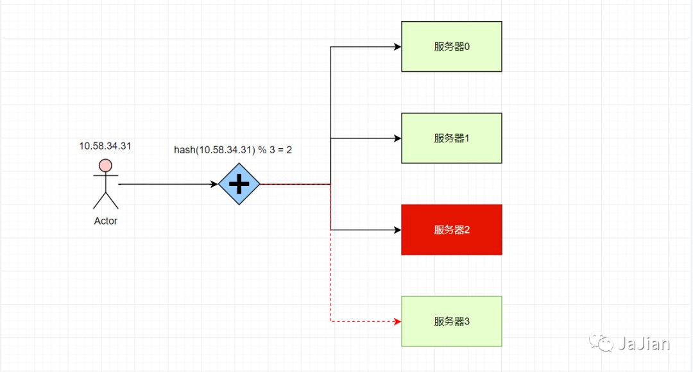
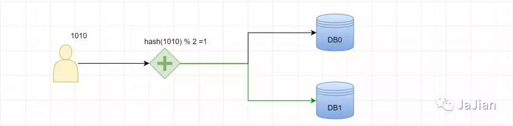
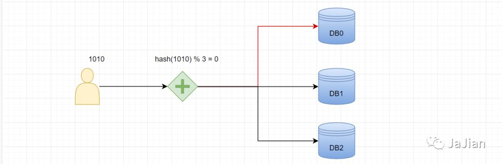
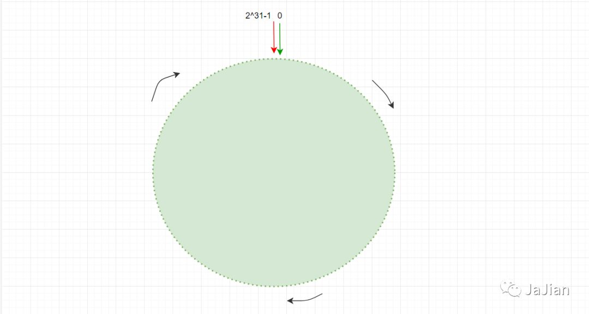
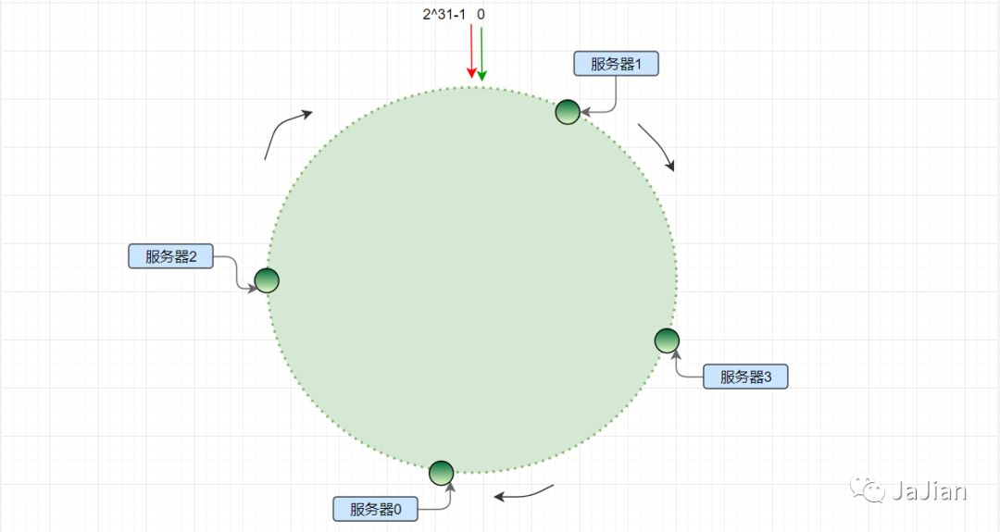
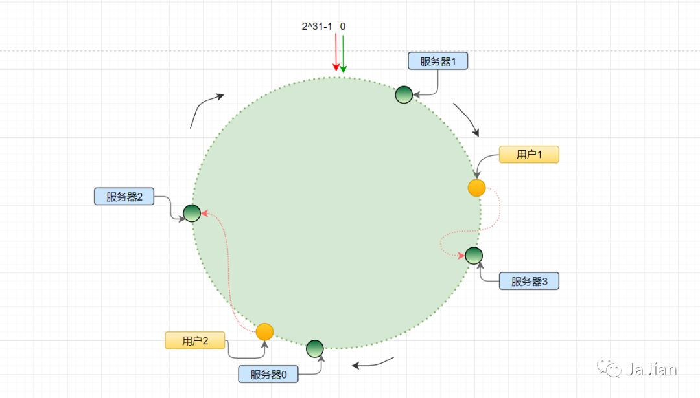
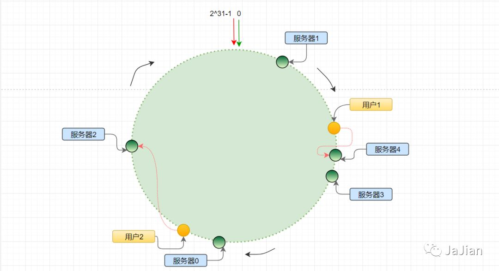
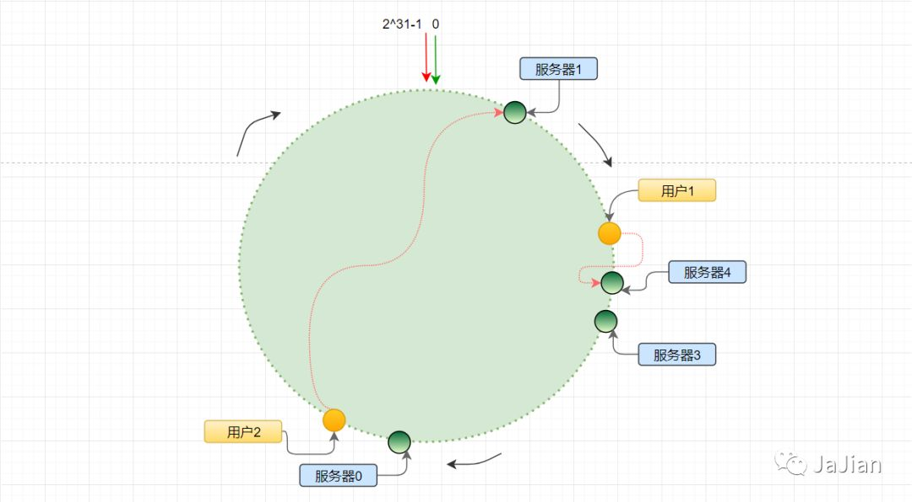
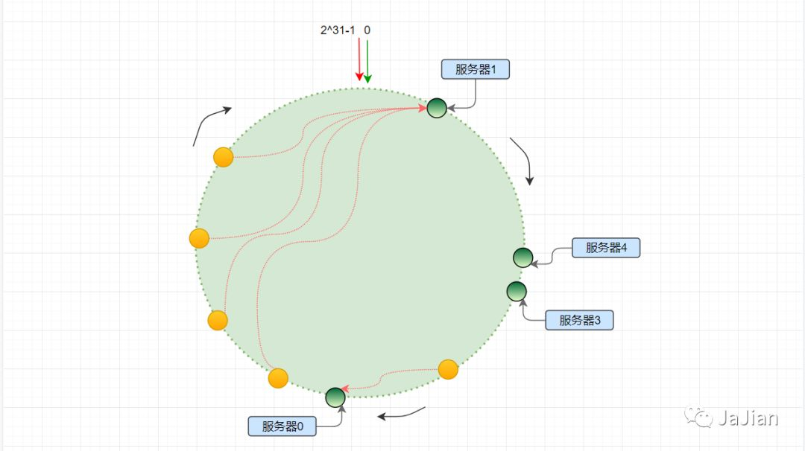
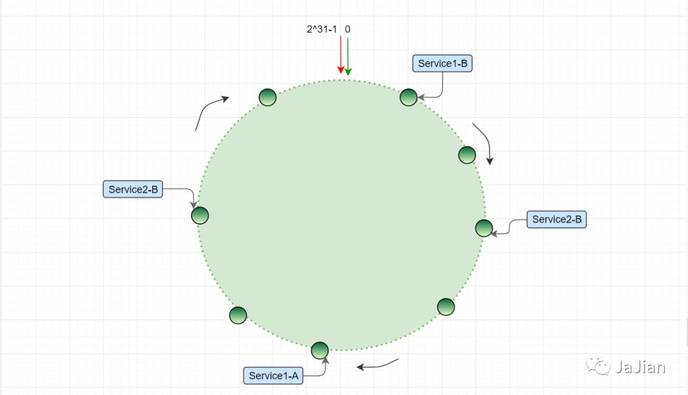

# 分布式系统中一致性哈希算法

# 业务场景

近年来B2C、O2O等商业概念的提出和移动端的发展，使得分布式系统流行了起来。分布式系统相对于单系统，解决了流量大、系统高可用和高容错等问题。功能强大也意味着实现起来需要更多技术的支持。例如系统访问层的负载均衡，缓存层的多实例主从复制备份，数据层的分库分表等。

我们以负载均衡为例，常见的负载均衡方法有很多，但是它们的优缺点也都很明显：

- **随机访问策略。**系统随机访问，缺点：可能造成服务器负载压力不均衡，俗话讲就是撑的撑死，饿的饿死。
- **轮询策略。**请求均匀分配，如果服务器有性能差异，则无法实现性能好的服务器能够多承担一部分。
- **权重轮询策略。**权值需要静态配置，无法自动调节，不适合对长连接和命中率有要求的场景。
- **Hash取模策略。**不稳定，如果列表中某台服务器宕机，则会导致路由算法产生变化，由此导致命中率的急剧下降。
- **一致性哈希策略。**

以上几个策略，排除本篇介绍的一致性哈希，可能使用最多的就是 Hash取模策略了。Hash取模策略的缺点也是很明显的，这种缺点也许在负载均衡的时候不是很明显，但是在涉及数据访问的主从备份和分库分表中就体现明显了。

# 使用Hash取模的问题

**负载均衡**

负载均衡时，假设现有3台服务器(编号分别为0、1、2)，使用哈希取模的计算方式则是：对访问者的IP，通过固定算式`hash(IP) % N`（N为服务器的个数），使得每个IP都可以定位到特定的服务器。

例如现有IP地址 `10.58.34.31`，对IP哈希取模策时，计算结果为2，即访问编号为2的服务器：

```java
String ip = "10.58.34.31";
int v1 = hash(ip) % 3;
System.out.println("访问服务器：" + v1);// 访问服务器：2
```

如果此时服务器2宕机了，则会导致所有计算结果为2的 IP 对应的用户都访问异常（包括上例中的IP）。或者你新增了一台服务器3，这时不修改N值的话那么服务器3永远不会被访问到。



当然如果你能动态获取到当前可用服务器的个数，亦即N值是根据当前可用服务器个数动态来变化的，则可解决此问题。但是对于类似要在特定地区或特定IP来访问特定服务器的这种需求就会造成访问偏差。

**分库分表**

负载均衡中有这种问题，那么分库分表中同样也有这样的问题。例如随着业务的飞速增长，我们的注册用户也越来越多，单个用户表数量已经达到千万级甚至更大。由于Mysql的单表建议百万级数据存储，所以这时为了保证系统查询和运行效率，肯定会考虑到分库分表。

对于分库分表，数据的分配是个重要的问题，你需要保证数据分配在这个服务器，那么在查询时也需要到该服务器上来查询，否则会造成数据查询丢失的问题。

通常是根据用户的 ID 哈希取模得到的值然后路由到对应的存储位置，计算公式为：`hash(userId) % N`，其中N为分库或分表的个数。

例如分库数为2时，计算结果为1，则ID为1010的用户存储在编号为1对应的库中：

```java
String userId = "1010";
int v1 = hash(userId) % 2;
System.out.println("存储：" + v1);// 存储：1
```



之后业务数量持续增长，又新增一台用户服务库，当我们根据`ID=1010`去查询数据时，路由计算方式为：

```java
int v2 = hash(userId) % 3;
System.out.println("存储：" + v2);// 存储：0
```

我们得到的路由值是0，最后的结果就不用说了，存在编号1上的数据我们去编号为0的库上去查询肯定是得不到查询结果的。



为了数据可用，你需要做数据迁移，按照新的路由规则对所有用户重新分配存储地址。每次的库或表的数量改变你都需要做一次全部用户信息数据的迁移。不用想这其中的工作量是有多费时费力了。

是否有某种方法，有效解决这种分布式存储结构下动态增加或删除节点所带来的问题，能保证这种不受实例数量变化影响而准确路由到正确的实例上的算法或实现机制呢？解决这些问题，一致性哈希算法诞生了。

# 基本思想原理

> 一致性哈希算法在1997年由麻省理工学院的Karger等人在解决分布式Cache中提出的，设计目标是为了解决因特网中的热点(Hot spot)问题，初衷和CARP十分类似。一致性哈希修正了CARP使用的简单哈希算法带来的问题，使得DHT可以在P2P环境中真正得到应用。

上面说的哈希取模方法，它是针对一个点的，业务布局严重依赖于这个计算的点值结果。你结算的结果是2，那么就对应到编号为2的服务器上。这样的映射就造成了业务容错性和可扩展性极低。

我们思考下，是否可以将这个计算结果的点值赋予范围的意义？我们知道Hash取模之后得到的是一个 int 型的整值。

```java
//Objects 类中默认的 hash 方法
 public static int hash(Object... values) {
    return Arrays.hashCode(values);
}
```

既然 hash的计算结果是 int 类型，而 java 中 int 的最小值是`-2^31`，最大值是`2^31-1`。意味着任何通过哈希取模之后的无符号值都会在 `0 ~ 2^31-1`范围之间，共`2^32`个数。那我们是否可以不对服务器的数量进行取模而是直接对`2^32`取模。这就形成了一致性哈希的基本算法思想，什么意思呢？

> **这里需要注意一点：**
>
> 默认的 hash 方法结果是有负值的情况，因此需要我们重写hash方法，保证哈希值的非负性。

简单来说，一致性Hash算法将整个哈希值空间组织成一个虚拟的圆环，如假设某哈希函数 H 的值空间为 `0 ~ 2^32-1`（即哈希值是一个32位无符号整形），整个哈希环如下：



整个空间圆按**顺时针**方向布局，圆环的正上方的点代表0，0点右侧的第一个点代表1。以此类推2、3、4、5、6……直到232-1，也就是说0点左侧的第一个点代表232-1， 0和2^32-1在零点中方向重合，我们把这个由`2^32`个点组成的圆环称为 **Hash环**。

那么，一致性哈希算法与上图中的圆环有什么关系呢？仍然以之前描述的场景为例，假设我们有4台服务器，服务器0、服务器1、服务器2，服务器3，那么，在生产环境中，这4台服务器肯定有自己的 IP 地址或主机名，我们使用它们各自的 IP 地址或主机名作为关键字进行哈希计算，使用哈希后的结果对`2^32`取模，可以使用如下公式示意：

```java
hash（服务器的IP地址） %  2^32
```

最后会得到一个 `[0, 2^32-1]`之间的一个无符号整形数，这个整数就代表服务器的编号。同时这个整数肯定处于`[0, 2^32-1]`之间，那么，上图中的 hash 环上必定有一个点与这个整数对应。那么这个服务器就可以映射到这个环上。

多个服务器都通过这种方式进行计算，最后都会各自映射到圆环上的某个点，这样每台机器就能确定其在哈希环上的位置，如下图所示。



# 如何提高容错性和扩展性的

那么用户访问，如何分配访问的服务器呢？我们根据用户的 IP 使用上面相同的函数 Hash 计算出哈希值，并确定此数据在环上的位置，从此位置沿环 **顺时针行走**，遇到的第一台服务器就是其应该定位到的服务器。



从上图可以看出 *用户1* 顺时针遇到的第一台服务器是 *服务器3* ，所以该用户被分配给服务器3来提供服务。同理可以看出用户2被分配给了服务器2。

**1. 新增服务器节点**

如果这时需要新增一台服务器节点，一致性哈希策略是如何应对的呢？如下图所示，我们新增了一台服务器4，通过上述一致性哈希算法计算后得出它在哈希环的位置。



可以发现，原来访问服务器3的用户1现在访问的对象是服务器4，用户能正常访问且服务不需要停机就可以自动切换。

**2. 删除服务器节点**

如果这时某台服务器异常宕机或者运维撤销了一台服务器，那么这时会发生什么情况呢？如下图所示，假设我们撤销了服务器2。



可以看出，我们服务仍然能正常提供服务，只不过这时用户2会被分配到服务1上了而已。

通过一致性哈希的方式，我们提高了我们系统的容错性和可扩展性，分布式节点的变动不会影响整个系统的运行且不需要我们做一些人为的调整策略。

# Hash环的数据倾斜问题

一致性哈希虽然为我们提供了稳定的切换策略，但是它也有一些小缺陷。因为 hash取模算法得到的结果是随机的，我们并不能保证各个服务节点能均匀的分配到哈希环上。

例如当有4个服务节点时，我们把哈希环认为是一个圆盘时钟，我们并不能保证4个服务节点刚好均匀的落在时钟的 12、3、6、9点上。

分布不均匀就会产生一个问题，用户的请求访问就会不均匀，同时4个服务承受的压力就会不均匀。这种问题现象我们称之为，**Hash环的数据倾斜问题**。



如上图所示，服务器0 到 服务器1 之间的哈希点值占据比例最大，大量请求会集中到 服务器1 上，而只有极少量会定位到 服务器0 或其他几个节点上，从而出现 hash环偏斜的情况。

如果想要均衡的将缓存分布到每台服务器上，最好能让这每台服务器尽量多的、均匀的出现在hash环上，但是如上图中所示，真实的服务器资源只有4台，我们怎样凭空的让它们多起来呢？

既然没有多余的真正的物理服务器节点，我们就只能将现有的物理节点通过虚拟的方法复制出来。

这些由实际节点虚拟复制而来的节点被称为 **"虚拟节点"**，即对每一个服务节点计算多个哈希，每个计算结果位置都放置一个此服务节点，称为虚拟节点。具体做法可以在服务器IP或主机名的后面增加编号来实现。

如上图所示，假如 服务器1 的 IP 是 `192.168.32.132`，那么原 服务器1 节点在环形空间的位置就是`hash("192.168.32.132") % 2^32`。

我们基于 服务器1 构建两个虚拟节点，Server1-A 和 Server1-B，虚拟节点在环形空间的位置可以利用（IP+后缀）计算，例如：

```
hash("192.168.32.132#A") % 2^32
hash("192.168.32.132#B") % 2^32
```

此时，环形空间中不再有物理节点 服务器1，服务器2，……，替代的是只有虚拟节点 Server1-A，Server1-B，Server2-A，Server2-B，……。



同时数据定位算法不变，只是多了一步虚拟节点到实际节点的映射，例如定位到 “Server1-A”、“Server1-B” 两个虚拟节点的数据均定位到 服务器1上。这样就解决了服务节点少时数据倾斜的问题。

在实际应用中，通常将虚拟节点数设置为32甚至更大，因此即使很少的服务节点也能做到相对均匀的数据分布。由于虚拟节点数量较多，与虚拟节点的映射关系也变得相对均衡了。

# 总结

一致性哈希一般在分布式缓存中使用的也比较多，本篇只介绍了服务的负载均衡和分布式存储，对于分布式缓存其实原理是类似的，读者可以自己举一反三来思考下。

其实，在分布式存储和分布式缓存中，当服务节点发生变化时（新增或减少），一致性哈希算法并不能杜绝数据迁移的问题，但是可以有效避免数据的全量迁移，需要迁移的只是更改的节点和它的上游节点它们两个节点之间的那部分数据。

另外，我们都知道 hash算法 有一个避免不了的问题，就是哈希冲突。对于用户请求IP的哈希冲突，其实只是不同用户被分配到了同一台服务器上，这个没什么影响。但是如果是服务节点有哈希冲突呢？这会导致两个服务节点在哈希环上对应同一个点，其实我感觉这个问题也不大，因为一方面哈希冲突的概率比较低，另一方面我们可以通过虚拟节点也可减少这种情况。
