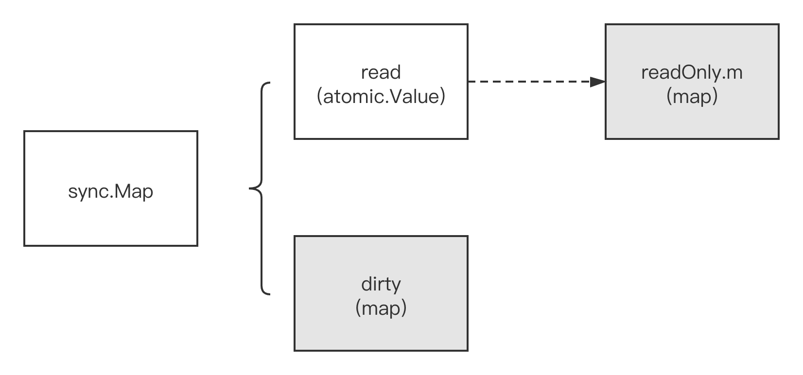

# 通过实例深入理解sync.Map的工作原理

### 一. 原生map的“先天不足”

对于已经初始化了的原生**[map](https://tip.golang.org/ref/spec#Map_types)**，我们可以尽情地对其进行并发读：

```go
package main

import (
    "fmt"
    "math/rand"
    "sync"
)

func main() {
    var wg sync.WaitGroup
    var m = make(map[int]int, 100)

    for i := 0; i < 100; i++ {
        m[i] = i
    }

    wg.Add(10)
    for i := 0; i < 10; i++ {
        // 并发读
        go func(i int) {
            for j := 0; j < 100; j++ {
                n := rand.Intn(100)
                fmt.Printf("goroutine[%d] read m[%d]: %d\n", i, n, m[n])
            }
            wg.Done()
        }(i)
    }
    wg.Wait()
}
```

但原生**[map](https://tip.golang.org/ref/spec#Map_types)**一个最大的问题就是不支持多[goroutine](https://tonybai.com/2017/06/23/an-intro-about-goroutine-scheduler)并发写。Go runtime内置对原生map并发写的检测，一旦检测到就会以panic的形式阻止程序继续运行，比如下面这个例子：

```go
package main

import (
        "math/rand"
        "sync"
)

func main() {
        var wg sync.WaitGroup
        var m = make(map[int]int, 100)

        for i := 0; i < 100; i++ {
                m[i] = i
        }

        wg.Add(10)
        for i := 0; i < 10; i++ {
                // 并发写
                go func(i int) {
                        for n := 0; n < 100; n++ {
                                n := rand.Intn(100)
                                m[n] = n
                        }
                        wg.Done()
                }(i)
        }
        wg.Wait()
}
```

运行上面这个并发写的例子，我们很大可能会得到下面panic：

```go
$go run concurrent_builtin_map_write.go
fatal error: concurrent map writes
... ...
```

原生**map**的“先天不足”让其无法直接胜任某些场合的要求，于是gopher们便寻求其他路径。一种路径无非是基于**原生map**包装出一个支持并发读写的自定义map类型，比如，最简单的方式就是用一把**互斥锁(sync.Mutex)**同步各个goroutine对map内数据的访问；如果读多写少，还可以利用**读写锁(sync.RWMutex)**来保护map内数据，减少锁竞争，提高并发读的性能。很多第三方map的实现原理也大体如此。

另外一种路径就是使用**sync.Map**。

### 二. sync.Map的原理简述

按照官方文档，**sync.Map**是goroutine-safe的，即多个goroutine同时对其读写都是ok的。和第一种路径的最大区别在于，sync.Map对特定场景做了性能优化，一种是读多写少的场景，另外一种多个goroutine读/写/修改的key集合没有交集。

下面是两种技术路径的性能基准测试结果对比

```go
package mapbench

import "sync"

type MyMap struct {
	sync.Mutex
	m map[int]int
}

type MyRwMap struct {
	sync.RWMutex
	m map[int]int
}

var myMap *MyMap
var myRwMap *MyRwMap
var syncMap *sync.Map

func init() {
	myMap = &MyMap{
		m: make(map[int]int, 100),
	}
	myRwMap = &MyRwMap{
		m: make(map[int]int, 100),
	}

	syncMap = &sync.Map{}
}

func builtinMapStore(k, v int) {
	myMap.Lock()
	defer myMap.Unlock()
	myMap.m[k] = v
}

func builtinMapLookup(k int) int {
	myMap.Lock()
	defer myMap.Unlock()
	if v, ok := myMap.m[k]; !ok {
		return -1
	} else {
		return v
	}
}

func builtinMapDelete(k int) {
	myMap.Lock()
	defer myMap.Unlock()
	if _, ok := myMap.m[k]; !ok {
		return
	} else {
		delete(myMap.m, k)
	}
}

func builtinRwMapStore(k, v int) {
	myRwMap.Lock()
	defer myRwMap.Unlock()
	myRwMap.m[k] = v
}

func builtinRwMapLookup(k int) int {
	myRwMap.RLock()
	defer myRwMap.RUnlock()
	if v, ok := myRwMap.m[k]; !ok {
		return -1
	} else {
		return v
	}
}

func builtinRwMapDelete(k int) {
	myRwMap.Lock()
	defer myRwMap.Unlock()
	if _, ok := myRwMap.m[k]; !ok {
		return
	} else {
		delete(myRwMap.m, k)
	}
}

func syncMapStore(k, v int) {
	syncMap.Store(k, v)
}

func syncMapLookup(k int) int {
	v, ok := syncMap.Load(k)
	if !ok {
		return -1
	}

	return v.(int)
}

func syncMapDelete(k int) {
	syncMap.Delete(k)
}
```

```go
package mapbench

import (
	"math/rand"
	"testing"
	"time"
)

func BenchmarkBuiltinMapStoreParalell(b *testing.B) {
	b.RunParallel(func(pb *testing.PB) {
		r := rand.New(rand.NewSource(time.Now().Unix()))
		for pb.Next() {
			// The loop body is executed b.N times total across all goroutines.
			k := r.Intn(100000000)
			builtinMapStore(k, k)
		}
	})
}

func BenchmarkSyncMapStoreParalell(b *testing.B) {
	b.RunParallel(func(pb *testing.PB) {
		r := rand.New(rand.NewSource(time.Now().Unix()))
		for pb.Next() {
			// The loop body is executed b.N times total across all goroutines.
			k := r.Intn(100000000)
			syncMapStore(k, k)
		}
	})
}

func BenchmarkBuiltinRwMapStoreParalell(b *testing.B) {
	b.RunParallel(func(pb *testing.PB) {
		r := rand.New(rand.NewSource(time.Now().Unix()))
		for pb.Next() {
			// The loop body is executed b.N times total across all goroutines.
			k := r.Intn(100000000)
			builtinRwMapStore(k, k)
		}
	})
}

func BenchmarkBuiltinMapLookupParalell(b *testing.B) {
	b.RunParallel(func(pb *testing.PB) {
		r := rand.New(rand.NewSource(time.Now().Unix()))
		for pb.Next() {
			// The loop body is executed b.N times total across all goroutines.
			//k := r.Int()
			k := r.Intn(100000000)
			builtinMapLookup(k)
		}
	})
}

func BenchmarkBuiltinRwMapLookupParalell(b *testing.B) {
	b.RunParallel(func(pb *testing.PB) {
		r := rand.New(rand.NewSource(time.Now().Unix()))
		for pb.Next() {
			// The loop body is executed b.N times total across all goroutines.
			//k := r.Int()
			k := r.Intn(100000000)
			builtinRwMapLookup(k)
		}
	})
}

func BenchmarkSyncMapLookupParalell(b *testing.B) {
	b.RunParallel(func(pb *testing.PB) {
		r := rand.New(rand.NewSource(time.Now().Unix()))
		for pb.Next() {
			// The loop body is executed b.N times total across all goroutines.
			k := r.Intn(100000000)
			syncMapLookup(k)
		}
	})
}

func BenchmarkBuiltinMapDeleteParalell(b *testing.B) {
	b.RunParallel(func(pb *testing.PB) {
		r := rand.New(rand.NewSource(time.Now().Unix()))
		for pb.Next() {
			// The loop body is executed b.N times total across all goroutines.
			k := r.Intn(100000000)
			builtinMapDelete(k)
		}
	})
}

func BenchmarkBuiltinRwMapDeleteParalell(b *testing.B) {
	b.RunParallel(func(pb *testing.PB) {
		r := rand.New(rand.NewSource(time.Now().Unix()))
		for pb.Next() {
			// The loop body is executed b.N times total across all goroutines.
			k := r.Intn(100000000)
			builtinRwMapDelete(k)
		}
	})
}

func BenchmarkSyncMapDeleteParalell(b *testing.B) {
	b.RunParallel(func(pb *testing.PB) {
		r := rand.New(rand.NewSource(time.Now().Unix()))
		for pb.Next() {
			// The loop body is executed b.N times total across all goroutines.
			k := r.Intn(100000000)
			syncMapDelete(k)
		}
	})
}
```

```go
$go test -bench .
goos: darwin
goarch: amd64
pkg: github.com/bigwhite/experiments/go19-examples/benchmark-for-map
BenchmarkBuiltinMapStoreParalell-8           7945152           179 ns/op
BenchmarkSyncMapStoreParalell-8              3523468           387 ns/op
BenchmarkBuiltinRwMapStoreParalell-8         7622342           190 ns/op
BenchmarkBuiltinMapLookupParalell-8          7319148           163 ns/op
BenchmarkBuiltinRwMapLookupParalell-8       21800383            55.2 ns/op
BenchmarkSyncMapLookupParalell-8            70512406            18.5 ns/op
BenchmarkBuiltinMapDeleteParalell-8          8773206           174 ns/op
BenchmarkBuiltinRwMapDeleteParalell-8        5424912           214 ns/op
BenchmarkSyncMapDeleteParalell-8            49899008            23.7 ns/op
PASS
ok      github.com/bigwhite/experiments/go19-examples/benchmark-for-map    15.727s
```

我们看到：**sync.Map**在读和删除两项性能基准测试上的数据都**大幅领先**使用sync.Mutex或RWMutex包装的原生map，仅在写入一项上存在一倍的差距。sync.Map是如何实现如此高的读取性能的呢？简单说：空间换时间+读写分离+原子操作(快路径)。

sync.Map底层使用了两个原生**map**，一个叫read，仅用于读；一个叫dirty，用于在特定情况下存储最新写入的key-value数据:



read(这个map)好比整个sync.Map的一个**“高速缓存”**，当goroutine从sync.Map中读取数据时，sync.Map会首先查看read这个缓存层是否有用户需要的数据(key是否命中)，如果有(命中)，则通过原子操作将数据读取并返回，这是sync.Map推荐的**快路径(fast path)**，也是为何上面基准测试结果中**读操作性能极高**的原因。

### 三. 通过实例深入理解sync.Map的原理

sync.Map源码(Go 1.14版本)不到400行，应该算是比较简单的了。但对于那些有着**“阅读源码恐惧症”**的gopher来说，我们可以通过另外一种研究方法：**实例法**，并结合些许源码来从“黑盒”角度理解sync.Map的工作原理。这种方法十分适合那些相对独立、可以从标准库中“单独”取出来的包，而sync.Map就是这样的包。

首先，我们将sync.Map从标准库源码目录中拷贝一份

```go
// Copyright 2016 The Go Authors. All rights reserved.
// Use of this source code is governed by a BSD-style
// license that can be found in the LICENSE file.

package smap

import (
	"fmt"
	"sync"
	"sync/atomic"
	"unsafe"
)

// Map is like a Go map[interface{}]interface{} but is safe for concurrent use
// by multiple goroutines without additional locking or coordination.
// Loads, stores, and deletes run in amortized constant time.
//
// The Map type is specialized. Most code should use a plain Go map instead,
// with separate locking or coordination, for better type safety and to make it
// easier to maintain other invariants along with the map content.
//
// The Map type is optimized for two common use cases: (1) when the entry for a given
// key is only ever written once but read many times, as in caches that only grow,
// or (2) when multiple goroutines read, write, and overwrite entries for disjoint
// sets of keys. In these two cases, use of a Map may significantly reduce lock
// contention compared to a Go map paired with a separate Mutex or RWMutex.
//
// The zero Map is empty and ready for use. A Map must not be copied after first use.
type Map struct {
	mu sync.Mutex

	// read contains the portion of the map's contents that are safe for
	// concurrent access (with or without mu held).
	//
	// The read field itself is always safe to load, but must only be stored with
	// mu held.
	//
	// Entries stored in read may be updated concurrently without mu, but updating
	// a previously-expunged entry requires that the entry be copied to the dirty
	// map and unexpunged with mu held.
	read atomic.Value // readOnly

	// dirty contains the portion of the map's contents that require mu to be
	// held. To ensure that the dirty map can be promoted to the read map quickly,
	// it also includes all of the non-expunged entries in the read map.
	//
	// Expunged entries are not stored in the dirty map. An expunged entry in the
	// clean map must be unexpunged and added to the dirty map before a new value
	// can be stored to it.
	//
	// If the dirty map is nil, the next write to the map will initialize it by
	// making a shallow copy of the clean map, omitting stale entries.
	dirty map[interface{}]*entry

	// misses counts the number of loads since the read map was last updated that
	// needed to lock mu to determine whether the key was present.
	//
	// Once enough misses have occurred to cover the cost of copying the dirty
	// map, the dirty map will be promoted to the read map (in the unamended
	// state) and the next store to the map will make a new dirty copy.
	misses int
}

func (m *Map) Dump() {
	fmt.Printf("=====> sync.Map:\n")
	// dump read
	read, ok := m.read.Load().(readOnly)
	fmt.Printf("\t read(amended=%v):\n", read.amended)
	if ok {
		// dump readOnly's map
		for k, v := range read.m {
			fmt.Printf("\t\t %#v:%#v\n", k, v)
		}
	}

	// dump dirty
	fmt.Printf("\t dirty:\n")
	for k, v := range m.dirty {
		fmt.Printf("\t\t %#v:%#v\n", k, v)
	}

	// dump miss
	fmt.Printf("\t misses:%d\n", m.misses)

	// dump expunged
	fmt.Printf("\t expunged:%#v\n", expunged)
	fmt.Printf("<===== sync.Map\n")
}

// readOnly is an immutable struct stored atomically in the Map.read field.
type readOnly struct {
	m       map[interface{}]*entry
	amended bool // true if the dirty map contains some key not in m.
}

// expunged is an arbitrary pointer that marks entries which have been deleted
// from the dirty map.
var expunged = unsafe.Pointer(new(interface{}))

// An entry is a slot in the map corresponding to a particular key.
type entry struct {
	// p points to the interface{} value stored for the entry.
	//
	// If p == nil, the entry has been deleted and m.dirty == nil.
	//
	// If p == expunged, the entry has been deleted, m.dirty != nil, and the entry
	// is missing from m.dirty.
	//
	// Otherwise, the entry is valid and recorded in m.read.m[key] and, if m.dirty
	// != nil, in m.dirty[key].
	//
	// An entry can be deleted by atomic replacement with nil: when m.dirty is
	// next created, it will atomically replace nil with expunged and leave
	// m.dirty[key] unset.
	//
	// An entry's associated value can be updated by atomic replacement, provided
	// p != expunged. If p == expunged, an entry's associated value can be updated
	// only after first setting m.dirty[key] = e so that lookups using the dirty
	// map find the entry.
	p unsafe.Pointer // *interface{}
}

func newEntry(i interface{}) *entry {
	return &entry{p: unsafe.Pointer(&i)}
}

// Load returns the value stored in the map for a key, or nil if no
// value is present.
// The ok result indicates whether value was found in the map.
func (m *Map) Load(key interface{}) (value interface{}, ok bool) {
	read, _ := m.read.Load().(readOnly)
	e, ok := read.m[key]
	if !ok && read.amended {
		m.mu.Lock()
		// Avoid reporting a spurious miss if m.dirty got promoted while we were
		// blocked on m.mu. (If further loads of the same key will not miss, it's
		// not worth copying the dirty map for this key.)
		read, _ = m.read.Load().(readOnly)
		e, ok = read.m[key]
		if !ok && read.amended {
			e, ok = m.dirty[key]
			// Regardless of whether the entry was present, record a miss: this key
			// will take the slow path until the dirty map is promoted to the read
			// map.
			m.missLocked()
		}
		m.mu.Unlock()
	}
	if !ok {
		return nil, false
	}
	return e.load()
}

func (e *entry) load() (value interface{}, ok bool) {
	p := atomic.LoadPointer(&e.p)
	if p == nil || p == expunged {
		return nil, false
	}
	return *(*interface{})(p), true
}

// Store sets the value for a key.
func (m *Map) Store(key, value interface{}) {
	read, _ := m.read.Load().(readOnly)
	if e, ok := read.m[key]; ok && e.tryStore(&value) {
		return
	}

	m.mu.Lock()
	read, _ = m.read.Load().(readOnly)
	if e, ok := read.m[key]; ok {
		if e.unexpungeLocked() {
			// The entry was previously expunged, which implies that there is a
			// non-nil dirty map and this entry is not in it.
			m.dirty[key] = e
		}
		e.storeLocked(&value)
	} else if e, ok := m.dirty[key]; ok {
		e.storeLocked(&value)
	} else {
		if !read.amended {
			// We're adding the first new key to the dirty map.
			// Make sure it is allocated and mark the read-only map as incomplete.
			m.dirtyLocked()
			m.read.Store(readOnly{m: read.m, amended: true})
		}
		m.dirty[key] = newEntry(value)
	}
	m.mu.Unlock()
}

// tryStore stores a value if the entry has not been expunged.
//
// If the entry is expunged, tryStore returns false and leaves the entry
// unchanged.
func (e *entry) tryStore(i *interface{}) bool {
	for {
		p := atomic.LoadPointer(&e.p)
		if p == expunged {
			return false
		}
		if atomic.CompareAndSwapPointer(&e.p, p, unsafe.Pointer(i)) {
			return true
		}
	}
}

// unexpungeLocked ensures that the entry is not marked as expunged.
//
// If the entry was previously expunged, it must be added to the dirty map
// before m.mu is unlocked.
func (e *entry) unexpungeLocked() (wasExpunged bool) {
	return atomic.CompareAndSwapPointer(&e.p, expunged, nil)
}

// storeLocked unconditionally stores a value to the entry.
//
// The entry must be known not to be expunged.
func (e *entry) storeLocked(i *interface{}) {
	atomic.StorePointer(&e.p, unsafe.Pointer(i))
}

// LoadOrStore returns the existing value for the key if present.
// Otherwise, it stores and returns the given value.
// The loaded result is true if the value was loaded, false if stored.
func (m *Map) LoadOrStore(key, value interface{}) (actual interface{}, loaded bool) {
	// Avoid locking if it's a clean hit.
	read, _ := m.read.Load().(readOnly)
	if e, ok := read.m[key]; ok {
		actual, loaded, ok := e.tryLoadOrStore(value)
		if ok {
			return actual, loaded
		}
	}

	m.mu.Lock()
	read, _ = m.read.Load().(readOnly)
	if e, ok := read.m[key]; ok {
		if e.unexpungeLocked() {
			m.dirty[key] = e
		}
		actual, loaded, _ = e.tryLoadOrStore(value)
	} else if e, ok := m.dirty[key]; ok {
		actual, loaded, _ = e.tryLoadOrStore(value)
		m.missLocked()
	} else {
		if !read.amended {
			// We're adding the first new key to the dirty map.
			// Make sure it is allocated and mark the read-only map as incomplete.
			m.dirtyLocked()
			m.read.Store(readOnly{m: read.m, amended: true})
		}
		m.dirty[key] = newEntry(value)
		actual, loaded = value, false
	}
	m.mu.Unlock()

	return actual, loaded
}

// tryLoadOrStore atomically loads or stores a value if the entry is not
// expunged.
//
// If the entry is expunged, tryLoadOrStore leaves the entry unchanged and
// returns with ok==false.
func (e *entry) tryLoadOrStore(i interface{}) (actual interface{}, loaded, ok bool) {
	p := atomic.LoadPointer(&e.p)
	if p == expunged {
		return nil, false, false
	}
	if p != nil {
		return *(*interface{})(p), true, true
	}

	// Copy the interface after the first load to make this method more amenable
	// to escape analysis: if we hit the "load" path or the entry is expunged, we
	// shouldn't bother heap-allocating.
	ic := i
	for {
		if atomic.CompareAndSwapPointer(&e.p, nil, unsafe.Pointer(&ic)) {
			return i, false, true
		}
		p = atomic.LoadPointer(&e.p)
		if p == expunged {
			return nil, false, false
		}
		if p != nil {
			return *(*interface{})(p), true, true
		}
	}
}

// Delete deletes the value for a key.
func (m *Map) Delete(key interface{}) {
	read, _ := m.read.Load().(readOnly)
	e, ok := read.m[key]
	if !ok && read.amended {
		m.mu.Lock()
		read, _ = m.read.Load().(readOnly)
		e, ok = read.m[key]
		if !ok && read.amended {
			delete(m.dirty, key)
		}
		m.mu.Unlock()
	}
	if ok {
		e.delete()
	}
}

func (e *entry) delete() (hadValue bool) {
	for {
		p := atomic.LoadPointer(&e.p)
		if p == nil || p == expunged {
			return false
		}
		if atomic.CompareAndSwapPointer(&e.p, p, nil) {
			return true
		}
	}
}

// Range calls f sequentially for each key and value present in the map.
// If f returns false, range stops the iteration.
//
// Range does not necessarily correspond to any consistent snapshot of the Map's
// contents: no key will be visited more than once, but if the value for any key
// is stored or deleted concurrently, Range may reflect any mapping for that key
// from any point during the Range call.
//
// Range may be O(N) with the number of elements in the map even if f returns
// false after a constant number of calls.
func (m *Map) Range(f func(key, value interface{}) bool) {
	// We need to be able to iterate over all of the keys that were already
	// present at the start of the call to Range.
	// If read.amended is false, then read.m satisfies that property without
	// requiring us to hold m.mu for a long time.
	read, _ := m.read.Load().(readOnly)
	if read.amended {
		// m.dirty contains keys not in read.m. Fortunately, Range is already O(N)
		// (assuming the caller does not break out early), so a call to Range
		// amortizes an entire copy of the map: we can promote the dirty copy
		// immediately!
		m.mu.Lock()
		read, _ = m.read.Load().(readOnly)
		if read.amended {
			read = readOnly{m: m.dirty}
			m.read.Store(read)
			m.dirty = nil
			m.misses = 0
		}
		m.mu.Unlock()
	}

	for k, e := range read.m {
		v, ok := e.load()
		if !ok {
			continue
		}
		if !f(k, v) {
			break
		}
	}
}

func (m *Map) missLocked() {
	m.misses++
	if m.misses < len(m.dirty) {
		return
	}
	m.read.Store(readOnly{m: m.dirty})
	m.dirty = nil
	m.misses = 0
}

func (m *Map) dirtyLocked() {
	if m.dirty != nil {
		return
	}

	read, _ := m.read.Load().(readOnly)
	m.dirty = make(map[interface{}]*entry, len(read.m))
	for k, e := range read.m {
		if !e.tryExpungeLocked() {
			m.dirty[k] = e
		}
	}
}

func (e *entry) tryExpungeLocked() (isExpunged bool) {
	p := atomic.LoadPointer(&e.p)
	for p == nil {
		if atomic.CompareAndSwapPointer(&e.p, nil, expunged) {
			return true
		}
		p = atomic.LoadPointer(&e.p)
	}
	return p == expunged
}
```

接下来，添加一个Map类型的新方法**Dump**：

```java
func (m *Map) Dump() {
        fmt.Printf("=====> sync.Map:\n")
        // dump read
        read, ok := m.read.Load().(readOnly)
        fmt.Printf("\t read(amended=%v):\n", read.amended)
        if ok {
                // dump readOnly's map
                for k, v := range read.m {
                        fmt.Printf("\t\t %#v:%#v\n", k, v)
                }
        }

        // dump dirty
        fmt.Printf("\t dirty:\n")
        for k, v := range m.dirty {
                fmt.Printf("\t\t %#v:%#v\n", k, v)
        }

        // dump miss
        fmt.Printf("\t misses:%d\n", m.misses)

        // dump expunged
        fmt.Printf("\t expunged:%#v\n", expunged)
        fmt.Printf("<===== sync.Map\n")
}
```

这个方法将打印Map的内部状态以及read、dirty两个原生map中的所有key-value对，这样我们在初始状态、store key-value后、load key以及delete key后通过Dump方法输出sync.Map状态便可以看到不同操作后sync.Map内部的状态变化，从而间接了解sync.Map的工作原理。下面我们就分情况剖析sync.Map的行为特征。

#### 1. 初始状态

**sync.Map**是零值可用的，我们可以像下面这样定义一个**sync.Map**类型变量，并无需做显式初始化

我们通过Dump输出初始状态下的sync.Map的内部状态：

```go
func main() {
        var m sync.Map
        fmt.Println("sync.Map init status:")
        m.Dump()
        ... ...
}
```

运行后，输出如下：

```go
sync.Map init status:
=====> sync.Map:
     read(amended=false):
     dirty:
     misses:0
     expunged:(unsafe.Pointer)(0xc0001101e0)
<===== sync.Map
```

在初始状态下，dirty和read两个内置map内都无数据。**expunged**是一个哨兵变量(也是一个包内的非导出变量)，它在sync.Map包初始化时就有了一个固定的值。该变量在后续用于元素删除场景(删除的key并不立即从map中删除，而是将其value置为expunged)以及load场景。如果哪个key值对应的value值与explunged一致，说明该key已经被map删除了（即便该key所占用的内存资源尚未释放）。

#### 2. 写入数据(store)

```go
type val struct {
        s string
}

func main() {
        ... ...
        val1 := &val{"val1"}
        m.Store("key1", val1)
        fmt.Println("\nafter store key1:")
        m.Dump()
        ... ...
}

```

我们看一下存入新数据后，Map内部的状态：

```go
after store key1:
=====> sync.Map:
     read(amended=true):
     dirty:
         "key1":&smap.entry{p:(unsafe.Pointer)(0xc000108080)}
     misses:0
     expunged:(unsafe.Pointer)(0xc000108040)
<===== sync.Map
```

我们看到写入(key1,value1)后，Map中有两处变化，一处是dirty map，新写入的数据存储在dirty map中；第二处是read中的**amended值**由false变为了true，**表示dirty map中存在某些read map还没有的key**。

#### 3. dirty提升(promoted)为read

此时，如果我们调用一次sync.Map的Load方法，无论传给Load的key值是否为”key1″还是其他，sync.Map内部都会发生较大变化，我们来看一下：

```go
  m.Load("key2") //这里我们尝试load key="key2"
        fmt.Println("\nafter load key2:")
        m.Dump()
```

下面是Load方法调用后Dump方法输出的内容：

```go
after load key2:
=====> sync.Map:
     read(amended=false):
         "key1":&smap.entry{p:(unsafe.Pointer)(0xc000010240)}
     dirty:
     misses:0
     expunged:(unsafe.Pointer)(0xc000010200)
<===== sync.Map
```

我们看到：**原dirty map中的数据被提升(promoted)到read map中了，提升后amended值重新变回false**。

结合sync.Map中Load方法的源码，我们得出如下sync.Map的工作原理：当Load方法在read map中没有命中（miss)传入的key时，该方法会再次尝试在dirty中继续匹配key；无论是否匹配到，Load方法都会在锁保护下调用missLocked方法增加misses的计数(+1)；如果增加完计数的misses值大于等于dirty map中的元素个数，则会将dirty中的元素整体提升到read：

```go
func (m *Map) missLocked() {
        m.misses++  //计数+1
        if m.misses < len(m.dirty) {
                return
        }
        m.read.Store(readOnly{m: m.dirty})  // dirty提升到read
        m.dirty = nil  // dirty置为nil
        m.misses = 0 // misses计数器清零
}
```

为了验证上述promoted的条件，我们再来做一组实验：

```go
 val2 := &val{"val2"}
        m.Store("key2", val2)
        fmt.Println("\nafter store key2:")
        m.Dump()

        val3 := &val{"val3"}
        m.Store("key3", val3)
        fmt.Println("\nafter store key3:")
        m.Dump()

        m.Load("key1")
        fmt.Println("\nafter load key1:")
        m.Dump()

        m.Load("key2")
        fmt.Println("\nafter load key2:")
        m.Dump()

        m.Load("key2")
        fmt.Println("\nafter load key2 2nd:")
        m.Dump()

        m.Load("key2")
        fmt.Println("\nafter load key2 3rd:")
        m.Dump()

```

在完成一次promoted动作之后，我们又向sync.Map中写入两个key：key2和key3，并在后续Load一次key1并连续三次Load key2，下面是Dump方法的输出结果：

```go
after store key2:
=====> sync.Map:
     read(amended=true):
         "key1":&smap.entry{p:(unsafe.Pointer)(0xc000010240)}
     dirty:
         "key1":&smap.entry{p:(unsafe.Pointer)(0xc000010240)}
         "key2":&smap.entry{p:(unsafe.Pointer)(0xc000010290)}
     misses:0
     expunged:(unsafe.Pointer)(0xc000010200)
<===== sync.Map

after store key3:
=====> sync.Map:
     read(amended=true):
         "key1":&smap.entry{p:(unsafe.Pointer)(0xc000010240)}
     dirty:
         "key1":&smap.entry{p:(unsafe.Pointer)(0xc000010240)}
         "key2":&smap.entry{p:(unsafe.Pointer)(0xc000010290)}
         "key3":&smap.entry{p:(unsafe.Pointer)(0xc0000102c0)}
     misses:0
     expunged:(unsafe.Pointer)(0xc000010200)
<===== sync.Map

after load key1:
=====> sync.Map:
     read(amended=true):
         "key1":&smap.entry{p:(unsafe.Pointer)(0xc000010240)}
     dirty:
         "key3":&smap.entry{p:(unsafe.Pointer)(0xc0000102c0)}
         "key1":&smap.entry{p:(unsafe.Pointer)(0xc000010240)}
         "key2":&smap.entry{p:(unsafe.Pointer)(0xc000010290)}
     misses:0
     expunged:(unsafe.Pointer)(0xc000010200)
<===== sync.Map

after load key2:
=====> sync.Map:
     read(amended=true):
         "key1":&smap.entry{p:(unsafe.Pointer)(0xc000010240)}
     dirty:
         "key1":&smap.entry{p:(unsafe.Pointer)(0xc000010240)}
         "key2":&smap.entry{p:(unsafe.Pointer)(0xc000010290)}
         "key3":&smap.entry{p:(unsafe.Pointer)(0xc0000102c0)}
     misses:1
     expunged:(unsafe.Pointer)(0xc000010200)
<===== sync.Map

after load key2 2nd:
=====> sync.Map:
     read(amended=true):
         "key1":&smap.entry{p:(unsafe.Pointer)(0xc000010240)}
     dirty:
         "key1":&smap.entry{p:(unsafe.Pointer)(0xc000010240)}
         "key2":&smap.entry{p:(unsafe.Pointer)(0xc000010290)}
         "key3":&smap.entry{p:(unsafe.Pointer)(0xc0000102c0)}
     misses:2
     expunged:(unsafe.Pointer)(0xc000010200)
<===== sync.Map

after load key2 3rd:
=====> sync.Map:
     read(amended=false):
         "key1":&smap.entry{p:(unsafe.Pointer)(0xc000010240)}
         "key2":&smap.entry{p:(unsafe.Pointer)(0xc000010290)}
         "key3":&smap.entry{p:(unsafe.Pointer)(0xc0000102c0)}
     dirty:
     misses:0
     expunged:(unsafe.Pointer)(0xc000010200)
<===== sync.Map

```

我们看到在写入key2这条数据后，dirty中不仅存储了key2这条数据，原read中的key1数据也被复制了一份存入到dirty中。这个操作是由sync.Map的dirtyLocked方法完成的：

```go
func (m *Map) dirtyLocked() {
        if m.dirty != nil {
                return
        }

        read, _ := m.read.Load().(readOnly)
        m.dirty = make(map[interface{}]*entry, len(read.m))
        for k, e := range read.m {
                if !e.tryExpungeLocked() {
                        m.dirty[k] = e
                }
        }
}

```

前面我们提到过，promoted(dirty -> read)是一个整体的指针交换操作，promoted时，sync.Map直接将原dirty指针store给read并将自身置为nil，因此sync.Map要保证amended=true时，dirty中拥有整个Map的全量数据，这样在下一次promoted(dirty -> read)时才不会丢失数据。不过dirtyLocked是通过一个迭代实现的元素从read到dirty的复制，如果Map中元素规模很大，这个过程付出的损耗将很大，并且这个过程是在锁保护下的。

在存入key3后，我们调用Load方法先load了key1，由于key1在read中有记录，因此此次load命中了，走的是快路径，对Map状态没有任何影响。

之后，我们又Load了key2，key2不在read中，因此产生了一次miss。misses增加计数后的值为1，而此时dirty中的元素数量为3，不满足promote的条件，于是没有执行promote操作。后续我们又连续进行了两次key2的Load操作，产生了两次miss事件后，misses的计数值等于了dirty中的元素数量，于是promote操作被执行，dirty map整体被置换给read，自己则变成了nil。

#### 4. 更新已存在的key

我们再来看一下更新已存在的key的值的情况。首先是该key仅存在于read中(刚刚promote完毕)，而不在dirty中。我们更新这时仅在read中存在的key2的值：

```go
 val2_1 := &val{"val2_1"}
        m.Store("key2", val2_1)
        fmt.Println("\nafter update key2(in read, not in dirty):")
        m.Dump()

```

下面是Dump输出的结果：

```go
after update key2(in read, not in dirty):
=====> sync.Map:
     read(amended=false):
         "key1":&smap.entry{p:(unsafe.Pointer)(0xc00008e220)}
         "key2":&smap.entry{p:(unsafe.Pointer)(0xc00008e2d0)}
         "key3":&smap.entry{p:(unsafe.Pointer)(0xc00008e2a0)}
     dirty:
     misses:0
     expunged:(unsafe.Pointer)(0xc00008e1e0)
<===== sync.Map
```

我们看到sync.Map直接更新了位于read中的key2的值(entry.storeLocked方法实现的)，dirty和其他字段没有受到影响。

第二种情况是该key刚store到dirty中，尚未promote，不在read中。我们新增一个key4，并更新其值：

```go
val4 := &val{"val4"}
        m.Store("key4", val4)
        fmt.Println("\nafter store key4:")
        m.Dump()

        val4_1 := &val{"val4_1"}
        m.Store("key4", val4_1)
        fmt.Println("\nafter update key4(not in read, in dirty):")
        m.Dump()

```

dump方法的输出结果如下：

```go
after store key4:
=====> sync.Map:
     read(amended=true):
         "key1":&smap.entry{p:(unsafe.Pointer)(0xc00008e220)}
         "key2":&smap.entry{p:(unsafe.Pointer)(0xc00008e2d0)}
         "key3":&smap.entry{p:(unsafe.Pointer)(0xc00008e2a0)}
     dirty:
         "key1":&smap.entry{p:(unsafe.Pointer)(0xc00008e220)}
         "key2":&smap.entry{p:(unsafe.Pointer)(0xc00008e2d0)}
         "key3":&smap.entry{p:(unsafe.Pointer)(0xc00008e2a0)}
         "key4":&smap.entry{p:(unsafe.Pointer)(0xc00008e310)}
     misses:0
     expunged:(unsafe.Pointer)(0xc00008e1e0)
<===== sync.Map

after update key4(not in read, in dirty):
=====> sync.Map:
     read(amended=true):
         "key1":&smap.entry{p:(unsafe.Pointer)(0xc00008e220)}
         "key2":&smap.entry{p:(unsafe.Pointer)(0xc00008e2d0)}
         "key3":&smap.entry{p:(unsafe.Pointer)(0xc00008e2a0)}
     dirty:
         "key1":&smap.entry{p:(unsafe.Pointer)(0xc00008e220)}
         "key2":&smap.entry{p:(unsafe.Pointer)(0xc00008e2d0)}
         "key3":&smap.entry{p:(unsafe.Pointer)(0xc00008e2a0)}
         "key4":&smap.entry{p:(unsafe.Pointer)(0xc00008e330)}
     misses:0
     expunged:(unsafe.Pointer)(0xc00008e1e0)
<===== sync.Map

```

我们看到，sync.Map同样是直接将key4对应的value重新设置为新值(val4_1)。

#### 5. 删除key

为了方便查看，我们将上述Map状态回滚到刚刚promote(dirty -> read)完的时刻，即：

```go
after load key2 3rd:
=====> sync.Map:
     read(amended=false):
         "key1":&smap.entry{p:(unsafe.Pointer)(0xc00008e220)}
         "key2":&smap.entry{p:(unsafe.Pointer)(0xc00008e270)}
         "key3":&smap.entry{p:(unsafe.Pointer)(0xc00008e2a0)}
     dirty:
     misses:0
     expunged:(unsafe.Pointer)(0xc00008e1e0)
<===== sync.Map
```

删除key也有几种情况，我们分别来看一下：

- 删除的key仅存在于read中

我们删除上面Map中仅存在于read中的key2：

```go
 m.Delete("key2")
        fmt.Println("\nafter delete key2:")
        m.Dump()
```

删除后的Dump结果如下：

```go
after delete key2:
=====> sync.Map:
     read(amended=false):
         "key1":&smap.entry{p:(unsafe.Pointer)(0xc000010240)}
         "key2":&smap.entry{p:(unsafe.Pointer)(nil)}
         "key3":&smap.entry{p:(unsafe.Pointer)(0xc0000102c0)}
     dirty:
     misses:0
     expunged:(unsafe.Pointer)(0xc000010200)
<===== sync.Map
```

我们看到sync.Map并没有删除key2，而是将其value置为nil。

- 删除的key仅存在于dirty中

为了构造初仅存在于dirty中的key，我们向sync.Map写入新数据key4，然后再立刻删除它

```go
 val4 := &val{"val4"}
        m.Store("key4", val4)
        fmt.Println("\nafter store key4:")
        m.Dump()

        m.Delete("key4")
        fmt.Println("\nafter delete key4:")
        m.Dump()

```

上述代码的Dump结果如下：

```go
after store key4:
=====> sync.Map:
     read(amended=true):
         "key1":&smap.entry{p:(unsafe.Pointer)(0xc000104220)}
         "key2":&smap.entry{p:(unsafe.Pointer)(0xc0001041e0)}
         "key3":&smap.entry{p:(unsafe.Pointer)(0xc0001042a0)}
     dirty:
         "key1":&smap.entry{p:(unsafe.Pointer)(0xc000104220)}
         "key4":&smap.entry{p:(unsafe.Pointer)(0xc0001042f0)}
         "key3":&smap.entry{p:(unsafe.Pointer)(0xc0001042a0)}
     misses:0
     expunged:(unsafe.Pointer)(0xc0001041e0)
<===== sync.Map

after delete key4:
=====> sync.Map:
     read(amended=true):
         "key1":&smap.entry{p:(unsafe.Pointer)(0xc000104220)}
         "key2":&smap.entry{p:(unsafe.Pointer)(0xc0001041e0)}
         "key3":&smap.entry{p:(unsafe.Pointer)(0xc0001042a0)}
     dirty:
         "key3":&smap.entry{p:(unsafe.Pointer)(0xc0001042a0)}
         "key1":&smap.entry{p:(unsafe.Pointer)(0xc000104220)}
     misses:0
     expunged:(unsafe.Pointer)(0xc0001041e0)
<===== sync.Map
```

我们看到：和仅在read中的情况不同(仅将value设置为nil)，仅存在于dirty中的key被删除后，该key就不再存在了。这里还有一点值得注意的是：当向dirty写入key4时，dirty会复制read中的未被删除的元素，由于key2已经被删除，因此顺带将read中的key2对应的value设置为哨兵(expunged)，并且该key不会被加入到dirty中。直到下一次promote，该key才会被回收（因为read被交换指向新的dirty，原read指向的内存将被GC）。

- 删除的key既存在于read，也存在于dirty中

目前上述sync.Map实例中既存在于read，也存在于dirty中的key有key1和key3（key2已经被删除），我们这里以删除key1为例：

```go
after delete key1:
=====> sync.Map:
     read(amended=true):
         "key2":&smap.entry{p:(unsafe.Pointer)(0xc0001041e0)}
         "key3":&smap.entry{p:(unsafe.Pointer)(0xc0001042a0)}
         "key1":&smap.entry{p:(unsafe.Pointer)(nil)}
     dirty:
         "key3":&smap.entry{p:(unsafe.Pointer)(0xc0001042a0)}
         "key1":&smap.entry{p:(unsafe.Pointer)(nil)}
     misses:0
     expunged:(unsafe.Pointer)(0xc0001041e0)
<===== sync.Map
```

我们看到删除key1后，read和dirty两个map中的key1均没有真正删除，而是将其value设置为nil。

我们再触发一次promote：连续调用两次导致read miss的LOAD：

```go
 m.Load("key5")
        fmt.Println("\nafter load key5:")
        m.Dump()

        m.Load("key5")
        fmt.Println("\nafter load key5 2nd:")
        m.Dump()

```

调用后的Dump输出如下：

```go
after load key5:
=====> sync.Map:
     read(amended=true):
         "key1":&smap.entry{p:(unsafe.Pointer)(nil)}
         "key2":&smap.entry{p:(unsafe.Pointer)(0xc000010200)}
         "key3":&smap.entry{p:(unsafe.Pointer)(0xc0000102c0)}
     dirty:
         "key3":&smap.entry{p:(unsafe.Pointer)(0xc0000102c0)}
         "key1":&smap.entry{p:(unsafe.Pointer)(nil)}
     misses:1
     expunged:(unsafe.Pointer)(0xc000010200)
<===== sync.Map

after load key5 2nd:
=====> sync.Map:
     read(amended=false):
         "key1":&smap.entry{p:(unsafe.Pointer)(nil)}
         "key3":&smap.entry{p:(unsafe.Pointer)(0xc0000102c0)}
     dirty:
     misses:0
     expunged:(unsafe.Pointer)(0xc000010200)
<===== sync.Map
```

我们看到虽然dirty中的key1已经处于被删除状态，但它仍算作dirty元素的个数，因此第二次miss才会触发promote。promote后，dirty被赋值给read，因此原dirty中的key1元素就顺带进入到read中，只能等下次写入一个不存在的新key时才能被置为哨兵值，并在下一次promote时才能被真正删除释放。

### 四. 小结

通过**实例法**，我们大致得到了sync.Map的工作原理和行为特征，从这些结果来看sync.Map并非是一个可应用于所有场合的goroutine-safe的map实现，但在读多写少的情况下，sync.Map才能发挥出最大的效能。