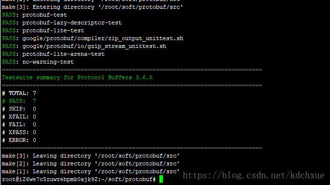
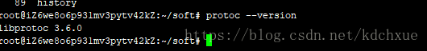

# protobuf简单介绍和ubuntu 16.04环境下安装

## protobuf简单介绍

> ​    protobuf是谷歌的开源序列化协议框架，结构类似于XML，JSON这种，显著的特点是二进制的，效率高，主要用于通信协议和数据存储等方面，算是一种结构化数据的表示方法。

### protobuf的优点

- 大家都在用，起码‘装逼’的都在用【咱要跟上时代】
- 别人说性能好，二进制格式【大项目不用这个，感觉丢人】
- 跨平台支持各种语言，前后兼容好强大【毕竟人家谷歌在用了】

### protobuf的缺点

- 二进制格式，一般人看不了
- 缺乏自我描述
  xml是自我描述的，但是protobuf格式不是的，给你一段二进制文件，你看不出来作用

### protobuf使用步骤

1. 定义自己的数据结构格式（.pro）源文件
2. 利用protobuf提供的编译器编译源文件
3. 利用protobuf go的api读写信息

比如定义一个结构化数据person,包含name和email属性

**xml中这样定义**

```xml
<person>
  <name>zhangsan</name>
  <email>zhangsan@qq.com</email>
<person>
```

**protobuf这样定义**

```protobuf
person{
    name:"zhangsan"
    email:"zhangsan@qq.com"
}
```

**json中这样定义**

```json
{
    "person":{
        "name":"zhangsan",
        "email":"zhangsan@qq.com"
    }
}
```

### protobuf的语法

具体可以参考：https://segmentfault.com/a/1190000007917576

- **Message定义**
  一个message类型定义一个请求或相应的消息格式，可以包含多种类型
- **Service服务**
  如果需要将消息类型用在rpc上面，那就需要在.proto文件定义一个rpc服务接口，protocol buffer编译器会根据所选择的不同语言生成服务接口代码。

### protobuf 在ubuntu下的安装

官方地址：https://github.com/google/protobuf/blob/master/src/README.md

**安装命令行如下：**

```shell
sudo apt-get install autoconf automake libtool curl make g++ unzip
git clone https://github.com/google/protobuf.git
cd protobuf
git submodule update --init --recursive
./autogen.sh
./configure
make
make check
sudo make install
sudo ldconfig # refresh shared library cache.
```

**make之后的截图**



**中途编译一路顺风，没有遇到什么问题，下面查看下版本吧**

```shell
protoc --version
```


