## 咋办，死锁了

在面试过程中，死锁也是高频的考点，因为如果线上环境真多发生了死锁，那真的出大事了。

这次，我们就来系统地聊聊死锁的问题。

* 死锁的概念；
* 模拟死锁问题的产生；
* 利用工具排查死锁问题；
* 避免死锁问题的发生；

### 死锁的概念

在多线程编程中，我们为了防止多线程竞争共享资源而导致数据错乱，都会在操作共享资源之前加上互斥锁，只有成功获得到锁的线程，才能操作共享资源，获取不到锁的线程就只能等待，直到锁被释放。

那么，当两个线程为了保护两个不同的共享资源而使用了两个互斥锁，那么这两个互斥锁应用不当的时候，可能会造成**两个线程都在等待对方释放锁**，在没有外力的作用下，这些线程会一直相互等待，就没办法继续运行，这种情况就是发生了**死锁**。

举个例子，小林拿了小美房间的钥匙，而小林在自己的房间里，小美拿了小林房间的钥匙，而小美也在自己的房间里。如果小林要从自己的房间里出去，必须拿到小美手中的钥匙，但是小美要出去，又必须拿到小林手中的钥匙，这就形成了死锁。

死锁只有**同时满足**以下四个条件才会发生：

- 互斥条件；
- 持有并等待条件；
- 不可剥夺条件；
- 环路等待条件；

##### 互斥条件

互斥条件是指**多个线程不能同时使用同一个资源**。

比如下图，如果线程 A 已经持有的资源，不能再同时被线程 B 持有，如果线程 B 请求获取线程 A 已经占用的资源，那线程 B 只能等待，直到线程 A 释放了资源。

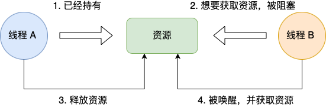

##### 持有并等待条件

持有并等待条件是指，当线程 A 已经持有了资源 1，又想申请资源 2，而资源 2 已经被线程 C 持有了，所以线程  A 就会处于等待状态，但是**线程  A 在等待资源 2 的同时并不会释放自己已经持有的资源 1**。

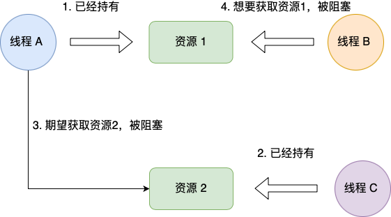

##### 不可剥夺条件

不可剥夺条件是指，当线程已经持有了资源 ，**在自己使用完之前不能被其他线程获取**，线程 B 如果也想使用此资源，则只能在线程 A 使用完并释放后才能获取。

##### 环路等待条件

环路等待条件指都是，在死锁发生的时候，**两个线程获取资源的顺序构成了环形链**。

比如，线程 A 已经持有资源 2，而想请求资源 1， 线程 B 已经获取了资源 1，而想请求资源 2，这就形成资源请求等待的环形图。

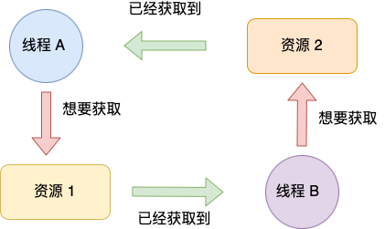

### 模拟死锁问题的产生

Talk is cheap. Show me the code.

下面，我们用代码来模拟死锁问题的产生。

首先，我们先创建 2 个线程，分别为线程 A 和 线程 B，然后有两个互斥锁，分别是 mutex_A 和 mutex_B，代码如下：

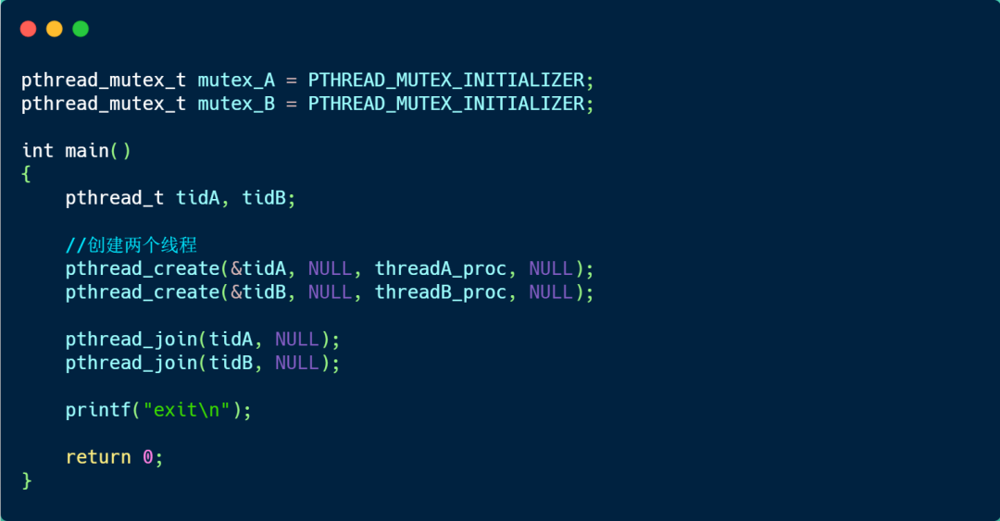

接下来，我们看下线程 A 函数做了什么。

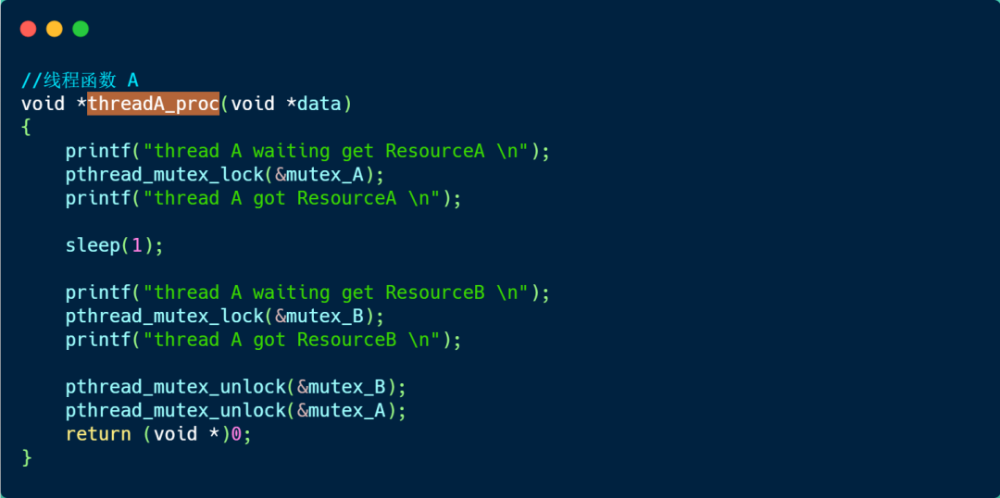

可以看到，线程 A 函数的过程：

- 先获取互斥锁 A，然后睡眠 1 秒；
- 再获取互斥锁 B，然后释放互斥锁 B；
- 最后释放互斥锁 A；

然后，我们看看线程 B。

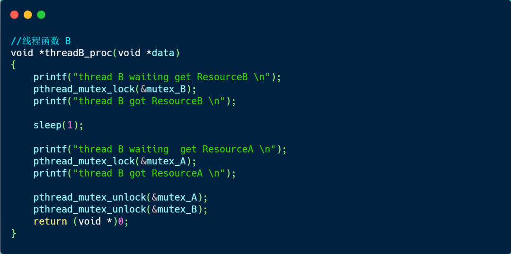

可以看到，线程 B 函数的过程：

- 先获取互斥锁 B，然后睡眠 1 秒；
- 再获取互斥锁 A，然后释放互斥锁 A；
- 最后释放互斥锁 B；

然后，我们运行这个程序，运行结果如下：

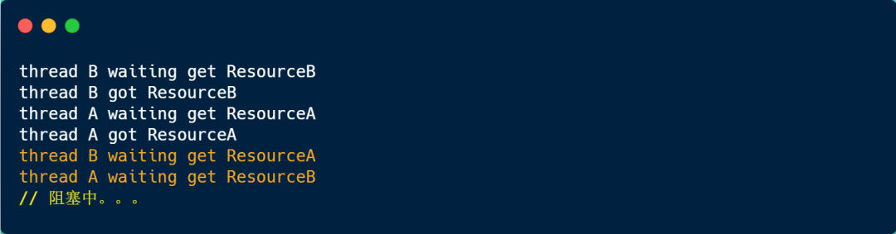

可以看到线程 B 在等待互斥锁 A 的释放，线程 A 在等待互斥锁 B 的释放，双方都在等待对方资源的释放，很明显，产生了死锁问题。

### 利用工具排查死锁问题

如果你想排查你的 Java 程序是否死锁，则可以使用 `jstack` 工具，它是 jdk 自带的线程堆栈分析工具。

由于小林的死锁代码例子是 C 写的，在 Linux 下，我们可以使用 `pstack` + `gdb` 工具来定位死锁问题。

pstack 命令可以显示每个线程的栈跟踪信息（函数调用过程），它的使用方式也很简单，只需要 `pstack <pid>` 就可以了。

那么，在定位死锁问题时，我们可以多次执行 pstack 命令查看线程的函数调用过程，多次对比结果，确认哪几个线程一直没有变化，且是因为在等待锁，那么大概率是由于死锁问题导致的。

我用 pstack 输出了我前面模拟死锁问题的进程的所有线程的情况，我多次执行命令后，其结果都一样，如下：

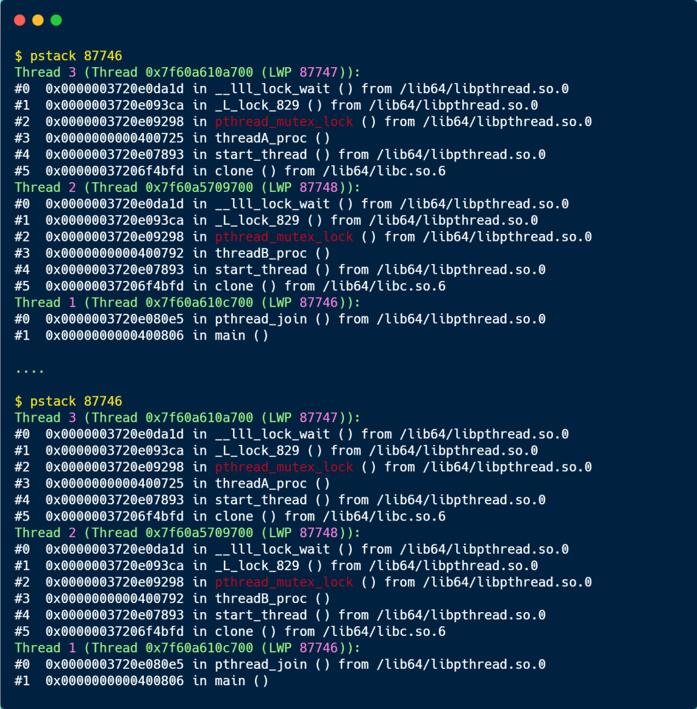

可以看到，Thread 2 和 Thread 3 一直阻塞获取锁（*pthread_mutex_lock*）的过程，而且 pstack 多次输出信息都没有变化，那么可能大概率发生了死锁。

但是，还不能够确认这两个线程是在互相等待对方的锁的释放，因为我们看不到它们是等在哪个锁对象，于是我们可以使用 gdb 工具进一步确认。

整个 gdb 调试过程，如下：

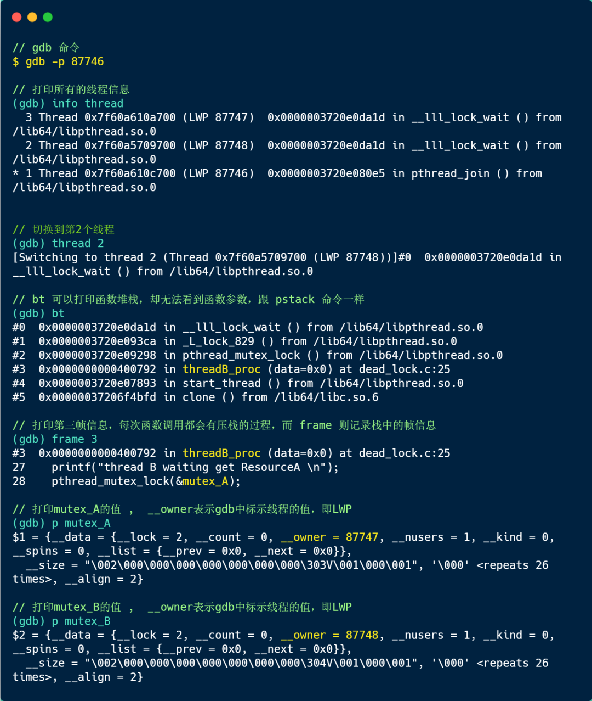

我来解释下，上面的调试过程：

1. 通过 `info thread` 打印了所有的线程信息，可以看到有 3 个线程，一个是主线程（LWP 87746），另外两个都是我们自己创建的线程（LWP 87747 和 87748）；
2. 通过 `thread 2`，将切换到第 2 个线程（LWP 87748）；
3. 通过 `bt`，打印线程的调用栈信息，可以看到有 threadB_proc 函数，说明这个是线程 B 函数，也就说 LWP 87748 是线程 B;
4. 通过 `frame 3`，打印调用栈中的第三个帧的信息，可以看到线程 B 函数，在获取互斥锁 A 的时候阻塞了；
5. 通过 `p mutex_A`，打印互斥锁 A 对象信息，可以看到它被 LWP 为 87747（线程 A） 的线程持有着；
6. 通过 `p mutex_B`，打印互斥锁 A 对象信息，可以看到他被 LWP 为 87748 （线程 B） 的线程持有着；

因为线程 B 在等待线程 A 所持有的 mutex_A, 而同时线程 A 又在等待线程 B 所拥有的mutex_B, 所以可以断定该程序发生了死锁。

### 避免死锁问题的发生

前面我们提到，产生死锁的四个必要条件是：互斥条件、持有并等待条件、不可剥夺条件、环路等待条件。

那么避免死锁问题就只需要破环其中一个条件就可以，最常见的并且可行的就是**使用资源有序分配法，来破环环路等待条件**。

那什么是资源有序分配法呢？

线程 A 和 线程 B 获取资源的顺序要一样，当线程 A 是先尝试获取资源 A，然后尝试获取资源  B 的时候，线程 B 同样也是先尝试获取资源 A，然后尝试获取资源 B。也就是说，线程 A 和 线程 B 总是以相同的顺序申请自己想要的资源。

我们使用资源有序分配法的方式来修改前面发生死锁的代码，我们可以不改动线程 A 的代码。

我们先要清楚线程 A 获取资源的顺序，它是先获取互斥锁 A，然后获取互斥锁 B。

所以我们只需将线程 B 改成以相同顺序的获取资源，就可以打破死锁了。

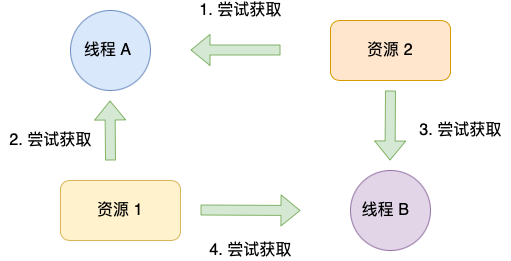

线程 B 函数改进后的代码如下：

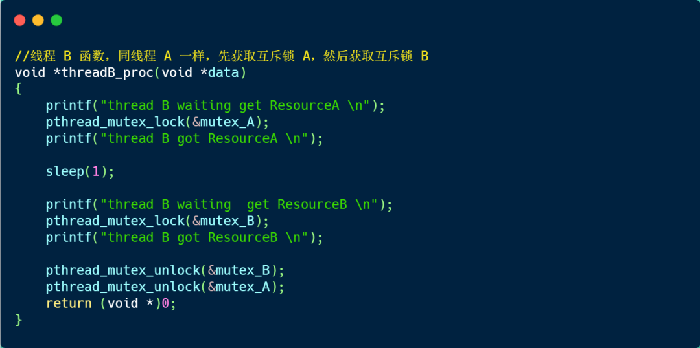

执行结果如下，可以看，没有发生死锁。

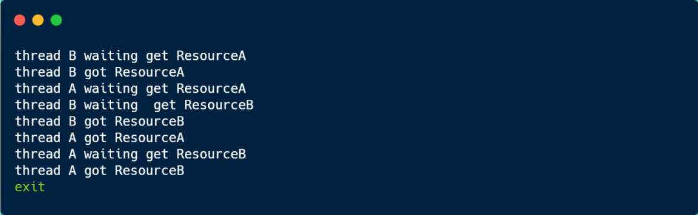

### 总结

简单来说，死锁问题的产生是由两个或者以上线程并行执行的时候，争夺资源而互相等待造成的。

死锁只有同时满足互斥、持有并等待、不可剥夺、环路等待这四个条件的时候才会发生。

所以要避免死锁问题，就是要破坏其中一个条件即可，最常用的方法就是使用资源有序分配法来破坏环路等待条件。
