## **垃圾回收概念**

程序创建对象等引用类型实体时会在虚拟内存中分配给它们一块内存空间，如果该内存空间不再被任何引用变量引用时就成为需要被回收的垃圾。操作系统会记录一个进程运行时的所占用的内存、CPU和寄存器等资源，当进程结束后便由操作系统能够自动回收资源。但是对于一个运行较长时间的程序，如果使用完内存资源后没有及时释放就会造成内存泄漏甚至系统错误。

以不支持自动垃圾回收的`C++`为例：

```cpp
void foo()
{
  char *p = new char[128];
  // 对指针的使用
  delete[] p; // delete语句释放对象数组
}
```

如果由于异常或者其他原因导致`delete`语句没有正常执行，且该函数被频繁调用，那么很容易占用所有系统内存从而导致程序崩溃，如果泄漏的是系统资源的话甚至还会导致系统崩溃。另一方面如果我们在不该释放内存的时候释放内存，那么仍然在使用这块内存的指针就会变成野指针`wild pointer`，使用该指针对内存进行读写是未定义的行为。

由于`C++`支持比较强大的指针计算功能，因此在`C++`中引入自动垃圾回收是一件比较困难的事情：

```cpp
int *p = new int;
p += 10; // 指针偏移, 原来p指向的内存不再被引用
// 原来p指向的内存可能被回收
p -= 10; // 偏移为指针p初始指向的位置
*p = 10; // 如果p指向的内存被回收的话, 那么这里就会出现野指针的问题

```

由于`Golang`没有`C++`这种对指针偏移的操作，因此可以在语言层面包含自动的垃圾回收功能，系统可以在`CPU`相对空闲的时候进行垃圾回收。

### **1. 垃圾回收过程**

用户程序`Mutator`通过内存分配器`Allocator`在堆`Heap`上申请内存，垃圾回收器`Collector`会定时清理堆上的内存。内存分配器如何申请内存我们已经在前面`Golang`内存管理介绍过了，本篇主要介绍的是垃圾回收器如何清理内存。


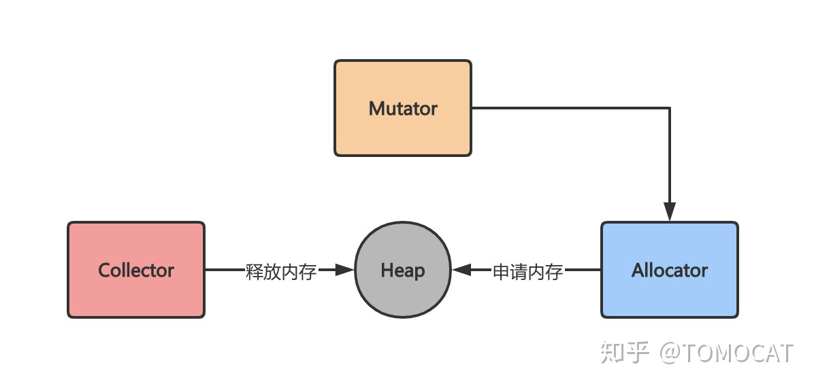


### **2. 自动垃圾回收与手动垃圾回收**

`C`语言这种较为传统的语言通过`malloc`和`free`手动向操作系统申请和释放内存，这种自由管理内存的方式给予程序员极大的自由度，但是也相应地提高了对程序员的要求。`C`语言的内存分配和回收方式主要包括三种：

- 函数体内的局部变量：在栈上创建，函数作用域结束后自动释放内存
- 静态变量：在静态存储区域上分配内存，整个程序运行结束后释放（全局生命周期）
- 动态分配内存的变量：在堆上分配，通过`malloc`申请，`free`释放

`C`、`C++`和`Rust`等较早的语言采用的是手动垃圾回收，需要程序员通过向操作系统申请和释放内存来手动管理内存，程序员极容易忘记释放自己申请的内存，对于一个长期运行的程序往往是一个致命的缺点。`Python`、`Java`和`Golang`等较新的语言采取的都是自动垃圾回收方式，程序员只需要负责申请内存，垃圾回收器会周期性释放结束生命周期的变量所占用的内存空间。

### **3. 垃圾回收目标**

垃圾回收器主要包括三个目标：

- 无内存泄漏：垃圾回收器最基本的目标就是减少防止程序员未及时释放导致的内存泄漏，垃圾回收器会识别并清理内存中的垃圾
- 自动回收无用内存：垃圾回收器作为独立的子任务，不需要程序员显式调用即可自动清理内存垃圾
- 内存整理：如果只是简单回收无用内存，那么堆上的内存空间会存在较多碎片而无法满足分配较大对象的需求，因此垃圾回收器需要重整内存空间，提高内存利用率


## **垃圾回收的常见方法**

> 根据判断对象是否存活的方法，可以简单将`GC`算法分为“引用计数式”垃圾回收和“追踪回收式”垃圾回收。前者根据每个对象的引用计数器是否为`0`来判断该对象是否为未引用的垃圾对象，后者先判断哪些对象存活，然后将其余的所有对象作为垃圾进行回收。追踪回收本身包括标记-清除`Mark-Sweep`、标记-复制`Mark-Copy`和标记-整理`Mark-Compact`三种回收算法。

### **1. 引用计数**

引用计数`Reference counting`会为每个对象维护一个计数器，当该对象被其他对象引用时加一，引用失效时减一，当引用次数归零后即可回收对象。使用这类`GC`方法的语言包括`python`、`php`、`objective-C`和`C++`标准库中的`std::shared_ptr`等。

以`python`为例，`python`中的每个对象都包含如下结构：

```c
typedef struct_object {
    int ob_refcnt;
    struct_typeobject *ob_type;
}PyObject;
```

其中`ob_refcnt`为引用计数器，当一个对象有新的引用时计数器增一，当引用它的对象被删除时计数器减一。

引用计数法优点包括：

- 原理和实现都比较简单
- 回收的即时性：当对象的引用计数为`0`时立即回收，不像其他`GC`机制需要等待特定时机再回收，提高了内存的利用率
- 不需要暂停应用即可完成回收

缺点包括：

- 无法解决循环引用的回收问题：当`ObjA`引用了`ObjB`，`ObjB`也引用`ObjA`时，这两个对象的引用次数使用大于`0`，从而占用的内存无法被回收
- 时间和空间成本较高：一方面是因为每个对象需要额外的空间存储引用计数器变量，另一方面是在栈上的赋值时修改引用次数时间成本较高（原本只需要修改寄存器中的值，现在计数器需要不断更新因此不是只读的，需要额外的原子操作来保证线程安全）
- 引用计数是一种摊销算法，会将内存的回收分摊到整个程序的运行过程，但是当销毁一个很大的树形结构时无法保证响应时间

### **2. 追踪基础：可达性分析算法**

尽管前面提到的三种追踪式垃圾回收算法实现起来各不相同，但是第一步都是通过可达性分析算法标记`Mark`对象是否“可达”。一般可到达的对象主要包括两类：

- `GC Root`对象：包括全局对象、栈上的对象（函数参数与内部变量）
- 与`GC Root`对象通过引用链`Reference Chain`相连的对象

对于“不可达”的对象，我们可以认为该对象为垃圾对象并回收对应的内存空间。


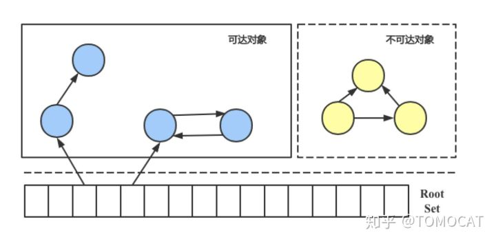


可达性算法中判断对象是否“可达”依赖于“引用”的定义，`java`中的引用从强到弱可分为四类，不同的引用类型可以满足多样化的场景：

- 强引用`Strong Reference`：使用`Object obj = new Object()`定义的引用，这类对象无论在什么情况下都不会被垃圾回收机制清理掉
- 软引用`Soft Reference`：用于描述有用但非必需的对象，只有在内存不足的时候才会回收该对象，适合实现内存敏感的高速缓存（网页缓存和图片缓存等）；软引用可以和引用队列`ReferenceQueue`一起使用，当软引用所引用的对象被回收时`JVM`会把这个软引用加入到与之关联的引用队列，`GC`线程会在抛出`OOM`错误前根据引用队列来回收长时间闲置不用的软引用对象
- 弱引用`Weak Reference`：用于描述非必需对象，在`JVM`进行垃圾回收时会直接回收被弱引用关联的对象，同软引用相比有更短的生命周期
- 虚引用`Phantom Reference`：一个对象与虚引用关联时在任何时候都可以被垃圾回收器回收，因此并不会影响该对象的生命周期，主要用于跟踪对象被`GC`回收的活动；虚引用必须和引用队列联合使用，当回收一个对象时如果发现它还有虚引用，就会在回收对象的内存之前将这个虚引用加入到与之关联的引用队列中，这样程序可以通过判断引用队列是否加入虚引用来判断被引用的对象是否将进行垃圾回收

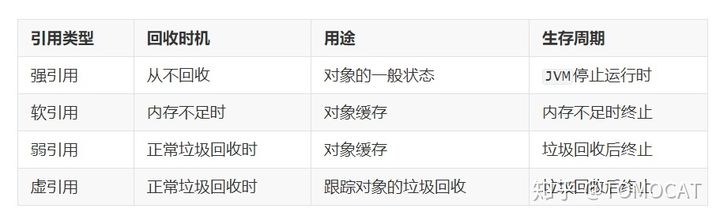

同引用计数法相比，追踪式算法具有如下优点：

- 解决了循环引用对象的回收问题
- 占用空间更少

缺点包括：

- 同引用计数相比无法立刻识别出垃圾对象，需要依赖`GC`线程
- 算法在标记时必须暂停整个程序，即`Stop The World, STW`，否则其他线程的代码会修改对象状态从而回收不该回收的对象

### **3. 标记-清除算法**

标记-清除`Mark-Sweep`算法是最基础的追踪式算法，分为“标记”和“清除”两个步骤：

- 标记：记录需要回收的垃圾对象
- 清除：在标记完成后回收垃圾对象的内存空间


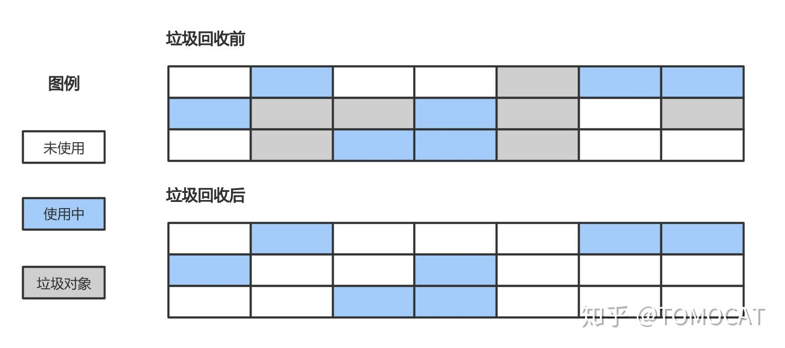


优点包括：

- 算法吞吐量较高，即运行用户代码时间 / （运行用户代码时间 + 运行垃圾收集时间）较高
- 空间利用率高：同标记-复制相比不需要额外空间复制对象，也不需要像引用计数算法为每个对象设置引用计数器

缺点包括：

- 清除后会产生大量的内存碎片空间，导致程序在运行时可能没法为较大的对象分配内存空间，导致提前进行下一次垃圾回收

### **4. 标记-复制算法**

标记-复制`Mark-Copy`算法将内存分成大小相同的两块，当某一块的内存使用完了之后就将使用中的对象挨个复制到另一块内存中，最后将当前内存恢复未使用的状态。


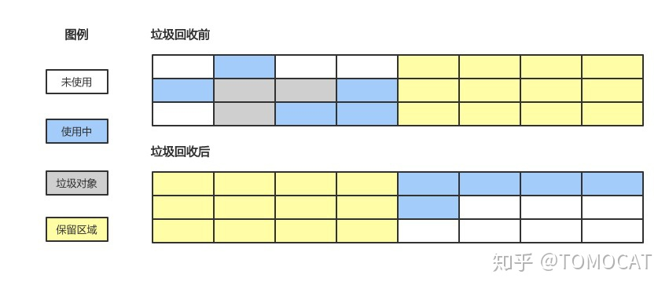


优点包括：

- 标记-清除法需要在清除阶段对大量垃圾对象进行扫描，标记-复制则只需要从`GC Root`对象出发，将“可到达”的对象复制到另一块内存后直接清理当前这块的内存，因此提升了垃圾回收的效率
- 解决了内存碎片化的问题，防止分配较大连续空间时的提前`GC`问题

缺点包括：

- 同标记-清除法相比，在“可达”对象占比较高的情况下有复制对象的开销
- 内存利用率较低，相当于可利用的内存仅有一半

### **5. 标记-整理算法**

标记-整理`Mark-Compact`算法综合了标记-清除法和标记-复制法的优势，既不会产生内存碎片化的问题，也不会有一半内存空间浪费的问题。该方法首先标记出所有“可达”的对象，然后将存活的对象移动到内存空间的一端，最后清理掉端边界以外的内存。


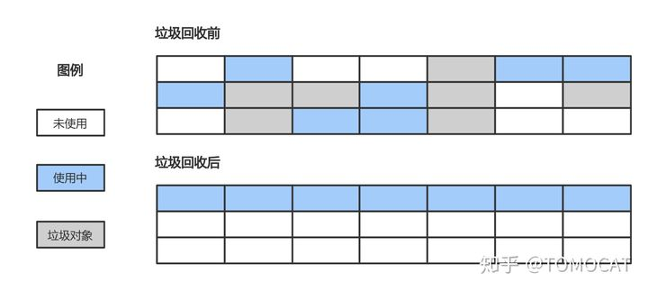


优点包括：

- 避免了内存碎片化的问题
- 在对象存活率较高的情况下，标记-整理算法由于不需要复制对象效率更高，因此更加适合老年代算法

缺点包括：

- 整理过程较为复杂，需要多次遍历内存导致`STW`时间比标记-清除算法更长

### **6. 三色标记法**

前面提到的“标记”类算法都有一个共同的瑕疵，即在进行垃圾回收的时候会暂停整个程序（`STW`问题）。三色标记法是对“标记”阶段的改进，在不暂停程序的情况下即可完成对象的可达性分析。`GC`线程将所有对象分为三类：

- 白色：未搜索的对象，在回收周期开始时所有对象都是白色，在回收周期结束时所有的白色都是垃圾对象
- 灰色：正在搜索的对象，但是对象身上还有一个或多个引用没有扫描
- 黑色：已搜索完的对象，所有的引用已经被扫描完

三色标记法属于增量式`GC`算法，回收器首先将所有的对象着色成白色，然后从`GC Root`出发，逐步把所有“可达”的对象变成灰色再到黑色，最终所有的白色对象即是“不可达”对象。

具体的实现如下：

- 初始时所有对象都是白色对象
- 从`GC Root`对象出发，扫描所有可达对象并标记为灰色，放入待处理队列
- 从队列取出一个灰色对象并标记为黑色，将其引用对象标记为灰色放入队列
- 重复上一步骤，直到灰色对象队列为空
- 此时所有剩下的白色对象就是垃圾对象

优点：

- 不需要暂停整个程序进行垃圾回收

缺点：

- 如果程序垃圾对象的产生速度大于垃圾对象的回收速度时，可能导致程序中的垃圾对象越来越多而无法及时收集
- 线程切换和上下文转换的消耗会使得垃圾回收的总体成本上升，从而降低系统吞吐量

## **读写屏障技术**

### **1. 三色标记法的并发性问题**

假设三色标记法执行前，包含如下对象：


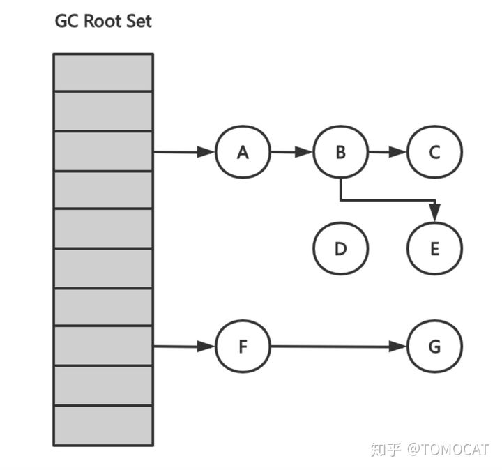


则三色标记法的具体执行过程如下：


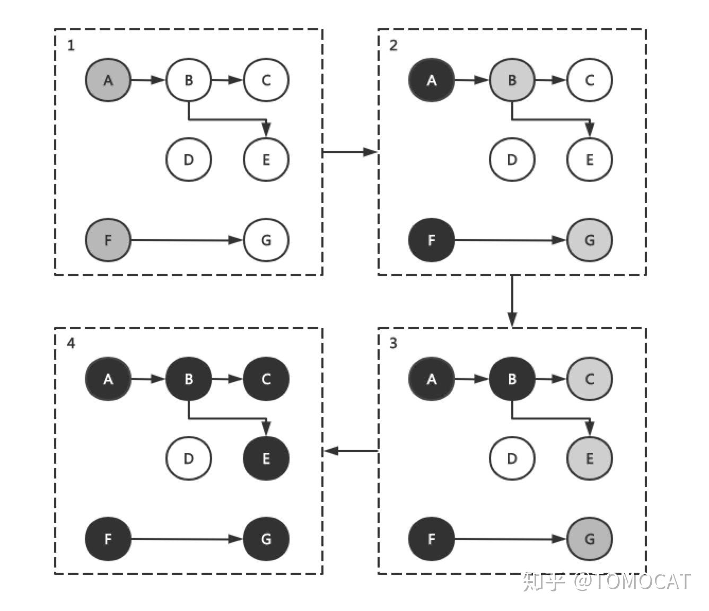


上述三色标记执行过后堆内存中白色对象（只有`D`）会被当做垃圾对象清理掉，如果用户在标记执行过程中建立了从`A`对象到`D`对象的引用，那么会导致后续对`D`的访问出错。这种没有指向合法地址的指针一般被称为“野指针”，会造成严重的程序错误。


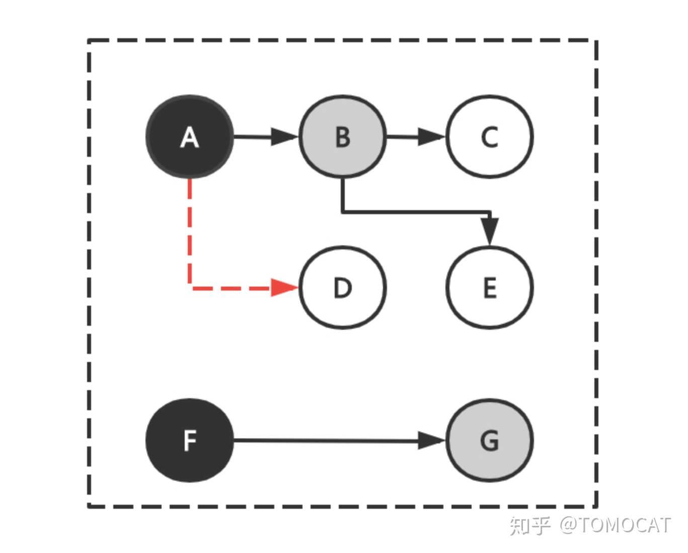


### **2. 并发问题原因及解决思路**

假设三色标记法和用户程序并发执行，那么下列两个条件**同时满足**就可能出现错误回收非垃圾对象的问题：

- 条件1：某一黑色对象引用白色对象
- 条件2：对于某个白色对象，所有和它存在可达关系的灰色对象丢失了访问它的可达路径

简单证明一下：如果条件1不满足，那么任何不该被回收的白色对象都能和至少一个灰色对象存在“可达”路径，因此不会有白色对象被遗漏；如果条件2不满足，那么对于某一个白色对象，即使它被黑色对象引用，但至少存在一个和它存在可达关系的灰色对象，因此这个白色对象也不会被回收。

> 一句话总结即是：在三色标记法执行的某个特定时机，只要存在未经访问的能够到达白色对象的可达路径，就可以令黑色对象引用白色对象，反正该白色对象在后面标记中会被识别为“可达”对象从而不会被错误回收。

一种最简单解决三色标记并发问题的方法是停止所有的赋值器线程，保证标记过程不受干扰，即垃圾回收器中常提到的`STW, stop the world`方法。另外一种思路就是使用赋值器屏障技术使得赋值器在进行指针写操作时同步垃圾回收器，保证不破坏弱三色不变性（见下文）。

### **3. 读写屏障技术**

> 屏障技术：给代码操作内存的顺序添加一些限制，即在内存屏障前执行的动作必须先于在你内存屏障后执行的动作。

使用屏障技术可以使得用户程序和三色标记过程并发执行，我们只需要达成下列任意一种三色不变性：

- 强三色不变性：黑色对象永远不会指向白色对象
- 弱三色不变性：黑色对象指向的白色对象至少包含一条由灰色对象经过白色对象的可达路径

`GC`中使用的内存读写屏障技术指的是编译器会在编译期间生成一段代码，该代码在运行期间用户读取、创建或更新对象指针时会拦截内存读写操作，相当于一个`hook`调用，根据`hook`时机不同可分为不同的屏障技术。由于读屏障`Read barrier`技术需要在读操作中插入代码片段从而影响用户程序性能，所以一般使用写屏障技术来保证三色标记的稳健性。

> 我们讲内存屏障技术解决了三色标记法的`STW`缺点，并不是指消除了所有的赋值器挂起问题。需要分清楚`STW`方法是全局性的赋值器挂起而内存屏障技术是局部的赋值器挂起。


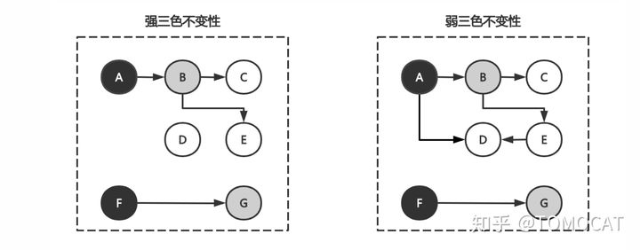


### **4. Dijkstra插入写屏障**

`Dijkstra`插入写屏障避免了前面提到的条件1，即防止黑色对象指向白色对象。

```text
// 添加下游对象的函数, 当前下游对象slot, 新下游对象ptr
func DijkstraWritePointer(slot *unsafe.Pointer, ptr unsafe.Pointer) {
    // 1) 将新下游对象标记为灰色
    shade(ptr)
    // 2) 当前下游对象slot = 新下游对象ptr
    *slot = ptr
}

// 场景一：A之前没有下游, 新添加一个下游对象B, B被标记为灰色
A.DijkstraWritePointer(nil, B)
// 场景二：A将下游对象C更换为B, B被标记为灰色
A.DijkstraWritePointer(C, B)
```

一个对象可以存储在内存中的“栈”或者“堆”，由于“栈”空间容量小且要求相应速度较高，因此“插入写屏障”不适合用于“栈”空间。在“插入写屏障”保护下的三色标记法执行例子如下：


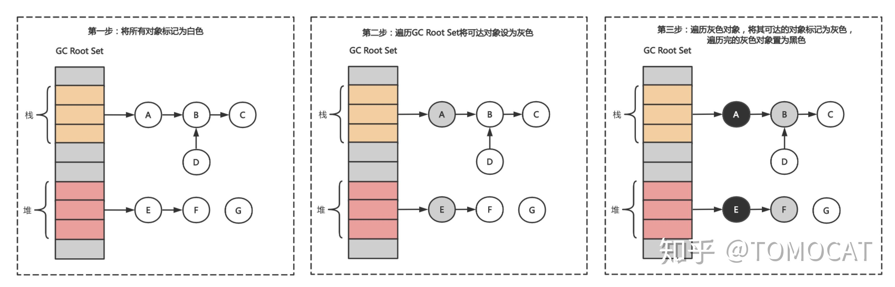


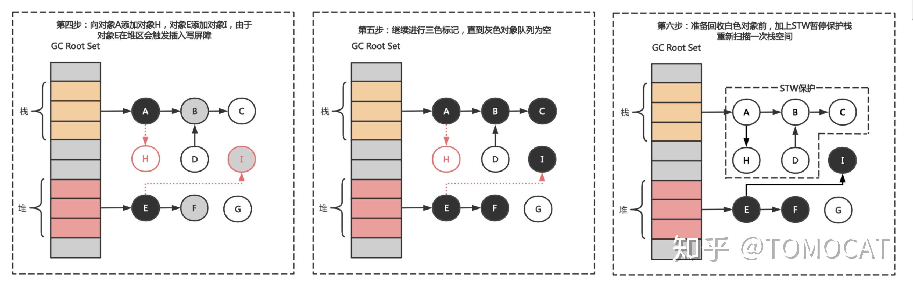


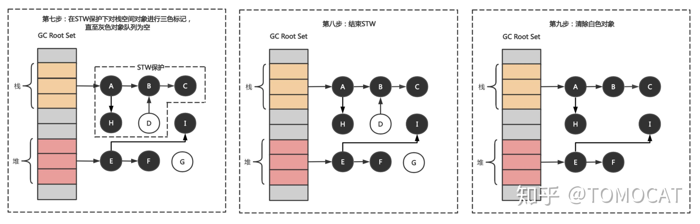


- 第一步：垃圾回收之前将所有的对象标记为白色
- 第二步：遍历`GC Root Set`，将可达对象标记为灰色
- 第三步：遍历灰色对象列表，将可达的对象从白色标记为灰色；将遍历完的灰色对象标记为黑色
- 第四步：在三色标记过程中用户程序令栈区对象A指向对象H，令堆区对象E指向对象I，由于对象E在堆区从而触发插入写屏障并将黑色对象E指向的白色对象I标记为灰色，栈区对象A不触发
- 第五步：继续三色标记直至灰色对象队列为空
- 第六步：由于栈区对象没有启动插入写屏障，因此栈上可能存在白色对象被引用的情况（上图中对应对象H），因此在回收白色对象前在`STW`保护下重新扫描一次栈空间
- 第七步：在`STW`保护下对栈空间一次性进行三色标记，直到灰色对象队列为空
- 第八步：结束`STW`
- 第九步：最后将栈空间和堆空间的白色垃圾对象进行回收

尽管`Dijkstra`插入写屏障可以实现垃圾回收和用户程序的并发执行，但是它存在两个缺点。一方面它是一种比较保守的垃圾回收方法，把有可能存活的对象都标记成灰色了以满足“强三色不变性”。以下图为例，用户程序`Mutator`将对象A原本指向B对象的指针改成指向C对象，尽管在修改后B对象已经是一个垃圾对象，但是它在本轮垃圾回收过程中不会被回收。


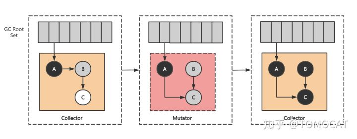


另外一个缺点在于栈上的对象也是根对象，`Dijkstra`插入写屏障要么在用户程序执行内存写操作时为栈上对象插入写屏障，要么在一轮三色标记完成后使用`STW`重新对栈上的对象进行三色标记。前者会降低栈空间的响应速度，后者会暂停用户程序。

### **5. Yuasa删除写屏障**

`Yuasa`删除写屏障避免了前面提到的条件2，防止丢失灰色对象到白色对象的可达路径。当用户程序执行`*slot = ptr`时（即令`slot`指向了`ptr`），我们会将当前下游对象`*slot`标记为灰色。一句话解释就是当删除对象`A`指向对象`B`的指针时，那么将被删除的对象标记为灰色。

```text
// 添加下游对象的函数, 当前下游对象slot, 新下游对象ptr
func YuasaWritePointer(slot *unsafe.Pointer, ptr unsafe.Pointer) {
    // 1) 将当前下游对象标记为灰色
    shade(*slot)
    // 2) 当前下游对象slot = 新下游对象ptr
    *slot = ptr
}

// 场景一：B被A删除, 将B标记为灰色
A.添加下游对象(B, nil)
// 场景二：B被A删除, 将B标记为灰色
A.添加下游对象(B, C)
```


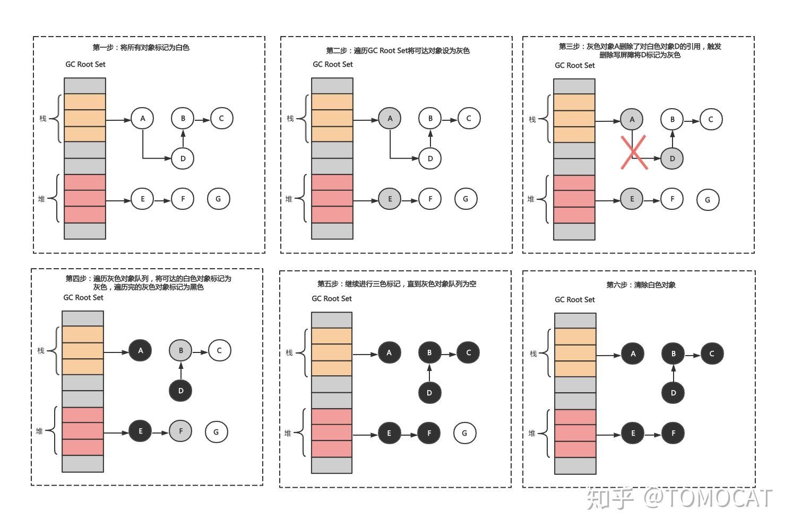


- 第一步：将所有对象标记为白色
- 第二步：遍历`GC Root Set`将可达对象设为灰色
- 第三步：如果用户程序令灰色对象`A`删除了对白色对象`D`的引用，如果这时候不触发删除写屏障，那么对象`D`、`B`和`C`直到本轮垃圾回收结束都会是白色对象。因此需要触发删除写屏障，将对象`D`标记为灰色。
- 第四步：遍历灰色对象队列，将可达的白色对象标记为灰色，遍历完的灰色对象标记为黑色
- 第五步：继续进行三色标记，直到灰色对象队列为空
- 第六步：清除所有的白色对象

下图简单绘制了`Yuasa`删除写屏障是如何保证用户程序`Mutator`和垃圾回收器`Collector`的并发执行的：

- 第二步中`Mutator`将对象`A`原本指向对象`B`的指针指向`C`，由于对象`B`本身就是灰色的，因此不需要对它重新着色
- 第三步中`Mutator`删除了对象`B`指向对象`C`的指针，删除写屏障将下游对象`C`标记为灰色


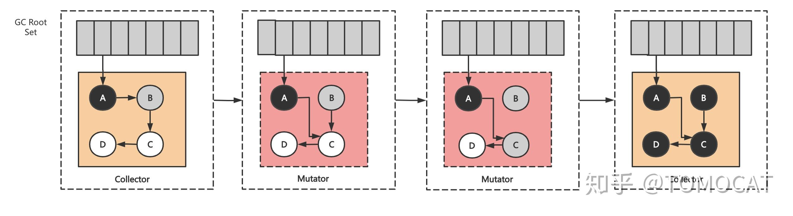


`Yuasa`删除写屏障和`Dijkstra`插入写屏障相比优点在于不需要在一轮三色标记后对栈空间上的对象进行重新扫描，缺点在于`Collector`会悲观地认为所有被删除的对象都可能被黑色对象引用，比如上图中第三步`Mutator`删除了对象`B`指向对象`C`的指针，如果此时还有一个单独的对象`E`指向`C`，那么本该被删除的对象`E`却可以在本轮垃圾回收中存活。

### **6. 混合写屏障**

### **6.1 引入混合写屏障的原因**

在`go v1.8`引入混合写屏障`hybrid write barrier`之前，由于`GC Root`对象包括了栈对象，如果运行时在所有`GC Root`对象上开启插入写屏障意味着需要在数量庞大的`Goroutine`的栈上都开启`Dijkstra`写屏障从而严重影响用户程序的性能。之前的做法是`Mark`阶段（`golang`垃圾回收使用的是标记-清除法）结束后暂停整个程序，对栈上对象重新进行三色标记法。

> 如果`Goroutine`较多的话，对栈对象`re-scan`这一步需要耗费`10~100 ms`。

回顾一下之前提到的两种写屏障的劣势：

- `Dijkstra`插入写屏障：一轮标记结束后需要`STW`重新扫描栈上对象
- `Yuasa`删除写屏障：回收精度低，在垃圾回收开始前使用`STW`扫描所有`GC Root`对象形成初始快照，用户程序`Mutator`从灰色/白色对象中删除白色指针时会将下游对象标记为灰色，相当于保护了所有初始快照中的白色对象不被删除

### **6.2 混合写屏障的实现**

```text
// 添加下游对象的函数, 当前下游对象slot, 新下游对象ptr
func HybridWritePointerSimple(slot *unsafe.Pointer, ptr unsafe.Pointer) {
    // 1) 将被删除的下游对象标记为灰色
    shade(*slot)
    // 2) 将新下游对象标记为灰色
    shade(ptr)
    // 3) 当前下游对象slot = 新下游对象ptr
    *slot = ptr
}
```

> 注意：混合写屏障也是仅在堆空间启动的，防止降低栈空间的运行效率

混合写屏障逻辑如下：

- `GC`开始时将栈上所有对象标记为黑色，无须`STW`
- `GC`期间在栈上创建的新对象均标记为黑色
- 将被删除的下游对象标记为灰色
- 将被添加的下游对象标记为灰色

### **6.3 具体场景的实现**

`GC`开始阶段会将所有栈空间可达对象都标记为黑色：


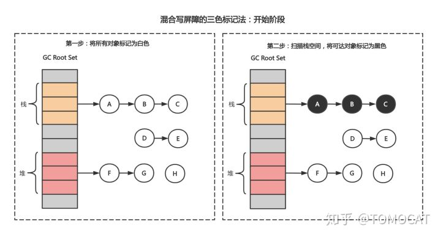


场景一：某个对象从堆对象的下游变成栈对象的下游，这种情况下标记该对象为灰色，该对象就不会被错误地回收


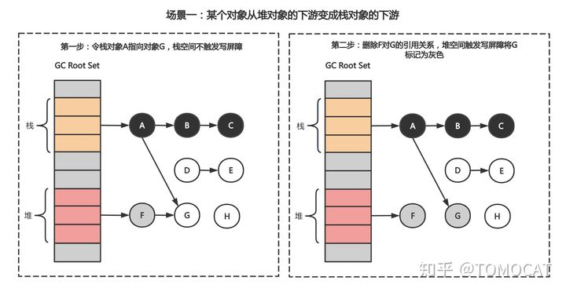


场景二：某个对象从一个栈对象的下游变成另一个对象的下游，由于对象全都在栈空间对象的可达对象中，因此混合写屏障不会对这些对象着色。


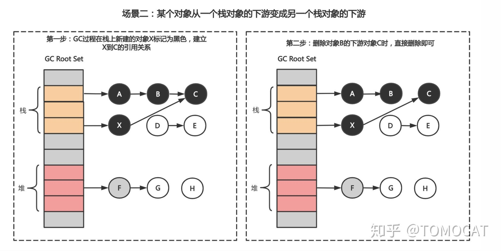


场景三：某个对象从一个堆对象的下游变成另一个堆对象的下游，比如下图中对象G从F的下游移动到Y的下游，为了避免对象`G`被错误回收，我们需要将其标记为灰色


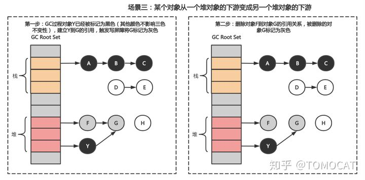


场景四：某个对象从栈对象的下游变成堆对象的下游，对于栈空间对象不触发写屏障，但是对于被删除的堆空间对象`G`需要标记成灰色以保护它和它的下游对象不被错误删除


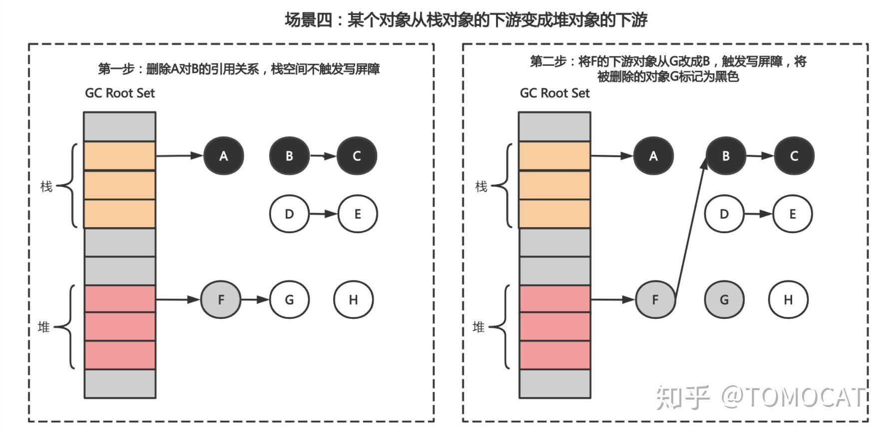


### **8. 分代收集算法**

前面提到追踪式垃圾回收算法一个显著的问题是会频繁扫描生命周期较长的对象，而内存分配存在一个`most object die young`（绝大部分对象的生命周期都很短）的事实，因此有必要将对象按照生命周期的长度划分到堆`heap`上的两个甚至多个区域。对于新生代区域的扫描频率应该高于老年代区域。

### **8.1 分代收集算法的三个假设**

- 弱分代假说：大多数对象的生命周期都很短
- 强分代假说：多轮垃圾回收都没清理掉的对象往往不容易死亡
- 跨代引用假说：跨代引用和同代引用相比仅占一小部分

### **8.2 新生代分区和老年代分区**

分代收集算法会将对象按照生命周期的长短划分到不同的分区。对于生命周期短的新生代区域，每次回收仅需要考虑如何保留少量的存活对象，因此可以采用标记-复制算法完成`GC`；对于生命周期长的老年代区域，可以通过减少垃圾回收的频率来提升效率，同时由于对象存活率高没有额外的空间用于复制，因此一般使用标记-清除算法或者标记-整理算法。

> 分代收集算法首先会根据对象的生命周期将内存划分为`Young`和`Old`两块大区域。由于新生代中的对象生命周期较短（每次回收约`98%`的对象是垃圾对象），再加上新生代采用标记-复制法需要两块内存交替使用，`Young`区为了节省复制算法的内存代价又划分成`Eden`、`Survivor0`和`Survivor1`三个分区（内存分配比例为`8:1:1`）。另外，我们没法保证`Young`区每次回收都仅有`10%`不到的对象存活，因此当`Survivor`区空间不够时需要放到`Old`区，而且大对象需要直接进`Old`区。


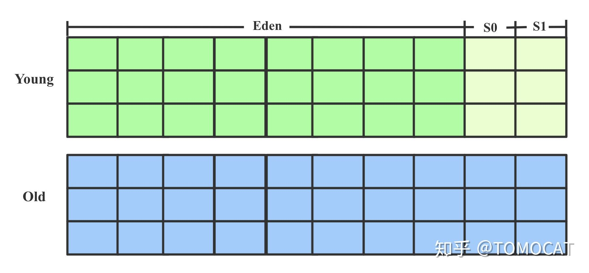


由于堆分为`Young`和`Old`两个分区，因此垃圾回收也根据回收的分区不同划分为新生代回收`Minor GC`和老年代回收`Major GC`。

### **8.3 对象的分配策略**

- 对象优先在`Yonug`上的`Eden`区域分配
- 大对象直接进入`Old`区：主要是因为我们没法保证`Young`区每次回收都仅有`10%`不到的对象存活，因此标记-复制法下`Survivor`难以回收较大的对象
- 新生代中生命周期较长的对象在`Survivor`区每熬过因此`Minor GC`就会增加一岁，年龄增加到一定阈值时就进入老年代

### **8.4 分代算法的大体流程**

假设一开始`Young`和`Old`区都是空的，流程如下：

1. 新分配的对象优先存放在`Eden`区（大对象直接进入`Old`区）
2. `Eden`区满了之后开始进行`Minor GC`，将`Eden`中存活的对象移动到`Survivor0`区，直接清空`Eden`区
3. `Eden`区第二次满了之后进行`Minor GC`，将`Eden`和`Survivor0`中存活的对象复制到`Survivor1`区，清空`Eden`和`Survivor0`区
4. 若干轮`Minor GC`过后，此时新生代中生命周期较长的对象熬过了一定次数的`Minor GC`晋升成老年代移动到`Old`区，某轮`Minor GC`存活率较高`Survivor`区空间不足时也会将存活对象放到`Old`区
5. 当`Old`区满了之后进行`Major GC`

## **增量和并发式垃圾回收**


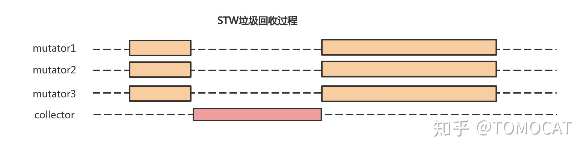


前面提到传统的垃圾回收算法都有`STW`的弊端，即需要在执行垃圾回收过程中需要抢占`CPU`，这会暂停所有的用户程序。这有两个弊端：

- 通常`GC`任务都比较繁重，长时间暂停用户程序会影响程序的响应速度，这对于实时性要求较高的程序是致命的缺点
- 对于多核计算机而言，抢占`CPU`进行垃圾回收会造成计算资源浪费

> 三色标记法结合读写屏障技术使得垃圾回收器`Collector`避免了`STW`，因此后续提到的增量式垃圾回收和并发式垃圾回收都是基于三色标记法和读写屏障技术的。为了保证三色不变性，我们需要在垃圾回收前打开写屏障，在本轮垃圾回收过程中用户所有对内存的写操作都需要被写屏障拦截。

### **1. 增量式垃圾回收**


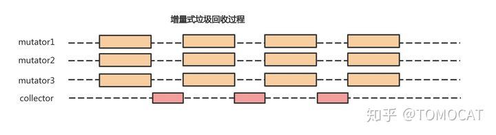


增量式垃圾回收过程图如上所示，同`STW`垃圾回收过程相比：

- 优势：将垃圾回收时间分摊开，避免了程序的长时间暂停，防止影响程序的实时性
- 劣势：一方面引入了内存写屏障技术，需要额外的计算开销；另一方面由于写屏障技术的保守性导致有一些垃圾对象没有被回收，会增加一轮垃圾回收的总时长

### **2. 并发式垃圾回收**


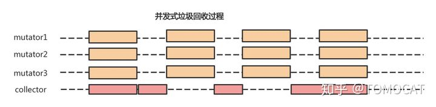


并发式垃圾回收允许垃圾回收器`collector`和用户程序`mutator`同时执行，但仍然有一些阶段需要暂停用户程序。并发式的垃圾回收机制在一定程序上利用了多核计算机的优势并减少了对用户程序的干扰，不过依然无法摆脱读写屏障的额外计算开销和增加一轮垃圾回收总时长的问题。

## **Golang GC如何扫描对象[见Reference14]**

Golang扫描对象可以分为三部分：

- 编译阶段：对静态类型做好标记准备
- 运行阶段：赋值器分配内存时，根据编译阶段的type为对象内存对应的指针设置bitmap
- 扫描阶段：根据指针的bitmap进行扫描

### **1. 编译阶段**

### **1.1 Golang结构体对齐规则**

Golang结构体对齐规则包括两部分：

- 长度对齐
- 地址对齐

### **1.2 长度对齐**

长度对齐指的是结构体的长度至少是内部最长的基础字段的整数倍。比如下面这个结构体内存占用为16个字节，因为TestStruct整体要和内部最长的基础字段ptr（8字节的uintptr类型）对齐。

```go
type TestStruct struct {
  ptr   uintptr  // 8字节
  int1  uint32   // 4字节
  int2  uint8    // 1字节
}
```

### **1.3 地址对齐**

字段的地址偏移是自身长度的整数倍，仍然以TestStruct为例，令第二个元素为1个字节大小：

```go
// 假设new一个TestStruct结构体的地址是x, 则各字段的地址如下
// ptr: a + 0
// int1: a + 8
// int2: a + 8 + 4
type TestStruct struct {
  ptr   uintptr  // 8字节
  int1  uint8    // 1字节
  int2  uint32   // 4字节
}
```

> int1和int2之间填充了一些没使用到的内存空间，进而实现了地址对齐。

### **1.4 指针位标记**

golang的所有类型都对应一个_type结构：

```go
// Needs to be in sync with ../cmd/link/internal/ld/decodesym.go:/^func.commonsize,
// ../cmd/compile/internal/gc/reflect.go:/^func.dcommontype and
// ../reflect/type.go:/^type.rtype.
type _type struct {
    size       uintptr
    ptrdata    uintptr // size of memory prefix holding all pointers
    hash       uint32
    tflag      tflag
    align      uint8
    fieldalign uint8
    kind       uint8
    alg        *typeAlg
    // gcdata stores the GC type data for the garbage collector.
    // If the KindGCProg bit is set in kind, gcdata is a GC program.
    // Otherwise it is a ptrmask bitmap. See mbitmap.go for details.
    gcdata    *byte
    str       nameOff
    ptrToThis typeOff
}
```

比如说我们定义一个struct如下：

```text
type TestStruct struct {
  ptr   uintptr
  int1  uint8
  pint1 *uint8
  int2  uint32
  pint2 *uint64
  int3  uint64
}
```

- size：类型长度，上面这个结构体的长度48个字节
- ptrdata：指针截止的长度位置，由于最后一个指针是`pint2`，因此包含指针的字段截止到40字节的位置
- kind：类型，自定义struct类型的kind为25
- gcdata：byte数组（*byte类型），表示指针的bitmap。比如当gcdata等于20（二进制00010100，从低位到高位就是00101000，其中每个bit表示一个指针大小（8字节）的内存，第3个bit和第5个bit为1表示第三个和第五个字段是指针类型）。

> 第一个类型uintptr在指针的bitmap是不会标记成指针类型的，用这个存储指针是无法保护对象的（扫描的时候uintptr指向的对象不会被扫描）。

### **2. 运行期内存分配**

golang在运行分配完内存后会调用函数`heapBitsSetType`，这个函数及其复杂，但是主要逻辑是根据编译期间对每个struct生成的type结构，用一个bitmap记录下来分配的内存块中哪些位置是指针。

### **3. 运行扫描阶段**

- 扫描阶段从markroot开始，以栈对象、全局变量和寄存器对象作为gc root，创建一个有向引用图并将根对象添加到队列中
- 新起一个异步goroutine执行gcDrain函数，从队列里消费并扫描对象

## **Golang GC**

### **1. Golang GC发展历史**

`Golang`每次改版几乎都伴随着垃圾回收机制的改进，其中里程碑式的改动主要包括：

> 注意：`gc pause`时间的缩短也就意味着程序的响应速度更快

- `go v1.1`：标记-清除法，整个过程都需要`STW`
- `go v1.3`：标记-清除法，标记过程仍然需要`STW`但清除过程并行化，`gc pause`约几百`ms`
- `go v1.5`：引入插入写屏障技术的三色标记法，仅在堆空间启动插入写屏障，全部扫描后需要`STW`重新扫描栈空间，`gc pause`耗时降到`10ms`以下
- `go v1.8`：引入混合写屏障技术的三色标记法，仅在堆空间启动混合写屏障，不需要在`GC`结束后对栈空间重新扫描，`gc pause`时间降低至`0.5ms`以下
- `go v1.14`：引入新的页分配器用于优化内存分配的速度

### **2. 回顾Golang内存管理内容**

每一个`Go`程序在启动时都会向操作系统申请一块内存（仅仅是虚拟的地址空间，并不会真正分配内存），在`X64`上申请的内存会被分成`512M`、`16G`和`512G`的三块空间，分别对应`spans`、`bitmap`和`arena`。

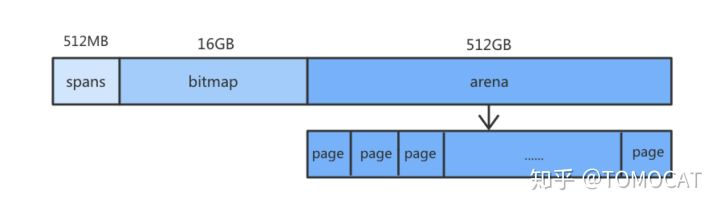

- `arena`：堆区，运行时该区域每`8KB`会被划分成一个页，存储了所有在堆上初始化的对象
- `bitmap`：标识`arena`中哪些地址保存了对象，`bitmap`中一个字节的内存对应`arena`区域中`4`个指针大小的内存，并标记了是否包含指针和是否扫描的信息（一个指针大小为`8B`，因此`bitmap`的大小为`512GB/(4*8)=16GB`）

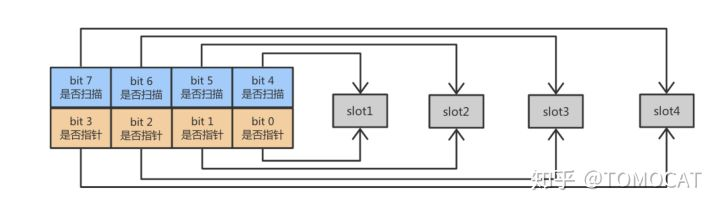

- `spans`：存放`mspan`的指针，其中每个`mspan`会包含多个页，`spans`中一个指针（`8B`）表示`arena`中某一个`page`（`8KB`），因此`spans`的大小为`512GB/(1024)=512MB`

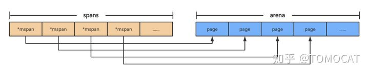

### **3. Golang GC实现【见Reference5】**

`go v1.5`至今都是基于三色标记法实现的垃圾回收机制，从而将长时间的`STW`分隔成多段较短时间的`STW`，`Golang`将垃圾回收阶段分成三个状态：

- `GC`开始前将所有对象标记为白色
- 将`GC Root`对象（`golang`中是**栈对象**和**全局变量**的指针）加入灰色对象队列
- 使用并发的`goroutine`扫描队列中的指针，如果指针还引用了其他指针，那么将被引用的加入灰色对象队列，被扫描的对象标记为黑色

### **3.1 Golang GC四个阶段**

前面提到Golang的GC属于并发式垃圾回收（意味着不需要长时间的STW，GC大部分执行过程是和用户代码并行的），它可以分为四个阶段：

- 清除终止`Sweep Termination`：

- - 暂停程序
  - 清扫未被回收的内存管理单元span，当上一轮GC的清扫工作完成后才可以开始新一轮的GC

- 标记`Mark`：

- - 切换至`_GCmark`，开启写屏障和用户程序协助`Mutator Assiste`并将根对象添加到三色标记法队列
  - 恢复程序，标记进程和`Mutator Assiste`进程会开始并发标记内存中的对象，混合写屏障将被删除的指针和新加入的指针都标记成灰色，新创建的对象标记成黑色
  - 扫描根对象（包括所有goroutine的栈、全局对象以及不在堆中的运行时数据结构），扫描goroutine栈期间会暂停当前处理器
  - 依次处理三色标记法队列，将扫描过的对象标记为黑色并将它们指向的对象标记成灰色
  - 使用分布式终止算法检查剩余的工作，发现标记阶段完成后进入标记终止阶段

- 标记终止`Mark Termination`

- - 暂停程序，切换至`_GCmarktermination`并关闭辅助标记的用户程序
  - 清理处理器上的线程缓存

- 清除`Sweep`

- - 将状态切换至`_GCoff`，关闭混合写屏障
  - 恢复用户程序，所有新创建的对象标记为白色
  - 后台并发清理所有的内存管理单元span，当goroutine申请新的内存管理单元时就会触发清理

> 在GC过程中会有两种后台任务（G），包括标记任务和清扫任务。可以同时执行的标记任务约是P数量的四分之一，即go所说的25%CPU用于GC的依据。清扫任务会在程序启动后运行，进入清扫阶段时唤醒。

### **3.2 辅助GC**

由于Golang使用了并发式的垃圾回收，将原本需要STW较长时间的GC过程分散到多次小规模的GC。当用户分配内存的速度超过GC回收速度时，Golang会通过辅助GC暂停用户程序进行垃圾回收，防止内存因分配对象速度过快消耗殆尽的问题。

### **3.3 GC触发时机**

触发垃圾回收首先要满足三个前提条件：

- `memstats.enablegc`：允许垃圾回收
- `panicking == 0`：程序没有panic
- `gcphase == _GCoff`：处于`_Gcoff`阶段

对应的触发时机包括：

- `gcTriggerHeap`：堆内存的大小达到一定阈值
- `gcTriggerTime`：距离上一次垃圾回收超过一定阈值时
- `gcTriggerCycle`：如果当前没有启动GC则开始新一轮的GC

```go
// test reports whether the trigger condition is satisfied, meaning
// that the exit condition for the _GCoff phase has been met. The exit
// condition should be tested when allocating.
func (t gcTrigger) test() bool {
    if !memstats.enablegc || panicking != 0 || gcphase != _GCoff {
        return false
    }
    switch t.kind {
    case gcTriggerHeap:
        // Non-atomic access to heap_live for performance. If
        // we are going to trigger on this, this thread just
        // atomically wrote heap_live anyway and we'll see our
        // own write.
        return memstats.heap_live >= memstats.gc_trigger
    case gcTriggerTime:
        if gcpercent < 0 {
            return false
        }
        lastgc := int64(atomic.Load64(&memstats.last_gc_nanotime))
        return lastgc != 0 && t.now-lastgc > forcegcperiod
    case gcTriggerCycle:
        // t.n > work.cycles, but accounting for wraparound.
        return int32(t.n-work.cycles) > 0
    }
    return true
}
```

### **4. GC调优常见方法**

- 尽量使用小数据类型，比如使用`int8`代替`int`。
- 少使用`+`连接`string`：go语言中string是一个只读类型，针对string的每一个操作都会创建一个新的string。大量小文本拼接时优先使用`strings.Join`，大量大文本拼接时使用`bytes.Buffer`。
