## String  

### 字符串的不可变性  

**定义一个字符串**

String s = "abcd"  

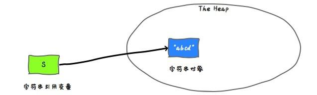

s 中保存了 string 对象的引用。 下面的箭头可以理解为“ 存储他的引用” 。  

**使用变量来赋值变量**

String s2 = s;  

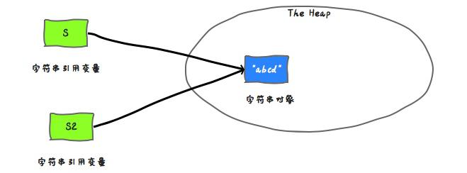

s2 保存了相同的引用值， 因为他们代表同一个对象。  

**字符串连接**

s = s.concat("ef")  

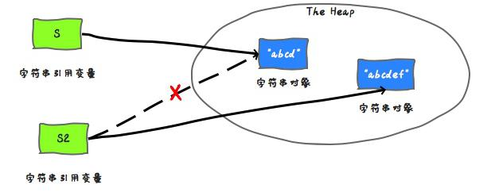

s 中保存的是一个重新创建出来的 string 对象的引用。  

**总结**

​		一旦一个 string 对象在内存(堆)中被创建出来， 他就无法被修改。 特别要注意的是，String 类的所有方法都没有改变字符串本身的值， 都是返回了一个新的对象。  

​		如果你需要一个可修改的字符串， 应该使用 StringBuffer 或者 StringBuilder。 否则会有大量时间浪费在垃圾回收上， 因为每次试图修改都有新的 string 对象被创建出来。  

### JDK 6 和 JDK 7 中 substring 的原理及区别  

​		String 是 Java 中一个比较基础的类， 每一个开发人员都会经常接触到。 而且，String 也是面试中经常会考的知识点。 String 有很多方法， 有些方法比较常用， 有些方法不太常用。 今天要介绍的 subString 就是一个比较常用的方法， 而且围绕 subString 也有很多面试题。  

​		substring(int beginIndex, int endIndex)方法在不同版本的 JDK 中的实现是不同的。 了解他们的区别可以帮助你更好的使用他。 为简单起见， 后文中用 substring()代表substring(int beginIndex, int endIndex)方法。  

**substring() 的作用**

substring(int beginIndex, int endIndex)方法截取字符串并返回其[beginIndex,endIndex-1]范围内的内容。  

```java
String x = "abcdef";
x = x.substring(1,3);
System.out.println(x);
```

输出内容：  

```java
bc
```

**调用 substring()时发生了什么？**

你可能知道， 因为 x 是不可变的， 当使用 x.substring(1,3)对 x 赋值的时候， 它会指向一个全新的字符串：  

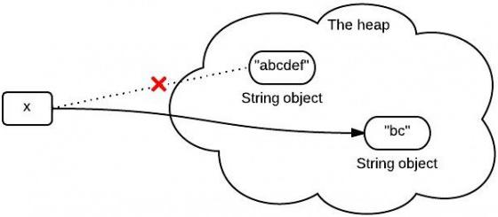

然而， 这个图不是完全正确的表示堆中发生的事情。 因为在 jdk6 和 jdk7 中调用substring 时发生的事情并不一样。  

**JDK 6 中的 substring**

​		String 是通过字符数组实现的。 在 jdk 6 中， String 类包含三个成员变量：char value[]， int offset， int count。 他们分别用来存储真正的字符数组， 数组的第一个位置索引以及字符串中包含的字符个数。  

​		当调用 substring 方法的时候， 会创建一个新的 string 对象， 但是这个 string 的值仍然指向堆中的同一个字符数组。 这两个对象中只有 count 和 offset 的值是不同的。  

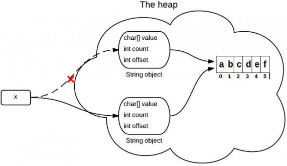

**下面是证明上说观点的 Java 源码中的关键代码：**

```java
//JDK 6
String(int offset, int count, char value[]) {
this.value = value;
this.offset = offset;
this.count = count;
} 
public String substring(int beginIndex, int endIndex) {
//check boundary
return new String(offset + beginIndex, endIndex - beginIndex, value);
}
```

**JDK 6 中的 substring 导致的问题**

​		如果你有一个很长很长的字符串， 但是当你使用 substring 进行切割的时候你只需要很短的一段。 这可能导致性能问题， 因为你需要的只是一小段字符序列， 但是你却引用了整个字符串（ 因为这个非常长的字符数组一直在被引用， 所以无法被回收， 就可能导致内存泄露） 。 在 JDK 6 中， 一般用以下方式来解决该问题， 原理其实就是生成一个新的字符串并引用他。  

```java
x = x.substring(x, y) + ""
```

关于 JDK 6 中 subString 的使用不当会导致内存系列已经被官方记录在 Java BugDatabase 中：  

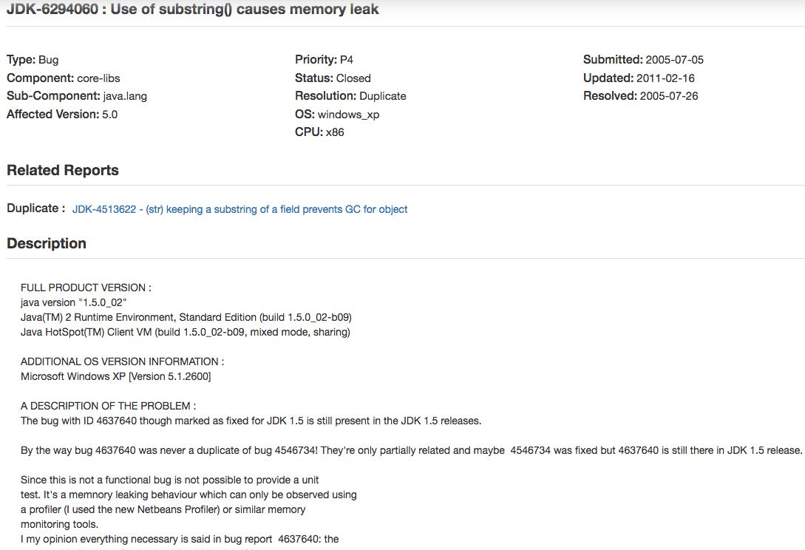


> 内存泄露： 在计算机科学中， 内存泄漏指由于疏忽或错误造成程序未能释放已经不再使
> 用的内存。 内存泄漏并非指内存在物理上的消失， 而是应用程序分配某段内存后， 由于设
> 计错误， 导致在释放该段内存之前就失去了对该段内存的控制， 从而造成了内存的浪费。  

**JDK 7 中的 substring**

​		上面提到的问题， 在 jdk 7 中得到解决。 在 jdk 7 中， substring 方法会在堆内存中创建一个新的数组。  

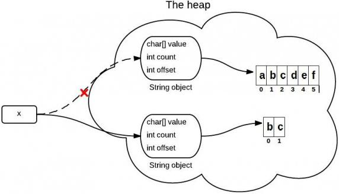

**Java 源码中关于这部分的主要代码如下：**

```java
//JDK 7
public String(char value[], int offset, int count) {
//check boundary
this.value = Arrays.copyOfRange(value, offset, offset + count);
}
public String substring(int beginIndex, int endIndex) {
//check boundary
int subLen = endIndex - beginIndex;
return new String(value, beginIndex, subLen);
}
```

​		以上是 JDK 7 中的 subString 方法， 其使用 new String 创建了一个新字符串， 避免对老字符串的引用。 从而解决了内存泄露问题。  

​		所以， 如果你的生产环境中使用的 JDK 版本小于 1.7， 当你使用 String 的 subString方法时一定要注意， 避免内存泄露。  

### replaceFirst、 replaceAll、 replace 区别  

​		replace、 replaceAll 和 replaceFirst 是 Java 中常用的替换字符的方法,它们的方法定义是：  

​		replace(CharSequence target, CharSequence replacement) ， 用replacement 替换所有的 target， 两个参数都是字符串。  

​		replaceAll(String regex, String replacement) ， 用 replacement 替换所有的regex 匹配项， regex 很明显是个正则表达式， replacement 是字符串。  

​		replaceFirst(String regex, String replacement) ， 基本和 replaceAll 相同， 区别是只替换第一个匹配项。  

​		可以看到， 其中 replaceAll 以及 replaceFirst 是和正则表达式有关的， 而 replace 和正则表达式无关。  

​		replaceAll 和 replaceFirst 的区别主要是替换的内容不同， replaceAll 是替换所有匹配的字符， 而 replaceFirst()仅替换第一次出现的字符。  

**用法例子**

1、 replaceAll() 替换符合正则的所有文字  

```java
//文字替换（全部）
Pattern pattern = Pattern.compile("正则表达式");
Matcher matcher = pattern.matcher("正则表达式 Hello World,正则表达式 Hello World");
//替换所有符合正则的数据
System.out.println(matcher.replaceAll("Java"));
```

2、 replaceFirst() 替换第一个符合正则的数据  

```java
//文字替换（首次出现字符）
Pattern pattern = Pattern.compile("正则表达式");
Matcher matcher = pattern.matcher("正则表达式 Hello World,正则表达式 Hello World");
//替换第一个符合正则的数据
System.out.println(matcher.replaceFirst("Java"));
```

3、 replaceAll()替换所有 html 标签  

```java
//去除 html 标记
Pattern pattern = Pattern.compile("<.+?>", Pattern.DOTALL);
Matcher matcher = pattern.matcher("<a href=\"index.html\">主页</a>");
String string = matcher.replaceAll("");
System.out.println(string);
```

### String 对“ +” 的重载  

1、 String s = "a" + "b"， 编译器会进行常量折叠(因为两个都是编译期常量， 编译期可知)， 即变成 String s = "ab"  

2、 对于能够进行优化的(String s = "a" + 变量 等)用 StringBuilder 的 append()方法替代， 最后调用 toString() 方法 (底层就是一个 new String())  

#### 字符串拼接的几种方式和区别  

​		字符串， 是 Java 中最常用的一个数据类型了。  

​		本文， 也是对于 Java 中字符串相关知识的一个补充， 主要来介绍一下字符串拼接相关的知识。 本文基于 jdk1.8.0_181。  

**字符串拼接**

​		字符串拼接是我们在 Java 代码中比较经常要做的事情， 就是把多个字符串拼接到一起。  

​		我们都知道， String 是 Java 中一个不可变的类， 所以他一旦被实例化就无法被修改。  

​		不可变类的实例一旦创建， 其成员变量的值就不能被修改。 这样设计有很多好处， 比如可以缓存 hashcode、 使用更加便利以及更加安全等。  

​		但是， 既然字符串是不可变的， 那么字符串拼接又是怎么回事呢？  

**字符串不变性与字符串拼接**

其实， 所有的所谓字符串拼接， 都是重新生成了一个新的字符串。 下面一段字符串拼接代码：  

```java
String s = "abcd";
s = s.concat("ef");
```

其实最后我们得到的 s 已经是一个新的字符串了。 如下图：  

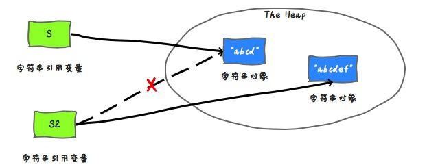

s 中保存的是一个重新创建出来的 String 对象的引用。  

那么， 在 Java 中， 到底如何进行字符串拼接呢？ 字符串拼接有很多种方式， 这里简单介绍几种比较常用的。  

**使用+拼接字符串**

在 Java 中， 拼接字符串最简单的方式就是直接使用符号+来拼接。 如：  

```java
String wechat = "Hollis";
String introduce = "每日更新 Java 相关技术文章";
String hollis = wechat + "," + introduce;
```

这里要特别说明一点， 有人把 Java 中使用+拼接字符串的功能理解为运算符重载。 其实并不是， Java 是不支持运算符重载的。 这其实只是 Java 提供的一个语法糖。 后面再详细介绍。  

运算符重载： 在计算机程序设计中， 运算符重载（ 英语： operator overloading） 是多态的一种。 运算符重载， 就是对已有的运算符重新进行定义， 赋予其另一种功能， 以适应不同的数据类型。  

语法糖： 语法糖（ Syntactic sugar）， 也译为糖衣语法， 是由英国计算机科学家彼得· 兰丁发明的一个术语， 指计算机语言中添加的某种语法， 这种语法对语言的功能没有影响， 但是更方便程序员使用。 语法糖让程序更加简洁， 有更高的可读性。  

除了使用+拼接字符串之外， 还可以使用 String 类中的方法 concat 方法来拼接字符串。如：  

```java
String wechat = "Hollis";
String introduce = "每日更新 Java 相关技术文章";
String hollis = wechat.concat(",").concat(introduce);
```

**StringBuffer**

关于字符串， Java 中除了定义了一个可以用来定义字符串常量的 String 类以外， 还提供了可以用来定义字符串变量的 StringBuffer 类， 它的对象是可以扩充和修改的。  

使用 StringBuffer 可以方便的对字符串进行拼接。 如：  

```java
StringBuffer wechat = new StringBuffer("Hollis");
String introduce = "每日更新 Java 相关技术文章";
StringBuffer hollis = wechat.append(",").append(introduce)
```

**StringBuilder**

除了 StringBuffer 以外， 还有一个类 StringBuilder 也可以使用， 其用法和StringBuffer 类似。 如：  

```java
StringBuilder wechat = new StringBuilder("Hollis");
String introduce = "每日更新 Java 相关技术文章";
StringBuilder hollis = wechat.append(",").append(introduce);
```

**StringUtils.join**

除了 JDK 中内置的字符串拼接方法， 还可以使用一些开源类库中提供的字符串拼接方法名， 如apache.commons 中提供的 StringUtils 类， 其中的 join 方法可以拼接字符串。  

```java
String wechat = "Hollis";
String introduce = "每日更新 Java 相关技术文章";
System.out.println(StringUtils.join(wechat, ",", introduce));
```

这里简单说一下， StringUtils 中提供的 join 方法， 最主要的功能是： 将数组或集合以某拼接符拼接到一起形成新的字符串， 如：  

```java
String []list ={"Hollis","每日更新 Java 相关技术文章"};
String result= StringUtils.join(list,",");
System.out.println(result);
//结果： Hollis,每日更新 Java 相关技术文章
```

并 且 ， J a v a 8 中 的 S t r i n g 类 中 也 提 供 了 一 个 静 态 的 j o i n 方 法 ， 用 法 和StringUtils.join 类似。  

以上就是比较常用的五种在 Java 中拼接字符串的方式， 那么到底哪种更好用呢？ 为什么 Java 开发手册中不建议在循环体中使用+进行字符串拼接呢？  

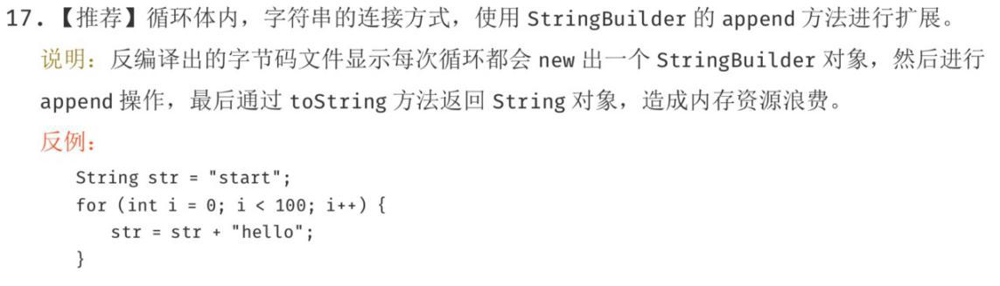

**使用+拼接字符串的实现原理**

前面提到过， 使用+拼接字符串， 其实只是 Java 提供的一个语法糖， 那么， 我们就来解一解这个语法糖， 看看他的内部原理到底是如何实现的。  

还是这样一段代码。 我们把他生成的字节码进行反编译， 看看结果。  

```java
String wechat = "Hollis";
String introduce = "每日更新 Java 相关技术文章";
String hollis = wechat + "," + introduce;
```

反编译后的内容如下， 反编译工具为 jad。  

```java
String wechat = "Hollis";
String introduce = "\u6BCF\u65E5\u66F4\u65B0Java\u76F8\u5173\u6280\u672F\u6
587\u7AE0";//每日更新 Java 相关技术文章
String hollis = (new StringBuilder()).append(wechat).append(",").append(int
roduce).toString();
```

通过查看反编译以后的代码， 我们可以发现， 原来字符串常量在拼接过程中， 是将String 转成了 StringBuilder 后， 使用其 append 方法进行处理的。  

那 么 也 就 是 说 ， J a v a 中 的 + 对 字 符 串 的 拼 接 ， 其 实 现 原 理 是 使 用StringBuilder.append。  

**concat 是如何实现的**

我们再来看一下 concat 方法的源代码， 看一下这个方法又是如何实现的。  

```java
public String concat(String str)
int otherLen = str.length();
if (otherLen == 0) {
return this;
}
int len = value.length;
char buf[] = Arrays.copyOf(value, len + otherLen);
str.getChars(buf, len);
return new String(buf, true);
}
```

这段代码首先创建了一个字符数组， 长度是已有字符串和待拼接字符串的长度之和， 再把两个字符串的值复制到新的字符数组中， 并使用这个字符数组创建一个新的 String 对象并返回。  

通过源码我们也可以看到， 经过 concat 方法， 其实是 new 了一个新的 String， 这也就呼应到前面我们说的字符串的不变性问题上了。  

**StringBuffer 和 StringBuilder**

接下来我们看看 StringBuffer 和 StringBuilder 的实现原理。  

和 String 类类似， StringBuilder 类也封装了一个字符数组， 定义如下：  

```java
char[] value;
```

与 String 不同的是， 它并不是 final 的， 所以他是可以修改的。 另外， 与 String 不同，字符数组中不一定所有位置都已经被使用， 它有一个实例变量， 表示数组中已经使用的字符个数， 定义如下：  

```java
int count;
```

其 append 源码如下：  

```java
public StringBuilder append(String str) {
super.append(str);
return this;
}
```

该类继承了 AbstractStringBuilder 类， 看下其 append 方法：  

```java
public AbstractStringBuilder append(String str) {
if (str == null)
return appendNull();
int len = str.length();
ensureCapacityInternal(count + len);
str.getChars(0, len, value, count);
count += len;
return this;
}
```

append 会直接拷贝字符到内部的字符数组中， 如果字符数组长度不够， 会进行扩展。  

StringBuffer 和 StringBuilder 类似， 最大的区别就是 StringBuffer 是线程安全的，看一下 StringBuffer 的 append 方法。  

```java
    public synchronized StringBuffer append(String str) {
        toStringCache = null;
        super.append(str);
        return this;
    }	
```

该方法使用 synchronized 进行声明， 说明是一个线程安全的方法。 而 StringBuilder则不是线程安全的。  

StringUtils.join 是如何实现的  

通过查看 StringUtils.join 的源代码， 我们可以发现， 其实他也是通过 StringBuilder 来实现的。  

```java
    public static String join(final Object[] array, String separator, final int
            startIndex, final int endIndex) {
        if (array == null) {
            return null;
        }
        if (separator == null) {
            separator = EMPTY;
        }
        // endIndex - startIndex > 0: Len = NofStrings *(len(firstString) + len(s
        eparator))
// (Assuming that all Strings are roughly equally long)
        final int noOfItems = endIndex - startIndex;
        if (noOfItems <= 0) {
            return EMPTY;
        }
        final StringBuilder buf = new StringBuilder(noOfItems * 16);
        for (int i = startIndex; i < endIndex; i++) {
            if (i > startIndex) {
                buf.append(separator);
            }
            if (array[i] != null) {
                buf.append(array[i]);
            }
        }
        return buf.toString();
    }
```

**效率比较**

既然有这么多种字符串拼接的方法， 那么到底哪一种效率最高呢？ 我们来简单对比一下。  

```java
long t1 = System.currentTimeMillis();
//这里是初始字符串定义
for (int i = 0; i < 50000; i++) {
//这里是字符串拼接代码
}
long t2 = System.currentTimeMillis();
System.out.println("cost:" + (t2 - t1));
```

我们使用形如以上形式的代码， 分别测试下五种字符串拼接代码的运行时间。 得到结果如下：  

```java
+cost:5119
StringBuilder cost:3
StringBuffer cost:4
concat cost:3623
StringUtils.join cost:25726
```

从结果可以看出， 用时从短到长的对比是：  

`StringBuilder<StringBuffer<concat<+<StringUtils.join  `

StringBuffer 在 StringBuilder 的基础上， 做了同步处理， 所以在耗时上会相对多一些。  

StringUtils.join 也是使用了 StringBuilder， 并且其中还是有很多其他操作， 所以耗时较长， 这个也容易理解。 其实 StringUtils.join 更擅长处理字符串数组或者列表的拼接。  

那么问题来了， 前面我们分析过， 其实使用+拼接字符串的实现原理也是使用的StringBuilder， 那为什么结果相差这么多， 高达 1000 多倍呢？  

我们再把以下代码反编译下：  

```java
    long t1 = System.currentTimeMillis();
    String str = "hollis";
    for (int i = 0; i < 50000; i++) {
        String s = String.valueOf(i);
        str += s;
    }
    long t2 = System.currentTimeMillis();
    System.out.println("+ cost:" + (t2 - t1));
```

反编译后代码如下：  

```java
long t1 = System.currentTimeMillis();
String str = "hollis";
for(int i = 0; i < 50000; i++)
{
String s = String.valueOf(i);
str = (new StringBuilder()).append(str).append(s).toString();
} 
long t2 = System.currentTimeMillis();
System.out.println((new StringBuilder()).append("+ cost:").append(t2 - t1).toString());
```

我们可以看到反编译后的代码， 在 for 循环中， 每次都是 new 了一个 StringBuilder，然后再把 String 转成 StringBuilder， 再进行 append。  

而频繁的新建对象当然要耗费很多时间了， 不仅仅会耗费时间， 频繁的创建对象， 还会造成内存资源的浪费。  

所以， Java 开发手册建议： 循环体内， 字符串的连接方式， 使用 StringBuilder 的append 方法进行扩展。 而不要使用+。  

**总结**

本文介绍了什么是字符串拼接， 虽然字符串是不可变的， 但是还是可以通过新建字符串的方式来进行字符串的拼接。  

常用的字符串拼接方式有五种， 分别是使用+、 使用 concat、 使用 StringBuilder、 使用 StringBuffer 以及使用 StringUtils.join。  

由于字符串拼接过程中会创建新的对象， 所以如果要在一个循环体中进行字符串拼接，就要考虑内存问题和效率问题。  

因此， 经过对比， 我们发现， 直接使用 StringBuilder 的方式是效率最高的。 因为StringBuilder 天生就是设计来定义可变字符串和字符串的变化操作的  。

但是， 还要强调的是：  

1、 如果不是在循环体中进行字符串拼接的话， 直接使用+就好了。
2 、 如 果 在 并 发 场 景 中 进 行 字 符 串 拼 接 的 话 ， 要 使 用 St r i n g B u f f e r 来 代 替StringBuilder。  

### String.valueOf 和 Integer.toString 的区别  

我们有三种方式将一个 int 类型的变量变成呢过 String 类型， 那么他们有什么区别？  

```java
1.int i = 5;
2.String i1 = "" + i;
3.String i2 = String.valueOf(i);
4.String i3 = Integer.toString(i);
```

第三行和第四行没有任何区别， 因为 String.valueOf(i)也是调用 Integer.toString(i)来实现的。  

第二行代码其实是 String i1 = (new StringBuilder()).append(i).toString();， 首先创建一个 StringBuilder 对象， 然后再调用 append 方法， 再调用 toString 方法。  

#### switch 对 String 的支持  

Java 7 中， switch 的参数可以是 String 类型了， 这对我们来说是一个很方便的改进。到目前为止 switch 支持这样几种数据类型： byte 、 short、 int 、 char 、 String 。 但是，作为一个程序员我们不仅要知道他有多么好用， 还要知道它是如何实现的， switch 对整型的支持是怎么实现的呢？ 对字符型是怎么实现的呢？ String 类型呢？ 有一点 Java 开发经验的人这个时候都会猜测 switch 对 String 的支持是使用 equals()方法和 hashcode()方
法。 那么到底是不是这两个方法呢？ 接下来我们就看一下， switch 到底是如何实现的。  

**一、 switch 对整型支持的实现**

下面是一段很简单的 Java 代码， 定义一个 int 型变量 a， 然后使用 switch 语句进行判断。 执行这段代码输出内容为 5， 那么我们将下面这段代码反编译， 看看他到底是怎么实现的。  

```java
    public class switchDemoInt {
        public static void main(String[] args) {
            int a = 5;
            switch (a) {
                case 1:
                    System.out.println(1);
                    break;
                case 5:
                    System.out.println(5);
                    break;
                default:
                    break;
            }
        }
    }
    //output 5
```

反编译后的代码如下：  

```java
    public class switchDemoInt {
        public switchDemoInt() {
        }

        public static void main(String args[]) {
            int a = 5;
            switch (a) {
                case 1: // '\001'
                    System.out.println(1);
                    break;
                case 5: // '\005'
                    System.out.println(5);
                    break;
            }
        }
    }
```

我们发现， 反编译后的代码和之前的代码比较除了多了两行注释以外没有任何区别， 那么我们就知道， switch 对 int 的判断是直接比较整数的值。  

**二、 switch 对字符型支持的实现**

直接上代码：  

```java

    public class switchDemoInt {
        public static void main(String[] args) {
            char a = 'b';
            switch (a) {
                case 'a':
                    System.out.println('a');
                    break;
                case 'b':
                    System.out.println('b');
                    break;
                default:
                    break;
            }
        }
    }
```

反编译后的代码如下：  

```java
    public class switchDemoChar
    {
        public switchDemoChar()
        {}
        public static void main(String args[])
        {
            char a = 'b';
            switch(a)
            {
                case 97: // 'a'
                    System.out.println('a');
                    break;
                case 98: // 'b'
                    System.out.println('b');
                    break;
            }
        }
    }
```

通过以上的代码作比较我们发现： 对 char 类型进行比较的时候， 实际上比较的是ascii 码， 编译器会把 char 型变量转换成对应的 int 型变量。  

**三、 switch 对字符串支持的实现**

还是先上代码：  

```java
    public class switchDemoString {
        public static void main(String[] args) {
            String str = "world";
            switch (str) {
                case "hello":
                    System.out.println("hello");
                    break;
                case "world":
                    System.out.println("world");
                    break;
                default:
                    break;
            }
        }
    }
```

对代码进行反编译：  

```java
    public class switchDemoString {
        public switchDemoString() {}
        public static void main(String args[])
        {
            String str = "world";
            String s;
            switch((s = str).hashCode())
            {
                default:
                    break;
                case 99162322:
                    if(s.equals("hello"))
                        System.out.println("hello");
                    break;
                case 113318802:
                    if(s.equals("world"))
                        System.out.println("world");
                    break;
            }
        }
    }
```

​		看到这个代码， 你知道原来字符串的 switch 是通过 equals()和 hashCode()方法来实现的。 记住， switch 中只能使用整型， 比如 byte， short， char(ackii 码是整型)以及int。 还好 hashCode()方法返回的是 int， 而不是 long。 通过这个很容易记住 hashCode返回的是 int 这个事实。 仔细看下可以发现， 进行 switch 的实际是哈希值， 然后通过使用equals 方法比较进行安全检查， 这个检查是必要的， 因为哈希可能会发生碰撞。 因此它的性能是不如使用枚举进行 switch 或者使用纯整数常量， 但这也不是很差。 因为 Java 编译器只增加了一个 equals 方法， 如果你比较的是字符串字面量的话会非常快， 比如” abc”==” abc” 。 如果你把 hashCode()方法的调用也考虑进来了， 那么还会再多一次的调用开销， 因为字符串一旦创建了， 它就会把哈希值缓存起来。 因此如果这个 switch 语句是用在一个循环里的， 比如逐项处理某个值， 或者游戏引擎循环地渲染屏幕， 这里 hashCode()方法的调用开销其实不会很大。  

好， 以上就是关于 switch 对整型、 字符型、 和字符串型的支持的实现方式， 总结一下我们可以发现， 其实 switch 只支持一种数据类型， 那就是整型， 其他数据类型都是转换成整型之后在使用 switch 的。  

#### 字符串池  

字符串大家一定都不陌生， 他是我们非常常用的一个类。  

String 作为一个 Java 类， 可以通过以下两种方式创建一个字符串：  

```java
String str = "Hollis";
String str = new String("Hollis")；
```

而第一种是我们比较常用的做法， 这种形式叫做"字面量"。  

在 JVM 中， 为了减少相同的字符串的重复创建， 为了达到节省内存的目的。 会单独开辟一块内存， 用于保存字符串常量， 这个内存区域被叫做字符串常量池。  

当代码中出现双引号形式（ 字面量） 创建字符串对象时， JVM 会先对这个字符串进行检查， 如果字符串常量池中存在相同内容的字符串对象的引用， 则将这个引用返回； 否则，创建新的字符串对象， 然后将这个引用放入字符串常量池， 并返回该引用。  

这种机制， 就是字符串驻留或池化。  

#### 字符串常量池的位置  

在 JDK 7 以前的版本中， 字符串常量池是放在永久代中的。  

因为按照计划， JDK 会在后续的版本中通过元空间来代替永久代， 所以首先在 JDK7 中， 将字符串常量池先从永久代中移出， 暂时放到了堆内存中。  

在 JDK 8 中， 彻底移除了永久代， 使用元空间替代了永久代， 于是字符串常量池再次从堆内存移动到永久代中。  

#### Class 常量池  

在 Java 中， 常量池的概念想必很多人都听说过。 这也是面试中比较常考的题目之一。  

在 Java 有关的面试题中， 一般习惯通过 String 的有关问题来考察面试者对于常量池的知识的理解， 几道简单的 String 面试题难倒了无数的开发者。 所以说， 常量池是 Java体系中一个非常重要的概念。  

谈到常量池， 在 Java 体系中， 共用三种常量池。 分别是字符串常量池、 Class 常量池和运行时常量池。  

本文先来介绍一下到底什么是 Class 常量池。  

**什么是 Class 文件**

在 Java 代码的编译与反编译那些事儿中我们介绍过 Java 的编译和反编译的概念。 我们知道， 计算机只认识 0 和 1， 所以程序员写的代码都需要经过编译成 0 和 1 构成的二进制格式才能够让计算机运行。  

我们在《 深入分析 Java 的编译原理》 中提到过， 为了让 Java 语言具有良好的跨平台能力， Java 独具匠心的提供了一种可以在所有平台上都能使用的一种中间代码——字节码（ ByteCode） 。  

有了字节码， 无论是哪种平台（ 如 Windows、 Linux 等） ， 只要安装了虚拟机， 都可以直接运行字节码。  

同样， 有了字节码， 也解除了 Java 虚拟机和 Java 语言之间的耦合。 这话可能很多人不理解， Java 虚拟机不就是运行 Java 语言的么？ 这种解耦指的是什么？  

其实， 目前 Java 虚拟机已经可以支持很多除 Java 语言以外的语言了， 如 Groovy、JRuby、 Jython、 Scala 等。 之所以可以支持， 就是因为这些语言也可以被编译成字节码。而虚拟机并不关心字节码是有哪种语言编译而来的。  

Java 语言中负责编译出字节码的编译器是一个命令是 javac。  

javac 是收录于 JDK 中的 Java 语言编译器。 该工具可以将后缀名为.java 的源文件编译为后缀名为.class 的可以运行于 Java 虚拟机的字节码。  

```java
    public class HelloWorld {
        public static void main(String[] args) {
            String s = "Hollis";
        }
    }
```

通过 javac 命令生成 class 文件：  

```java
javac HelloWorld.java
```

生成 HelloWorld.class 文件:  

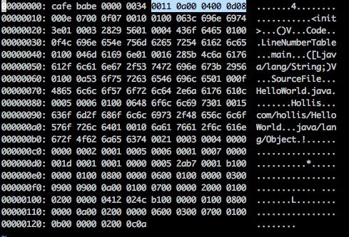

如何使用 16 进制打开 class 文件： 使用 vim test.class ， 然后在交互模式下， 输入:%!xxd 即可。  

可以看到， 上面的文件就是 Class 文件， Class 文件中包含了 Java 虚拟机指令集和符号表以及若干其他辅助信息。  

要想能够读懂上面的字节码， 需要了解 Class 类文件的结构， 由于这不是本文的重点，这里就不展开说明了。  

读者可以看到， HelloWorld.class 文件中的前八个字母是 cafe babe， 这就是Class 文件的魔数（ Java 中的” 魔数” ） 。  

我们需要知道的是， 在 Class 文件的 4 个字节的魔数后面的分别是 4 个字节的 Class文件的版本号（ 第 5、 6 个字节是次版本号， 第 7、 8 个字节是主版本号， 我生成的 Class文件的版本号是 52， 这是 Java 8 对应的版本。 也就是说， 这个版本的字节码， 在 JDK1.8 以下的版本中无法运行） 在版本号后面的， 就是 Class 常量池入口了。  

**Class 常量池**

Class 常量池可以理解为是 Class 文件中的资源仓库。 Class 文件中除了包含类的版本、 字段、 方法、 接口等描述信息外， 还有一项信息就是常量池(constant pool table)，用于存放编译器生成的各种字面量(Literal)和符号引用(Symbolic References)。  

由于不同的 Class 文件中包含的常量的个数是不固定的， 所以在 Class 文件的常量池入口处会设置两个字节的常量池容量计数器， 记录了常量池中常量的个数。  


当然， 还有一种比较简单的查看 Class 文件中常量池的方法， 那就是通过 javap 命令。对于以上的 HelloWorld.class， 可以通过  

```java
javap -v HelloWorld.class
```

查看常量池内容如下:  

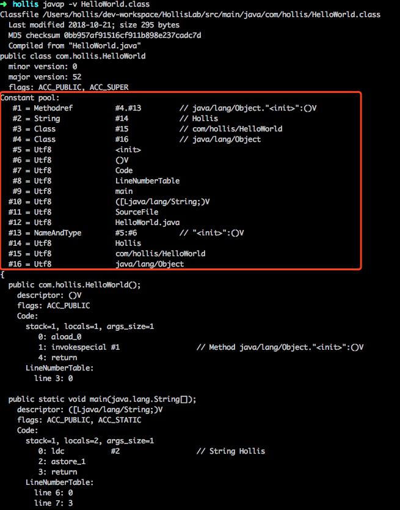

从上图中可以看到， 反编译后的 class 文件常量池中共有 16 个常量。 而 Class 文件中常量计数器的数值是 0011， 将该 16 进制数字转换成 10 进制的结果是 17。  

原因是与 Java 的语言习惯不同， 常量池计数器是从 0 开始而不是从 1 开始的， 常量池的个数是 10 进制的 17， 这就代表了其中有 16 个常量， 索引值范围为 1-16。  

**常量池中有什么**

介绍完了什么是 Class 常量池以及如何查看常量池， 那么接下来我们就要深入分析一下， Class 常量池中都有哪些内容。  

常量池中主要存放两大类常量： 字面量（ literal）和符号引用（ symbolic references）。  

**字面量**

面说过， 运行时常量池中主要保存的是字面量和符号引用， 那么到底什么字面量？  

在计算机科学中， 字面量（ literal） 是用于表达源代码中一个固定值的表示法（ notation） 。 几乎所有计算机编程语言都具有对基本值的字面量表示， 诸如： 整数、 浮点数以及字符串； 而有很多也对布尔类型和字符类型的值也支持字面量表示； 还有一些甚至对枚举类型的元素以及像数组、 记录和对象等复合类型的值也支持字面量表示法。  

以上是关于计算机科学中关于字面量的解释， 并不是很容易理解。 说简单点， 字面量就是指由字母、 数字等构成的字符串或者数值。  

字面量只可以右值出现， 所谓右值是指等号右边的值， 如： int a=123 这里的 a 为左值， 123 为右值。 在这个例子中 123 就是字面量。  

```java
int a = 123;
String s = "hollis";
```

上面的代码事例中， 123 和 hollis 都是字面量。  

本文开头的 HelloWorld 代码中， Hollis 就是一个字面量。  

**符号引用**

常量池中， 除了字面量以外， 还有符号引用， 那么到底什么是符号引用呢。  

符号引用是编译原理中的概念， 是相对于直接引用来说的。 主要包括了以下三类常量：
**类和接口的全限定名****字段的名称和描述符****方法的名称和描述符** 

这也就可以印证前面的常量池中还包含一些 com/hollis/HelloWorld、 main、([Ljava/lang/String;)V 等常量的原因了。  

**Class 常量池有什么用**

前面介绍了这么多， 关于 Class 常量池是什么， 怎么查看 Class 常量池以及 Class 常量池中保存了哪些东西。 有一个关键的问题没有讲， 那就是 Class 常量池到底有什么用。  

首先， 可以明确的是， Class 常量池是 Class 文件中的资源仓库， 其中保存了各种常量。 而这些常量都是开发者定义出来， 需要在程序的运行期使用的。  

在《 深入理解 Java 虚拟》 中有这样的表述：  

Java 代码在进行 Javac 编译的时候， 并不像 C 和 C++那样有“ 连接” 这一步骤， 而是在虚拟机加载 Class 文件的时候进行动态连接。 也就是说， 在 Class 文件中不会保存各个方法、 字段的最终内存布局信息， 因此这些字段、 方法的符号引用不经过运行期转换的话无法得到真正的内存入口地址， 也就无法直接被虚拟机使用。 当虚拟机运行时， 需要从常量池获得对应的符号引用， 再在类创建时或运行时解析、 翻译到具体的内存地址之中。 关于类的创建和动态连接的内容， 在虚拟机类加载过程时再进行详细讲解。  

前面这段话， 看起来很绕， 不是很容易理解。 其实他的意思就是： Class 是用来保存常量的一个媒介场所， 并且是一个中间场所。 在 JVM 真的运行时， 需要把常量池中的常量加载到内存中。  

另外， 关于常量池中常量的存储形式， 以及数据类型的表示方法本文中并未涉及， 并不是说这部分知识点不重要， 只是 Class 字节码的分析本就枯燥， 作者不想在一篇文章中给读者灌输太多的理论上的内容。 感兴趣的读者可以自行 Google 学习， 如果真的有必要，我也可以单独写一篇文章再深入介绍。  

#### 运行时常量池  

运行时常量池（ Runtime Constant Pool） 是每一个类或接口的常量池（Constant_Pool） 的运行时表示形式。  

它包括了若干种不同的常量： 从编译期可知的数值字面量到必须运行期解析后才能获得的方法或字段引用。 运行时常量池扮演了类似传统语言中符号表（ SymbolTable）的角色，不过它存储数据范围比通常意义上的符号表要更为广泛。  

每一个运行时常量池都分配在 Java 虚拟机的方法区之中， 在类和接口被加载到虚拟机后， 对应的运行时常量池就被创建出来。  

以上， 是 Java 虚拟机规范中关于运行时常量池的定义。  

**运行时常量池在 JDK 各个版本中的实现**

根据 Java 虚拟机规范约定： 每一个运行时常量池都在 Java 虚拟机的方法区中分配，在加载类和接口到虚拟机后， 就创建对应的运行时常量池。  

在不同版本的 JDK 中， 运行时常量池所处的位置也不一样。 以 HotSpot 为例：  

在 JDK 1.7 之前， 方法区位于堆内存的永久代中， 运行时常量池作为方法区的一部分，也处于永久代中。  

因为使用永久代实现方法区可能导致内存泄露问题， 所以， 从 JDK1.7 开始， JVM 尝试解决这一问题， 在 1.7 中， 将原本位于永久代中的运行时常量池移动到堆内存中。 （ 永久代在 JDK 1.7 并没有完全移除， 只是原来方法区中的运行时常量池、 类的静态变量等移动到了堆内存中。 ）  

在 JDK 1.8 中， 彻底移除了永久代， 方法区通过元空间的方式实现。 随之， 运行时常量池也在元空间中实现。  

**运行时常量池中常量的来源**

运行时常量池中包含了若干种不同的常量：  

编译期可知的字面量和符号引用（ 来自 Class 常量池） 运行期解析后可获得的常量（ 如String 的 intern 方法）。  

所以， 运行时常量池中的内容包含： Class 常量池中的常量、 字符串常量池中的内容
运行时常量池、 Class 常量池、 字符串常量池的区别与联系。  

虚拟机启动过程中， 会将各个 Class 文件中的常量池载入到运行时常量池中。  

所以， Class 常量池只是一个媒介场所。 在 JVM 真的运行时， 需要把常量池中的常量加载到内存中， 进入到运行时常量池。  

字符串常量池可以理解为运行时常量池分出来的部分。 加载时， 对于 class 的静态常量池， 字符串会被装到字符串常量池中。  

#### intern  

在 JVM 中， 为了减少相同的字符串的重复创建， 为了达到节省内存的目的。 会单独开辟一块内存， 用于保存字符串常量， 这个内存区域被叫做字符串常量池。  

当代码中出现双引号形式（ 字面量） 创建字符串对象时， JVM 会先对这个字符串进行检查， 如果字符串常量池中存在相同内容的字符串对象的引用， 则将这个引用返回； 否则，创建新的字符串对象， 然后将这个引用放入字符串常量池， 并返回该引用。  

除了以上方式之外， 还有一种可以在运行期将字符串内容放置到字符串常量池的办法，那就是使用 intern。  

intern 的功能很简单：  

在每次赋值的时候使用 String 的 intern 方法， 如果常量池中有相同值， 就会重复使用该对象， 返回对象引用。  

### String 有没有长度限制？  

关于 String 有没有长度限制的问题， 我之前单独写过一篇文章分析过， 最近我又抽空回顾了一下这个问题， 发现又有了一些新的认识。 于是准备重新整理下这个内容。  

这次在之前那篇文章的基础上除了增加了一些验证过程外， 还有些错误内容的修正。 我这次在分析过程中会尝试对 Jdk 的编译过程进行 debug， 并且会参考一些 JVM 规范等全方面的介绍下这个知识点。  

因为这个问题涉及到 Java 的编译原理相关的知识， 所以通过视频的方式讲解会更加容易理解一些， 视频我上传到了 B 站： https://www.bilibili.com/video/BV1uK4y1t7H1/。  

**String 的长度限制**

想要搞清楚这个问题， 首先我们需要翻阅一下 String 的源码， 看下其中是否有关于长度的限制或者定义。  

String 类中有很多重载的构造函数， 其中有几个是支持用户传入 length 来执行长度的：  

```java
public String(byte bytes[], int offset, int length)
```

可以看到， 这里面的参数 length 是使用 int 类型定义的， 那么也就是说， String 定义的时候， 最大支持的长度就是 int 的最大范围值。  

根据 Integer 类的定义， java.lang.Integer#MAX_VALUE 的最大值是 2^31 - 1;那么， 我们是不是就可以认为 String 能支持的最大长度就是这个值了呢？  

其实并不是， 这个值只是在运行期， 我们构造 String 的时候可以支持的一个最大长度，而实际上， 在编译期， 定义字符串的时候也是有长度限制的。  

如以下代码：  

```java
String s = "11111...1111";//其中有 10 万个字符"1"
```

当我们使用如上形式定义一个字符串的时候， 当我们执行 javac 编译时， 是会抛出异常的， 提示如下：  

```java
错误: 常量字符串过长
```

那么， 明明 String 的构造函数指定的长度是可以支持 2147483647(2^31 - 1)的， 为什么像以上形式定义的时候无法编译呢？  

其实， 形如 String s = "xxx";定义 String 的时候， xxx 被我们称之为字面量， 这种字面量在编译之后会以常量的形式进入到 Class 常量池。  

那么问题就来了， 因为要进入常量池， 就要遵守常量池的有关规定。  

**常量池限制**

我们知道， javac 是将 Java 文件编译成 class 文件的一个命令， 那么在 Class 文件生成过程中， 就需要遵守一定的格式。  

根据《 Java 虚拟机规范》 中第 4.4 章节常量池的定义， CONSTANT_String_info用于表示 java.lang.String 类型的常量对象， 格式如下：  

```java
CONSTANT_String_info {
u1 tag;
u2 string_index;
}
```

其中， string_index 项的值必须是对常量池的有效索引， 常量池在该索引处的项必须是 CONSTANT_Utf8_info 结构， 表示一组 Unicode 码点序列， 这组 Unicode 码点序列最终会被初始化为一个 String 对象。  

CONSTANT_Utf8_info 结构用于表示字符串常量的值：  

```java
CONSTANT_Utf8_info {
u1 tag;
u2 length;
u1 bytes[length];
}
```

其中， length 则指明了 bytes[]数组的长度， 其类型为 u2。  

通过翻阅《 规范》 ， 我们可以获悉。 u2 表示两个字节的无符号数， 那么 1 个字节有 8位， 2 个字节就有 16 位。  

16 位无符号数可表示的最大值位 2^16 - 1 = 65535。  

也就是说， Class 文件中常量池的格式规定了， 其字符串常量的长度不能超过 65535。  

那么， 我们尝试使用以下方式定义字符串  

```java
String s = "11111...1111";//其中有 65535 个字符"1"
```

尝试使用 javac 编译， 同样会得到"错误: 常量字符串过长"， 那么原因是什么呢？  

其实， 这个原因在 javac 的代码中是可以找到的， 在 Gen 类中有如下代码：  

```java

    private void checkStringConstant(DiagnosticPosition var1, Object var2) {
        if (this.nerrs == 0 && var2 != null && var2 instanceof String && ((String)var2).length() >= 65535) {
            this.log.error(var1, "limit.string", new Object[0]);
            ++this.nerrs;
        }
    }
```

代码中可以看出， 当参数类型为 String， 并且长度大于等于 65535 的时候， 就会导致
编译失败。  

这个地方大家可以尝试着 debug 一下 javac 的编译过程（ 视频中有对 java 的编译过程进行 debug 的方法） ， 也可以发现这个地方会报错。  

如果我们尝试以 65534 个字符定义字符串， 则会发现可以正常编译。  

其实， 关于这个值， 在《 Java 虚拟机规范》 也有过说明：  

`if the Java Virtual Machine code for a method is exactly 65535 bytes
long and ends with an instruction that is 1 byte long, then that instruction
cannot be protected by an exception handler. A compiler writer can work
around this bug by limiting the maximum size of the generated Java Virtual
Machine code for any method, instance initialization method, or static
initializer (the size of any code array) to 65534 bytes.  `

**运行期限制**

上面提到的这种 String 长度的限制是编译期的限制， 也就是使用 String s= “ ” ;这种字面值方式定义的时候才会有的限制。  

那么。 String 在运行期有没有限制呢， 答案是有的， 就是我们前文提到的那个 Integer.MAX_VALUE ， 这个值约等于 4G， 在运行期， 如果 String 的长度超过这个范围， 就可能会抛出异常。  

(在 jdk 1.9 之前） int 是一个 32 位变量类型， 取正数部分来算的话， 他们最长可以有：  

```java
2^31-1 =2147483647 个 16-bit Unicodecharacter
2147483647 * 16 = 34359738352 位
34359738352 / 8 = 4294967294 (Byte)
4294967294 / 1024 = 4194303.998046875 (KB)
4194303.998046875 / 1024 = 4095.9999980926513671875 (MB)
4095.9999980926513671875 / 1024 = 3.99999999813735485076904296875 (GB)
```

有近 4G 的容量。  

很多人会有疑惑， 编译的时候最大长度都要求小于 65535 了， 运行期怎么会出现大于65535 的情况呢。 这其实很常见， 如以下代码：  

```java
String s = "";
for (int i = 0; i <100000 ; i++) {
s+="i";
}
```

得到的字符串长度就有 10 万， 另外我之前在实际应用中遇到过这个问题。  

之前一次系统对接， 需要传输高清图片， 约定的传输方式是对方将图片转成 BASE6编码， 我们接收到之后再转成图片。  

在将 BASE64 编码后的内容赋值给字符串的时候就抛了异常。  

**总结**

字符串有长度限制， 在编译期， 要求字符串常量池中的常量不能超过 65535， 并且在javac 执行过程中控制了最大值为 65534。  

在运行期， 长度不能超过 Int 的范围， 否则会抛异常。  

最后， 这个知识点 ， 我录制了视频(https://www.bilibili.com/video/BV1uK4y1t7H1/)，其中有关于如何进行实验测试、如何查阅 Java 规范以及如何对 javac 进行 deubg 的技巧。欢迎进一步学习。  