## toString()、String.valueOf、(String)强转，如何抉择，你真的了解吗

### 一、前言

相信大家在日常开发中这三种方法用到的应该很多，尤其是前两种，经常在开发的时候，随心所欲，想用哪个用哪个，既然存在，那就应该有它存在的道理，那么什么情况下用哪个呢？

### 二、代码实例

#### 1、基本类型

（1）基本类型没有toString()方法

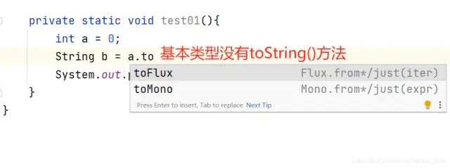

（2）推荐使用

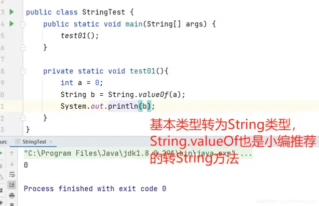

（3）无法强转

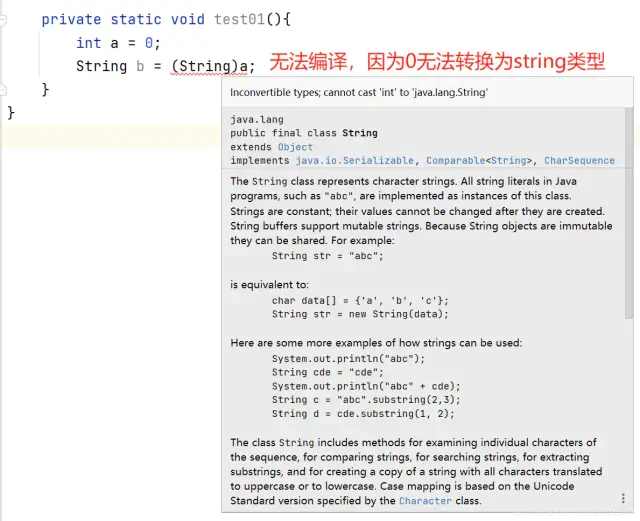

（String）是标准的类型转换，将Object类型转为String类型，使用(String)强转时，最好使用instanceof做一个类型检查，以判断是否可以进行强转，否则容易抛出ClassCastException异常。需要注意的是编写的时候，编译器并不会提示有语法错误，所以这个方法要谨慎的使用。

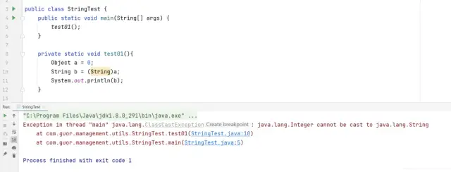

instanceof判断

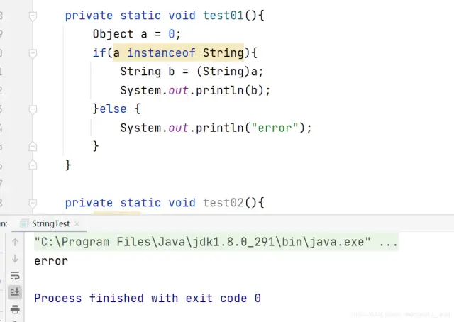

#### 2、封装类型

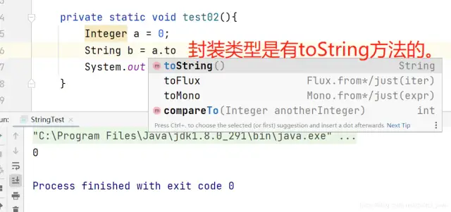

（2）String.valueOf()

自然也是可以的。

（3）封装类型也无法强转

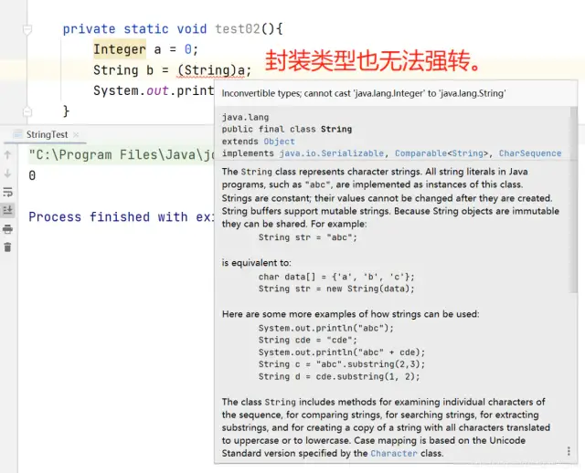

#### 3、null值问题

（1）toString()报空指针异常

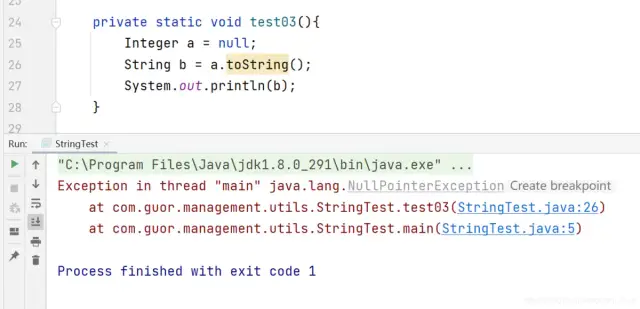

（2）String.valueOf()返回字符串“null”

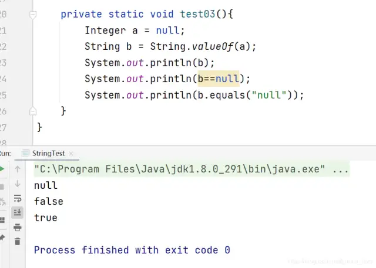

（3）null值强转成功

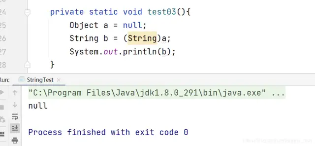

### 三、源码分析

#### 1、toString()

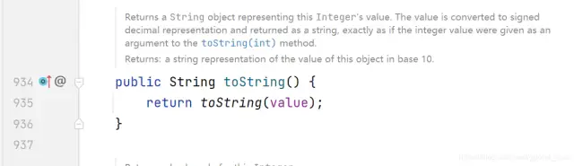

#### 2、String.valueOf()

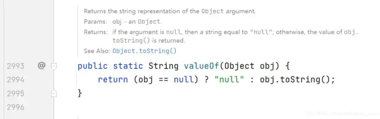

String.valueOf()比toString多了一个非空判断。

### 四、总结

#### 1、toString()，可能会抛空指针异常

在这种使用方法中，因为java.lang.Object类里已有public方法.toString()，所以java对象都可以调用此方法。但在使用时要注意，必须保证object不是null值，否则将抛出NullPointerException异常。采用这种方法时，通常派生类会覆盖Object里的toString()方法。

#### 2、String.valueOf()，推荐使用，返回字符串“null”

String.valueOf()方法是小编推荐使用的，因为它不会出现空指针异常，而且是静态的方法，直接通过String调用即可，只是有一点需要注意，就是上面提到的，如果为null，String.valueOf()返回结果是字符串“null”。而不是null。

#### 3、(String)强转，不推荐使用

（String）是标准的类型转换，将Object类型转为String类型，使用(String)强转时，最好使用instanceof做一个类型检查，以判断是否可以进行强转，否则容易抛出ClassCastException异常。需要注意的是编写的时候，编译器并不会提示有语法错误，所以这个方法要谨慎的使用。