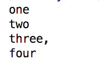
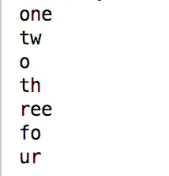
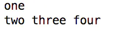

# Java中的split( )函数

#### 首先，我们来了解一下split()函数各个参数的意义

```java
public String[] split(String regex, int limit)
```

- regex -- 正则表达式分隔符。
- limit -- 分割的份数。

##### 下面就让我们来举个例子

```java
 String str = "one two three, four";
        String[] tokens = str.split(" ");
        for (String s: tokens)
            System.out.println(s);
```

这个例子中，我们用了split函数中的第一个参数，我们用空格（“ ”），进行分割，所以这段代码的结果如下：



##### 如果我们想用两个分割符进行分割，及即想用空格（" "）分割,也想用逗号（","）分割,我们可以用 "|" 来使其实现，下面看一个例子：

```java
       String str = "one tw,o th,ree fo,ur";
        String[] tokens = str.split(" |,");
        for (String s: tokens)
            System.out.println(s);
```

结果如下：



##### 下面就让我们来看看第二个参数的作用

第二个参数是分割的份数，我们来举个例子：

```java
  String str = "one two three four";
        String[] tokens = str.split(" ",2);
        for (String s: tokens)
            System.out.println(s);
```

结果如下：



可以看出，由于多了第二个参数，结果发生了改变，是因为我们限制了分割的份数为2份，所以当分割结果达到2份时，分割就结束了。