## 面向对象  

### 面向对象与面向过程  

##### 什么是面向过程？  

概述: 自顶而下的编程模式  

把问题分解成一个一个步骤， 每个步骤用函数实现， 依次调用即可。  

就是说， 在进行面向过程编程的时候， 不需要考虑那么多， 上来先定义一个函数， 然后使用各种诸如 if-else、 for-each 等方式进行代码执行。  

使用各种诸如 if-else、 for-each 等方式进行代码执行。  

##### 什么是面向对象？  

概述: 将事务高度抽象化的编程模式  

将问题分解成一个一个步骤， 对每个步骤进行相应的抽象， 形成对象， 通过不同对象之间的调用， 组合解决问题。  

就是说， 在进行面向对象进行编程的时候， 要把属性、 行为等封装成对象， 然后基于这些对象及对象的能力进行业务逻辑的实现。  

比如： 想要造一辆车， 上来要先把车的各种属性定义出来， 然后抽象成一个 Car 类。  

##### 举例说明区别  

同样一个象棋设计。  

面向对象： 创建黑白双方的对象负责演算， 棋盘的对象负责画布， 规则的对象负责判断，例子可以看出， 面向对象更重视不重复造轮子， 即创建一次,重复使用。  

面向过程： 开始—黑走—棋盘—判断—白走—棋盘—判断—循环。 只需要关注每一步怎么实现即可。  

##### 优劣对比  

面向对象： 占用资源相对高,速度相对慢。  

面向过程： 占用资源相对低,速度相对快。  

### 面向对象的三大基本特征和五大基本原则  

#### 面向对象的三大基本特征  

**封装(Encapsulation) **

所谓封装， 也就是把客观事物封装成抽象的类， 并且类可以把自己的数据和方法只让可信的类或者对象操作， 对不可信的进行信息隐藏。  

封装是面向对象的特征之一， 是对象和类概念的主要特性。 简单的说， 一个类就是一个封装了数据以及操作这些数据的代码的逻辑实体。 在一个对象内部， 某些代码或某些数据可以是私有的， 不能被外界访问。 通过这种方式， 对象对内部数据提供了不同级别的保护， 以防止程序中无关的部分意外的改变或错误的使用了对象的私有部分。  

**继承(Inheritance) **

继承是指这样一种能力： 它可以使用现有类的所有功能， 并在无需重新编写原来的类的情况下对这些功能进行扩展。  

通过继承创建的新类称为“ 子类” 或“ 派生类” ， 被继承的类称为“ 基类” 、 “ 父类”或“ 超类” 。 继承的过程， 就是从一般到特殊的过程。  

继承概念的实现方式有二类： 实现继承与接口继承。 实现继承是指直接使用基类的属性和方法而无需额外编码的能力； 接口继承是指仅使用属性和方法的名称、 但是子类必须提供实现的能力。  

**多态(Polymorphism) **

所谓多态就是指一个类实例的相同方法在不同情形有不同表现形式。多态机制使具有不同内部结构的对象可以共享相同的外部接口。这意味着， 虽然针对不同对象的具体操作不同，但通过一个公共的类， 它们（ 那些操作） 可以通过相同的方式予以调用。  

最常见的多态就是将子类传入父类参数中， 运行时调用父类方法时通过传入的子类决定具体的内部结构或行为。  

#### 面向对象的五大基本原则  

**单一职责原则（ Single-Responsibility Principle）**

其核心思想为： 一个类， 最好只做一件事， 只有一个引起它的变化。  

单一职责原则可以看做是低耦合、 高内聚在面向对象原则上的引申， 将职责定义为引起变化的原因， 以提高内聚性来减少引起变化的原因。  

职责过多， 可能引起它变化的原因就越多， 这将导致职责依赖， 相互之间就产生影响，从而大大损伤其内聚性和耦合度。  

通常意义下的单一职责， 就是指只有一种单一功能， 不要为类实现过多的功能点， 以保证实体只有一个引起它变化的原因。  

专注， 是一个人优良的品质； 同样的， 单一也是一个类的优良设计。 交杂不清的职责将使得代码看起来特别别扭牵一发而动全身， 有失美感和必然导致错误的风险。  

#### 开放封闭原则（ Open-Closed principle）  

其核心思想是： 软件实体应该是可扩展的， 而不可修改的。 也就是， 对扩展开放， 对修改封闭的。  

开放封闭原则主要体现在两个方面：  

1、 对扩展开放， 意味着有新的需求或变化时， 可以对现有代码进行扩展， 以适应新的情况。    

2、 对修改封闭， 意味着类一旦设计完成， 就可以独立完成其工作， 而不要对其进行任何尝试的修改。  

实现开放封闭原则的核心思想就是对抽象编程， 而不对具体编程， 因为抽象相对稳定。让类依赖于固定的抽象， 所以修改就是封闭的； 而通过面向对象的继承和多态机制， 又可实现对抽象类的继承， 通过覆写其方法来改变固有行为， 实现新的拓展方法， 所以就是开放的。  

“ 需求总是变化” 没有不变的软件， 所以就需要用封闭原则满足需求用开放原则来满足变化，同时还能保持软件内部的封装体系稳定， 不被需求的变化影响。  

**Liskov 替换原则（ Liskov-Substitution Principle） **

其核心思想是： 子类必须能够替换其基类。 这一思想体现为对继承机制的约束规范， 只有子类能够替换基类时， 才能保证系统在运行期内识别子类， 这是保证继承复用的基础。  

在父类和子类的具体行为中， 必须严格把握继承层次中的关系和特征， 将基类替换为子类， 程序的行为不会发生任何变化。 同时， 这一约束反过来则是不成立的， 子类可以替换基类， 但是基类不一定能替换子类 。  

Liskov 替换原则， 主要着眼于对抽象和多态建立在继承的基础上， 因此只有遵循Liskov 替换原则， 才能保证继承复用是可靠地  

实现的方法是面向接口编程： 将公共部分抽象为基类接口或抽象类， 通过 ExtractAbstract Class， 在子类中通过覆写父类的方法实现新的方式支持同样的职责。 Liskov替换原则是关于继承机制的设计原则， 违反了 Liskov 替换原则就必然导致违反开放封闭原则。  

Liskov 替换原则能够保证系统具有良好的拓展性， 同时实现基于多态的抽象机制， 能够减少代码冗余， 避免运行期的类型判别。  

**依赖倒置原则（ Dependecy-Inversion Principle）**

其核心思想是： 依赖于抽象。 具体而言就是高层模块不依赖于底层模块， 二者都同依赖于抽象； 抽象不依赖于具体， 具体依赖于抽象。  

我们知道， 依赖一定会存在于类与类、 模块与模块之间。 当两个模块之间存在紧密的耦合关系时， 最好的方法就是分离接口和实现： 在依赖之间定义一个抽象的接口使得高层模块调用接口， 而底层模块实现接口的定义， 以此来有效控制耦合关系， 达到依赖于抽象的设计目标。  

抽象的稳定性决定了系统的稳定性， 因为抽象是不变的， 依赖于抽象是面向对象设计的精髓， 也是依赖倒置原则的核心。 依赖于抽象是一个通用的原则， 而某些时候依赖于细节则是在所难免的， 必须权衡在抽象和具体之间的取舍， 方法不是一成不变的。 依赖于抽象，就是对接口编程， 不要对实现编程。  

**接口隔离原则（ Interface-Segregation Principle） **

其核心思想是： 使用多个小的专门的接口， 而不要使用一个大的总接口。  

具体而言， 接口隔离原则体现在： 接口应该是内聚的， 应该避免“ 胖” 接口。 一个类对另外一个类的依赖应该建立在最小的接口上， 不要强迫依赖不用的方法， 这是一种接口污染。  

接口有效地将细节和抽象隔离， 体现了对抽象编程的一切好处， 接口隔离强调接口的单一性。 而胖接口存在明显的弊端， 会导致实现的类型必须完全实现接口的所有方法、 属性等；而某些时候， 实现类型并非需要所有的接口定义， 在设计上这是“ 浪费” ， 而且在实施上这会带来潜在的问题， 对胖接口的修改将导致一连串的客户端程序需要修改， 有时候这是一种灾难。 在这种情况下， 将胖接口分解为多个特点的定制化方法， 使得客户端仅仅依赖于它们的实际调用的方法， 从而解除了客户端不会依赖于它们不用的方法。  

分离的手段主要有以下两种：  

1、 委托分离， 通过增加一个新的类型来委托客户的请求， 隔离客户和接口的直接依赖，但是会增加系统的开销。  

2、 多重继承分离， 通过接口多继承来实现客户的需求， 这种方式是较好的。  

以上就是 5 个基本的面向对象设计原则， 它们就像面向对象程序设计中的金科玉律，遵守它们可以使我们的代码更加鲜活， 易于复用， 易于拓展， 灵活优雅。 不同的设计模式对应不同的需求， 而设计原则则代表永恒的灵魂， 需要在实践中时时刻刻地遵守。  

就如 ARTHUR J.RIEL 在那本《 OOD 启示录》 中所说的： “ 你并不必严格遵守这些原则， 违背它们也不会被处以宗教刑罚。 但你应当把这些原则看做警铃， 若违背了其中的一条， 那么警铃就会响起。  

### Java 中的封装、 继承、 多态  

#### 什么是多态  

多态的概念比较简单， 就是同一操作作用于不同的对象， 可以有不同的解释， 产生不同的执行结果。  

如果按照这个概念来定义的话， 那么多态应该是一种运行期的状态。  

#### 多态的必要条件  

为了实现运行期的多态， 或者说是动态绑定， 需要满足三个条件。  

即有类继承或者接口实现、 子类要重写父类的方法、 父类的引用指向子类的对象。  

简单来一段代码解释下：  

```java
    public class Parent {
        public void call(){
            System.out.println("im Parent");
        }
    }

    // 1.有类继承或者接口实现
    public class Son extends Parent {
        // 2.子类要重写父类的方法
        public void call(){
            System.out.println("im Son");
        }
    }

    // 1.有类继承或者接口实现
    public class Daughter extends Parent {
        // 2.子类要重写父类的方法
        public void call(){
            System.out.println("im Daughter");
        }
    }

    public class Test{
        public static void main(String[] args) {
            //3.父类的引用指向子类的对象
            Parent p = new Son();
            //3.父类的引用指向子类的对象
            Parent p1 = new Daughter();
        }
    }
```

这样， 就实现了多态， 同样是 Parent 类的实例， p.call 调用的是 Son 类的实现、p1.call 调用的是 Daughter 的实现。  

有人说， 你自己定义的时候不就已经知道 p 是 son， p1 是 Daughter 了么。 但是， 有些时候你用到的对象并不都是自己声明的啊。  

比如 Spring 中的 IOC(Inversion of Control) 出来的对象， 你在使用的时候就不知道他是谁， 或者说你可以不用关心他是谁。 根据具体情况而定。  

另外， 还有一种说法， 包括维基百科也说明， 多态还分为动态多态和静态多态。  

上面提到的那种动态绑定认为是动态多态， 因为只有在运行期才能知道真正调用的是哪个类的方法。  

还有一种静态多态， 一般认为 Java 中的函数重载是一种静态多态， 因为他需要在编译期决定具体调用哪个方法。  

关于这个动态静态的说法， 我更偏向于重载和多态其实是无关的。  

但是也要看情况， 普通场合， 我会认为只有方法的重写算是多态， 毕竟这是我的观点。但是如果在面试的时候， 我“ 可能” 会认为重载也算是多态， 毕竟面试官也有他的观点。 我会和面试官说： 我认为， 多态应该是一种运行期特性， Java 中的重写是多态的体现。 不过也有人提出重载是一种静态多态的想法， 这个问题在 StackOverflow 等网站上有很多人讨论， 但是并没有什么定论。 我更加倾向于重载不是多态。  

这样沟通， 既能体现出你了解的多， 又能表现出你有自己的思维， 不是那种别人说什么就是什么的。  

#### 方法重写与重载  

重载（ Overloading） 和重写（ Overriding） 是 Java 中两个比较重要的概念。 但是对于新手来说也比较容易混淆。 本文通过两个简单的例子说明了他们之间的区别。  

**定义  **

* 重载  

简单说， 就是函数或者方法有同样的名称， 但是参数列表不相同的情形， 这样的同名不同参数的函数或者方法之间， 互相称之为重载函数或者方法。  

* 重写

重写指的是在 Java 的子类与父类中有两个名称、 参数列表都相同的方法的情况。 由于他们具有相同的方法签名， 所以子类中的新方法将覆盖父类中原有的方法。  

* 重载 VS 重写  

关于重载和重写， 你应该知道以下几点：  

1、 重载是一个编译期概念、 重写是一个运行期间概念。  

2、 重载遵循所谓“ 编译期绑定” ， 即在编译时根据参数变量的类型判断应该调用哪个方法。  

3、 重写遵循所谓“ 运行期绑定” ， 即在运行的时候， 根据引用变量所指向的实际对象的类型来调用方法。  

4、 因为在编译期已经确定调用哪个方法， 所以重载并不是多态。 而重写是多态。 重载只是一种语言特性， 是一种语法规则， 与多态无关， 与面向对象也无关。 （ 注： 严格来说，重载是编译时多态， 即静态多态。 但是， Java 中提到的多态， 在不特别说明的情况下都指动态多态） 。  

**重写的例子  **

```java
public class Dog {

    public void bark() {
        System.out.println("woof");
    }
}

class Hound extends Dog{

    public void sniff() {
        System.out.println("sniff");
    }

    public void bark() {
        System.out.println("bowl");
    }
}

public class OverridingTest{
    public static void main(String [] args){
        Dog dog = new Hound();
        dog.bark();
    }
}
```

输出结果：  

```java
bowl
```

上面的例子中， dog 对象被定义为 Dog 类型。 在编译期， 编译器会检查 Dog 类中是否有可访问的 bark()方法， 只要其中包含 bark（ ） 方法， 那么就可以编译通过。 在运行期，Hound 对象被 new 出来， 并赋值给 dog 变量， 这时， JVM 是明确的知道 dog 变量指向的其实是 Hound 对象的引用。 所以， 当 dog 调用 bark()方法的时候， 就会调用 Hound类中定义的 bark（ ） 方法。 这就是所谓的动态多态性。  

**重写的条件  **

参数列表必须完全与被重写方法的相同；  

返回类型必须完全与被重写方法的返回类型相同；  

访问级别的限制性一定不能比被重写方法的强；  

访问级别的限制性可以比被重写方法的弱；  

重写方法一定不能抛出新的检查异常或比被重写的方法声明的检查异常更广泛的检查异常。  

重写的方法能够抛出更少或更有限的异常（ 也就是说， 被重写的方法声明了异常， 但重写的方法可以什么也不声明） 。  

不能重写被标示为 final 的方法。  

如果不能继承一个方法， 则不能重写这个方法。  

**重载的例子  **

```java
public class Dog {

    public void bark() {
        System.out.println("woof");
    }

    // overloading method
    public void bark(int num){
        for(int i=0; i<num; i++)
            System.out.println("woof ");
    }
}
```

上面的代码中， 定义了两个 bark 方法， 一个是没有参数的 bark 方法， 另外一个是包含一个 int 类型参数的 bark 方法。 在编译期， 编译期可以根据方法签名（ 方法名和参数情况） 情况确定哪个方法被调用。  

**重载的条件  **

被重载的方法必须改变参数列表；  

被重载的方法可以改变返回类型；  

被重载的方法可以改变访问修饰符；  

被重载的方法可以声明新的或更广的检查异常；  

方法能够在同一个类中或者在一个子类中被重载。  

#### Java 的继承与实现  

面向对象有三个特征： 封装、 继承、 多态。  

其中继承和实现都体现了传递性。 而且明确定义如下：  

继承： 如果多个类的某个部分的功能相同， 那么可以抽象出一个类出来， 把他们的相同部分都放到父类里， 让他们都继承这个类。  

实现： 如果多个类处理的目标是一样的， 但是处理的方法方式不同， 那么就定义一个接口， 也就是一个标准， 让他们的实现这个接口， 各自实现自己具体的处理方法来处理那个目标。  

所以， 继承的根本原因是因为要复用， 而实现的根本原因是需要定义一个标准。  

在 Java 中， 继承使用 extends 关键字实现， 而实现通过 implements 关键字。  

Java 中支持一个类同时实现多个接口， 但是不支持同时继承多个类。  

简单点说， 就是同样是一台汽车， 既可以是电动车， 也可以是汽油车， 也可以是油电混合的， 只要实现不同的标准就行了， 但是一台车只能属于一个品牌， 一个厂商。  

```java
class Car extends Benz implements GasolineCar, ElectroCar{
}
```

在接口中只能定义全局常量（ static final） 和无实现的方法（ Java 8 以后可以有defult 方法） ； 而在继承中可以定义属性方法,变量,常量等。  

#### Java 的继承与组合  

Java 是一个面向对象的语言。 每一个学习过 Java 的人都知道， 封装、 继承、 多态是面向对象的三个特征。 每个人在刚刚学习继承的时候都会或多或少的有这样一个印象： 继承可以帮助我实现类的复用。 所以， 很多开发人员在需要复用一些代码的时候会很自然的使用类的继承的方式， 因为书上就是这么写的（ 老师就是这么教的） 。 但是， 其实这样做是不对的。 长期大量的使用继承会给代码带来很高的维护成本。  

本文将介绍组合和继承的概念及区别， 并从多方面分析在写代码时如何进行选择。  

**面向对象的复用技术  **

前面提到复用， 这里就简单介绍一下面向对象的复用技术。  

复用性是面向对象技术带来的很棒的潜在好处之一。如果运用的好的话可以帮助我们节省很多开发时间， 提升开发效率。 但是， 如果被滥用那么就可能产生很多难以维护的代码。  

作为一门面向对象开发的语言， 代码复用是 Java 引人注意的功能之一。 Java 代码的复用有继承， 组合以及代理三种具体的表现形式。 本文将重点介绍继承复用和组合复用。  

**继承  **

继承（ Inheritance） 是一种联结类与类的层次模型。 指的是一个类（ 称为子类、 子接口） 继承另外的一个类（ 称为父类、 父接口） 的功能， 并可以增加它自己的新功能的能力，继承是类与类或者接口与接口之间最常见的关系；继承是一种 is-a 关系。  

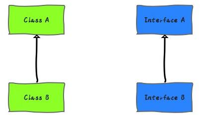

**组合  **

组合(Composition)体现的是整体与部分、 拥有的关系， 即 has-a 的关系。  


**组合与继承的区别和联系  **

在继承结构中， 父类的内部细节对于子类是可见的。 所以我们通常也可以说通过继承的代码复用是一种白盒式代码复用。 （ 如果基类的实现发生改变， 那么派生类的实现也将随之改变。 这样就导致了子类行为的不可预知性。）  

组合是通过对现有的对象进行拼装（ 组合） 产生新的、 更复杂的功能。 因为在对象之间，各自的内部细节是不可见的， 所以我们也说这种方式的代码复用是黑盒式代码复用。 （ 因为组合中一般都定义一个类型， 所以在编译期根本不知道具体会调用哪个实现类的方法）  

继承， 在写代码的时候就要指名具体继承哪个类， 所以， 在编译期就确定了关系。 （ 从基类继承来的实现是无法在运行期动态改变的， 因此降低了应用的灵活性。 ）  

组合， 在写代码的时候可以采用面向接口编程。 所以， 类的组合关系一般在运行期确定。  

**优缺点对比  **

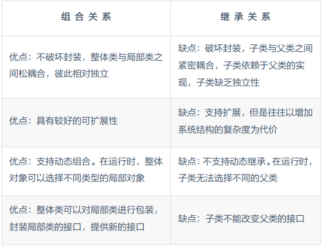

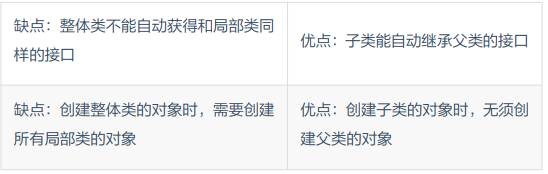

**如何选择  **

相信很多人都知道面向对象中有一个比较重要的原则『 多用组合、 少用继承』或者说『 组合优于继承』 。 从前面的介绍已经优缺点对比中也可以看出， 组合确实比继承更加灵活， 也更有助于代码维护。  

所以，  建议在同样可行的情况下， 优先使用组合而不是继承。  因为组合更安全， 更简单， 更灵活， 更高效。  

注意， 并不是说继承就一点用都没有了， 前面说的是【 在同样可行的情况下】 。 有一些场景还是需要使用继承的， 或者是更适合使用继承。  

继承要慎用， 其使用场合仅限于你确信使用该技术有效的情况。 一个判断方法是， 问一问自己是否需要从新类向基类进行向上转型。 如果是必须的， 则继承是必要的。 反之则应该好好考虑是否需要继承。《 Java 编程思想》  

只有当子类真正是超类的子类型时， 才适合用继承。 换句话说， 对于两个类 A 和 B，只有当两者之间确实存在 is-a 关系的时候， 类 B 才应该继承类 A。 《 Effective Java》  

#### 构造函数与默认构造函数  

构造函数， 是一种特殊的方法。 主要用来在创建对象时初始化对象， 即为对象成员变量赋初始值， 总与 new 运算符一起使用在创建对象的语句中。 特别的一个类可以有多个构造函数， 可根据其参数个数的不同或参数类型的不同来区分它们即构造函数的重载。  

构造函数跟一般的实例方法十分相似； 但是与其它方法不同， 构造器没有返回类型， 不会被继承， 且可以有范围修饰符。 构造器的函数名称必须和它所属的类的名称相同。 它承担着初始化对象数据成员的任务。  

如果在编写一个可实例化的类时没有专门编写构造函数， 多数编程语言会自动生成缺省构造器（ 默认构造函数） 。 默认构造函数一般会把成员变量的值初始化为默认值， 如 int ->0， Integer -> null。  

#### 类变量、 成员变量和局部变量  

Java 中共有三种变量， 分别是类变量、 成员变量和局部变量。 他们分别存放在 JVM的方法区、 堆内存和栈内存中。  

```java
public class Variables {
    /**
     * 类变量
     */
    private static int a;
    /**
     * 成员变量
     */
    private int b;
    /**
     * 局部变量
     * @param c
     */
    public void test(int c){
        int d;
    }
}
```

上面定义的三个变量中， 变量 a 就是类变量， 变量 b 就是成员变量， 而变量 c 和 d 是局部变量。  

#### 成员变量和方法作用域  

对于成员变量和方法的作用域， public， protected， private 以及不写之间的区别：  

**public **: 表明该成员变量或者方法是对所有类或者对象都是可见的,所有类或者对象都可以直接访问。  

**private **: 表明该成员变量或者方法是私有的,只有当前类对其具有访问权限,除此之外其他类或者对象都没有访问权限.子类也没有访问权限。  

**protected **: 表明成员变量或者方法对类自身,与同在一个包中的其他类可见,其他包下的类不可访问,除非是他的子类。  

**default **: 表明该成员变量或者方法只有自己和其位于同一个包的内可见,其他包内的类不能访问,即便是它的子类。  

### 什么是平台无关性  

#### Java 如何实现的平台无关性的  

相信对于很多 Java 开发来说， 在刚刚接触 Java 语言的时候， 就听说过 Java 是一门跨平台的语言， Java 是平台无关性的， 这也是 Java 语言可以迅速崛起并风光无限的一个重要原因。 那么， 到底什么是平台无关性？ Java 又是如何实现平台无关性的呢？ 本文就来简单介绍一下。  

**什么是平台无关性  **

平台无关性就是一种语言在计算机上的运行不受平台的约束， 一次编译， 到处执行（Write Once ,Run Anywhere） 。  

也就是说， 用 Java 创建的可执行二进制程序， 能够不加改变的运行于多个平台。  

**平台无关性好处  **

作为一门平台无关性语言， 无论是在自身发展， 还是对开发者的友好度上都是很突出的。  

因为其平台无关性， 所以 Java 程序可以运行在各种各样的设备上， 尤其是一些嵌入式设备， 如打印机、 扫描仪、 传真机等。 随着 5G 时代的来临， 也会有更多的终端接入网络，相信平台无关性的 Java 也能做出一些贡献。  

对于 Java 开发者来说， Java 减少了开发和部署到多个平台的成本和时间。 真正的做到一次编译， 到处运行。  

**平台无关性的实现  **

对于 Java 的平台无关性的支持， 就像对安全性和网络移动性的支持一样， 是分布在整个 Java 体系结构中的。 其中扮演者重要的角色的有 Java 语言规范、 Class 文件、 Java虚拟机（ JVM） 等。  

**编译原理基础  **

讲到 Java 语言规范、 Class 文件、 Java 虚拟机就不得不提 Java 到底是是如何运行起来的。  

在计算机世界中， 计算机只认识0 和 1， 所以， 真正被计算机执行的其实是由 0 和 1 组成的二进制文件。  

但是， 我们日常开发使用的 C、 C++、 Java、 Python 等都属于高级语言， 而非二进制语言。 所以， 想要让计算机认识我们写出来的 Java 代码， 那就需要把他"翻译"成由 0 和1 组成的二进制文件。 这个过程就叫做编译。 负责这一过程的处理的工具叫做编译器。  

在 Java 平台中， 想要把 Java 文件， 编译成二进制文件， 需要经过两步编译， 前端编译和后端编译：  

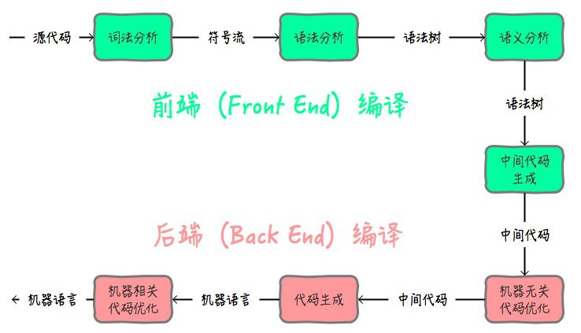

前端编译主要指与源语言有关但与目标机无关的部分。 Java 中， 我们所熟知的 javac的编译就是前端编译。 除了这种以外， 我们使用的很多 IDE， 如 eclipse， idea 等， 都内置了前端编译器。 主要功能就是把.java 代码转换成.class 代码。  

这里提到的.class 代码， 其实就是 Class 文件。  

后端编译主要是将中间代码再翻译成机器语言。 Java 中， 这一步骤就是 Java 虚拟机来执行的。  

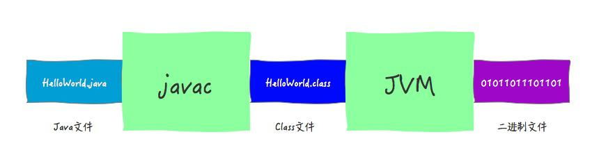

所以， 我们说的， Java 的平台无关性实现主要作用于以上阶段。 如下图所示：  

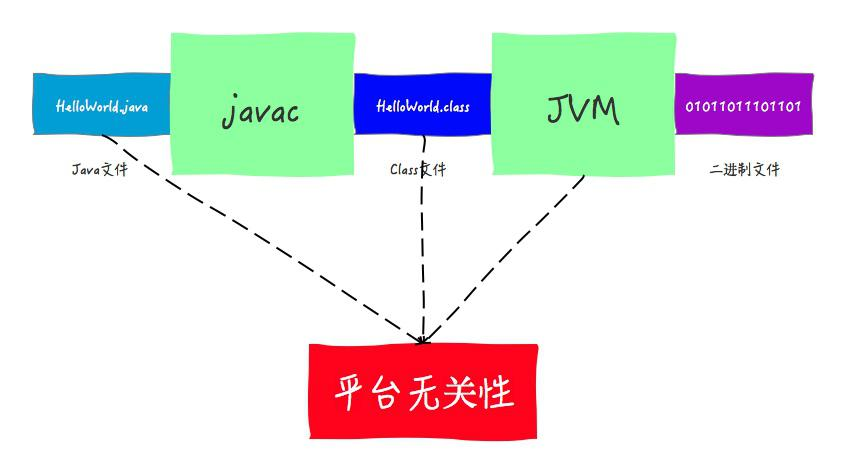

我们从后往前介绍一下这三位主演： Java 虚拟机、 Class 文件、 Java 语言规范  

**Java 虚拟机  **

所谓平台无关性， 就是说要能够做到可以在多个平台上都能无缝对接。 但是， 对于不同的平台， 硬件和操作系统肯定都是不一样的。  

对于不同的硬件和操作系统， 最主要的区别就是指令不同。 比如同样执行 a+b， A 操作系统对应的二进制指令可能是 10001000， 而 B 操作系统对应的指令可能是 11101110。那么， 想要做到跨平台， 最重要的就是可以根据对应的硬件和操作系统生成对应的二进制指令。  

而这一工作， 主要由我们的 Java 虚拟机完成。 虽然 Java 语言是平台无关的， 但JVM 却是平台有关的， 不同的操作系统上面要安装对应的 JVM。  

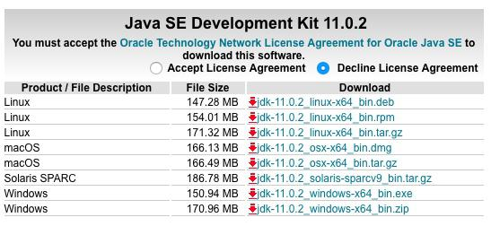

上图是 Oracle 官网下载 JDK 的指引， 不同的操作系统需要下载对应的 Java 虚拟机。  

有了 Java 虚拟机， 想要执行 a+b 操作， A 操作系统上面的虚拟机就会把指令翻译成 10001000， B 操作系统上面的虚拟机就会把指令翻译成 11101110。  

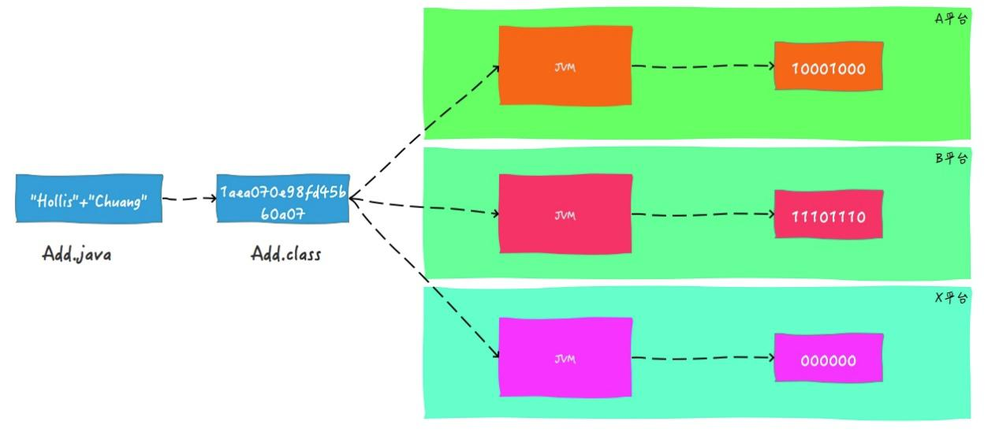

所以， Java 之所以可以做到跨平台， 是因为 Java 虚拟机充当了桥梁。 他扮演了运行时 Java 程序与其下的硬件和操作系统之间的缓冲角色。  

**字节码  **

各种不同的平台的虚拟机都使用统一的程序存储格式——字节码（ ByteCode） 是构成平台无关性的另一个基石。 Java 虚拟机只与由字节码组成的 Class 文件进行交互。  

我们说 Java 语言可以 Write Once ,Run Anywhere。 这里的 Write 其实指的就是生成 Class 文件的过程。  

因为 Java Class 文件可以在任何平台创建， 也可以被任何平台的 Java 虚拟机装载并执行， 所以才有了 Java 的平台无关性。  

**Java 语言规范  **

已经有了统一的 Class 文件， 以及可以在不同平台上将 Class 文件翻译成对应的二进制文件的 Java 虚拟机， Java 就可以彻底实现跨平台了吗？  

其实并不是的， Java 语言在跨平台方面也是做了一些努力的， 这些努力被定义Java 语言规范中。  

比如， Java 中基本数据类型的值域和行为都是由其自己定义的。 而 C/C++中， 基本数据类型是由它的占位宽度决定的， 占位宽度则是由所在平台决定的。 所以， 在不同的平台中， 对于同一个 C++程序的编译结果会出现不同的行为。  

举一个简单的例子， 对于 int 类型， 在 Java 中， int 占 4 个字节， 这是固定的。  

但是在 C++中却不是固定的了。 在 16 位计算机上， int 类型的长度可能为两字节； 在32 位计算机上， 可能为 4 字节； 当 64 位计算机流行起来后， int 类型的长度可能会达到 8字节。 （ 这里说的都是可能哦！ ）  

通过保证基本数据类型在所有平台的一致性， Java 语言为平台无关性提供强了有力的支持。  

**小结  **

对于 Java 的平台无关性的支持是分布在整个 Java 体系结构中的。 其中扮演着重要角色的有 Java 语言规范、 Class 文件、 Java 虚拟机等。  

* Java 语言规范  

通过规定 Java 语言中基本数据类型的取值范围和行为  

* Class 文件  

所有 Java 文件要编译成统一的 Class 文件  

* Java 虚拟机  

通过 Java 虚拟机将 Class 文件转成对应平台的二进制文件等  

Java 的平台无关性是建立在 Java 虚拟机的平台有关性基础之上的， 是因为 Java 虚拟机屏蔽了底层操作系统和硬件的差异。  

**语言无关性  **

其实， Java 的无关性不仅仅体现在平台无关性上面， 向外扩展一下， Java 还具有语言无关性。  

前面我们提到过。 JVM 其实并不是和 Java 文件进行交互的， 而是和 Class 文件， 也 就是说， 其实 JVM 运行的时候， 并不依赖于 Java 语言。  

时至今日， 商业机构和开源机构已经在 Java 语言之外发展出一大批可以在 JVM 上运行的语言了， 如 Groovy、 Scala、 Jython 等。 之所以可以支持， 就是因为这些语言也可以被编译成字节码（ Class 文件） 。 而虚拟机并不关心字节码是有哪种语言编译而来的。  

**JVM 还支持哪些语言  **

为了让 Java 语言具有良好的跨平台能力， Java 独具匠心的提供了一种可以在所有平台上都能使用的一种中间代码——字节码（ ByteCode） 。  

有了字节码， 无论是哪种平台（ 如 Windows、 Linux 等） ， 只要安装了虚拟机， 都可以直接运行字节码。  

同样， 有了字节码， 也解除了 Java 虚拟机和 Java 语言之间的耦合。 这话可能很多人不理解， Java 虚拟机不就是运行 Java 语言的么？ 这种解耦指的是什么？  

其实， 目前 Java 虚拟机已经可以支持很多除 Java 语言以外的语言了， 如 Kotlin、Groovy、 JRuby、 Jython、 Scala 等。 之所以可以支持， 就是因为这些语言也可以被编译 成 字 节 码 。 而 虚拟机并不关心字节码是由哪种 语言编译而来的 。  

经常使用 IDE 的开发者可能会发现， 当我们在 Intelij IDEA 中， 鼠标右键想要创建Java 类的时候， IDE 还会提示创建其他类型的文件， 这就是 IDE 默认支持的一些可以运行在 JVM 上面的语言， 没有提示的， 可以通过插件来支持。  

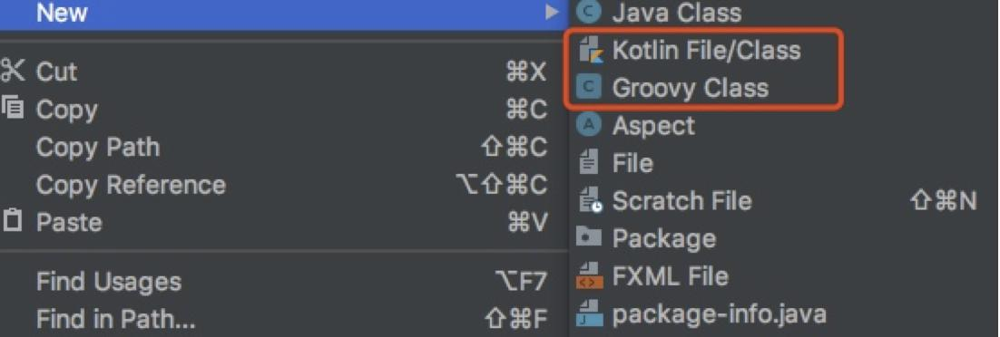

**总结**

好啦， 以上就是目前主流的可以在 JVM 上面运行的 9 种语言。 加上 Java 正好 10 种。如果你是一个 Java 开发， 那么有必要掌握以上 9 中的一种， 这样可以在一些有特殊需求的场景中有更多的选择。 推荐在 Groovy、 Scala、 Kotlin 中选一个。  

### 为什么说 Java 中只有值传递  

对于初学者来说， 很难把这个问题回答正确， 最初思考这个问题的时候， 我发现我竟然无法通过简单的语言把这个事情描述的很容易理解， 遗憾的是， 我也没有在网上找到哪篇文章可以把这个事情讲解的通俗易懂。 所以，就有了我写这篇文章的初衷。  

#### 辟谣时间  

关于这个问题， 在 StackOverflow 上也引发过广泛的讨论， 看来很多程序员对于这个问题的理解都不尽相同， 甚至很多人理解的是错误的。 还有的人可能知道 Java 中的参数传递是值传递， 但是说不出来为什么。  

在开始深入讲解之前， 有必要纠正一下大家以前的那些错误看法了。如果你有以下想法，那么你有必要好好阅读本文。  

错误理解一： 值传递和引用传递， 区分的条件是传递的内容， 如果是个值， 就是值传递。如果是个引用， 就是引用传递。  

错误理解二： Java 是引用传递。  

错误理解三： 传递的参数如果是普通类型， 那就是值传递， 如果是对象， 那就是引用传递。  

#### 实参与形参  

我们都知道， 在 Java 中定义方法的时候是可以定义参数的。 比如 Java 中的 main 方法，` public static void main(String[] args)`， 这里面的 args 就是参数。 参数在程序语言中分为形式参数和实际参数。  

形式参数： 是在定义函数名和函数体的时候使用的参数,目的是用来接收调用该函数时传入的参数。  

实际参数： 在调用有参函数时， 主调函数和被调函数之间有数据传递关系。 在主调函数中调用一个函数时， 函数名后面括号中的参数称为“ 实际参数” 。  

简单举个例子：  

```java
    public static void main(String[] args){
        ParamTest pt = new ParamTest();
        // 实际参数为 Hollis
        System.out.println("Hollis");
    }
    
    //形式参数为 name
    public void sout(String name) {
        System.out.println(name);
    }
```

实际参数是调用有参方法的时候真正传递的内容， 而形式参数是用于接收实参内容的参数。  

#### 求值策略  

我们说当进行方法调用的时候， 需要把实际参数传递给形式参数， 那么传递的过程中到底传递的是什么东西
呢？  

这其实是程序设计中求值策略（ Evaluation strategies） 的概念。  

在计算机科学中， 求值策略是确定编程语言中表达式的求值的一组（ 通常确定性的） 规则。 求值策略定义何时和以何种顺序求值给函数的实际参数、 什么时候把它们代换入函数、和代换以何种形式发生。  

求值策略分为两大基本类， 基于如何处理给函数的实际参数， 分为严格的和非严格的。  

#### 严格求值  

在“ 严格求值” 中， 函数调用过程中， 给函数的实际参数总是在应用这个函数之前求值。多数现存编程语言对函数都使用严格求值。 所以， 我们本文只关注严格求值。  

在严格求值中有几个关键的求值策略是我们比较关心的， 那就是传值调用（ Call by value） 、 传引用调用（ Call by reference） 以及传共享对象调用（ Call by sharing） 。  

* **传值调用（ 值传递）  **

在传值调用中， 实际参数先被求值， 然后其值通过复制， 被传递给被调函数的形式参数。 因为形式参数拿到的只是一个"局部拷贝"， 所以如果在被调函数中改变了形式参数的值， 并不会改变实际参数的值。  

* **传引用调用（ 引用传递）  **

在传引用调用中， 传递给函数的是它的实际参数的隐式引用而不是实参的拷贝。 因为传递的是引用， 所以， 如果在被调函数中改变了形式参数的值， 改变对于调用者来说是可见的。  

* **传共享对象调用（ 共享对象传递）  **

传共享对象调用中， 先获取到实际参数的地址， 然后将其复制， 并把该地址的拷贝传递给被调函数的形式参数。 因为参数的地址都指向同一个对象， 所以我们也称之为"传共享对象"， 所以， 如果在被调函数中改变了形式参数的值， 调用者是可以看到这种变化的。  

不知道大家有没有发现， 其实传共享对象调用和传值调用的过程几乎是一样的， 都是进行"求值"、 "拷贝"、 "传递"。  

但是， 传共享对象调用和内传引用调用的结果又是一样的， 都是在被调函数中如果改变参数的内容， 那么这种改变也会对调用者有影响。 你再品， 你再细品。  

那么， 共享对象传递和值传递以及引用传递之间到底有很么关系呢？  

对于这个问题， 我们应该关注过程， 而不是结果， 因为传共享对象调用的过程和传值调用的过程是一样的， 而且都有一步关键的操作， 那就是"复制"， 所以， 通常我们认为传共享对象调用是传值调用的特例。  

我们先把传共享对象调用放在一边， 我们再来回顾下传值调用和传引用调用的主要区别：  

传值调用是指在调用函数时将实际参数复制一份传递到函数中， 传引用调用是指在调用函数时将实际参数的引用直接传递到函数中。  

所以， 两者的最主要区别就是是直接传递的， 还是传递的是一个副本。  

这里我们来举一个形象的例子。 再来深入理解一下传值调用和传引用调用：  

你有一把钥匙， 当你的朋友想要去你家的时候， 如果你直接把你的钥匙给他了， 这就是引用传递。  

这种情况下， 如果他对这把钥匙做了什么事情， 比如他在钥匙上刻下了自己名字， 那么这把钥匙还给你的时候， 你自己的钥匙上也会多出他刻的名字。  

你有一把钥匙， 当你的朋友想要去你家的时候， 你复刻了一把新钥匙给他， 自己的还在自己手里， 这就是值传递。  

这种情况下， 他对这把钥匙做什么都不会影响你手里的这把钥匙。  

#### Java 的求值策略  

前面我们介绍过了传值调用、 传引用调用以及传值调用的特例传共享对象调用， 那么，Java 中是采用的哪种求值策略呢？  

很多人说 Java 中的基本数据类型是值传递的， 这个基本没有什么可以讨论的， 普遍都是这样认为的。  

但是， 有很多人却误认为 Java 中的对象传递是引用传递。 之所以会有这个误区， 主要是因为 Java 中的变量和对象之间是有引用关系的。 Java 语言中是通过对象的引用来操纵对象的。 所以， 很多人会认为对象的传递是引用的传递。  

而且很多人还可以举出以下的代码示例：  

```java
    public static void main(String[] args) {
        Test pt = new Test();
        User hollis = new User();
        hollis.setName("Hollis");
        hollis.setGender("Male");
        pt.pass(hollis);
        System.out.println("print in main , user is " + hollis);
    } 
    public void pass(User user) {
        user.setName("hollischuang");
        System.out.println("print in pass , user is " + user);
    }

    public void bark() {
        System.out.println("woof");
    }
```

输出结果：  

```java
print in pass , user is User{name='hollischuang', gender='Male'}print in main , user is User{name='hollischuang', gender='Male'}
```

可以看到， 对象类型在被传递到 pass 方法后， 在方法内改变了其内容， 最终调用方main 方法中的对象也变了。  

所以， 很多人说， 这和引用传递的现象是一样的， 就是在方法内改变参数的值， 会影响到调用方。  

但是， 其实这是走进了一个误区。  

#### Java 中的对象传递  

很多人通过代码示例的现象说明 Java 对象是引用传递， 那么我们就从现象入手， 先来反驳下这个观点。  

我们前面说过， 无论是值传递， 还是引用传递， 只不过是求值策略的一种， 那求值策略还有很多， 比如前面提到的共享对象传递的现象和引用传递也是一样的。 那凭什么就说Java 中的参数传递就一定是引用传递而不是共享对象传递呢？  

那么， Java 中的对象传递， 到底是哪种形式呢？ 其实， 还真的就是共享对象传递。  

其实在 《 The Java™ Tutorials》 中， 是有关于这部分内容的说明的。 首先是关于基本类型描述如下：  

`Primitive arguments, such as an int or a double, are passed intomethods by value. This means that any changes to the values of the parameters exist only within the scope of the method. When the method returns,the parameters are gone and any changes to them are lost.  `

即， 原始参数通过值传递给方法。 这意味着对参数值的任何更改都只存在于方法的范围内。 当方法返回时， 参数将消失， 对它们的任何更改都将丢失。  

关于对象传递的描述如下：  

`Reference data type parameters, such as objects, are also passed into methods by value. This means that when the method returns, the passed-in reference still references the same object as before. However, the values of the object’ s fields can be changed in the method, if they havethe proper access level.  `

也就是说， 引用数据类型参数(如对象)也按值传递给方法。 这意味着， 当方法返回时，传入的引用仍然引用与以前相同的对象。 但是， 如果对象字段具有适当的访问级别， 则可以在方法中更改这些字段的值。  

这一点官方文档已经很明确的指出了， Java 就是值传递， 只不过是把对象的引用当做值传递给方法。 你细品， 这不就是共享对象传递么？  

其实 Java 中使用的求值策略就是传共享对象调用， 也就是说， Java 会将对象的地址的拷贝传递给被调函数的形式参数。 只不过"传共享对象调用"这个词并不常用， 所以 Java社区的人通常说"Java 是传值调用"， 这么说也没错， 因为传共享对象调用其实是传值调用的一个特例。  

#### 值传递和共享对象传递的现象冲突吗？  

看到这里很多人可能会有一个疑问， 既然共享对象传递是值传递的一个特例， 那么为什么他们的现象是完全不同的呢？  

难道值传递过程中， 如果在被调方法中改变了值， 也有可能会对调用者有影响吗？ 那到底什么时候会影响什么时候不会影响呢？  

其实是不冲突的， 之所以会有这种疑惑， 是因为大家对于到底是什么是"改变值"有误解。  

我们先回到上面的例子中来， 看一下调用过程中实际上发生了什么？  

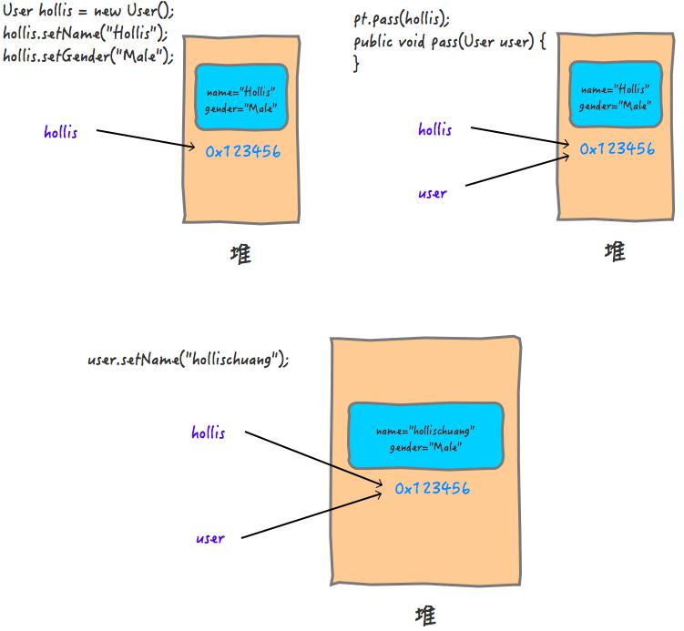

在参数传递的过程中， 实际参数的地址 0X1213456 被拷贝给了形参。 这个过程其实就是值传递， 只不过传递的值得内容是对象的应用。  

那为什么我们改了 user 中的属性的值， 却对原来的 user 产生了影响呢？  

其实， 这个过程就好像是： 你复制了一把你家里的钥匙给到你的朋友， 他拿到钥匙以后，并没有在这把钥匙上做任何改动， 而是通过钥匙打开了你家里的房门， 进到屋里， 把你家的电视给砸了。  

这个过程， 对你手里的钥匙来说， 是没有影响的， 但是你的钥匙对应的房子里面的内容却是被人改动了。  

也就是说， Java 对象的传递， 是通过复制的方式把引用关系传递了， 如果我们没有改引用关系， 而是找到引用的地址， 把里面的内容改了， 是会对调用方有影响的， 因为大家指向的是同一个共享对象。  

那么， 如果我们改动一下 pass 方法的内容：  

```java
    public void pass(User user) {        user = new User();        user.setName("hollischuang");        System.out.println("print in pass , user is " + user);    }
```

上面的代码中， 我们在 pass 方法中， 重新 new 了一个 user 对象， 并改变了他的值，输出结果如下：  

```java
print in pass , user is User{name='hollischuang', gender='Male'}print in main , user is User{name='Hollis', gender='Male'}
```

再看一下整个过程中发生了什么：  

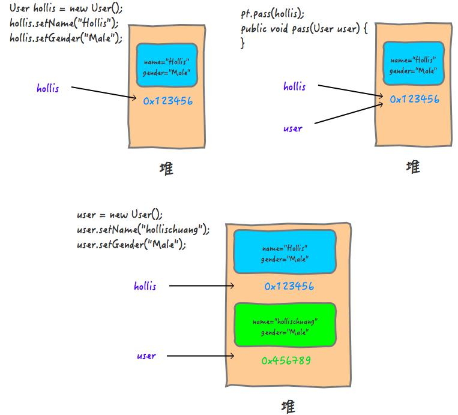

这个过程， 就好像你复制了一把钥匙给到你的朋友， 你的朋友拿到你给他的钥匙之后，找个锁匠把他修改了一下， 他手里的那把钥匙变成了开他家锁的钥匙。 这时候， 他打开自己家， 就算是把房子点了， 对你手里的钥匙， 和你家的房子来说都是没有任何影响的。  

所以， Java 中的对象传递， 如果是修改引用， 是不会对原来的对象有任何影响的， 但是如果直接修改共享对象的属性的值， 是会对原来的对象有影响的。  

#### 总结  

我们知道， 编程语言中需要进行方法间的参数传递， 这个传递的策略叫做求值策略。  

在程序设计中， 求值策略有很多种， 比较常见的就是值传递和引用传递。 还有一种值传递的特例——共享对象传递。  

值传递和引用传递最大的区别是传递的过程中有没有复制出一个副本来， 如果是传递副本， 那就是值传递， 否则就是引用传递。  

在 Java 中， 其实是通过值传递实现的参数传递， 只不过对于 Java 对象的传递， 传递的内容是对象的引用。  

我们可以总结说， Java 中的求值策略是共享对象传递， 这是完全正确的。  

但是， 为了让大家都能理解你说的， 我们说 Java 中只有值传递， 只不过传递的内容是对象的引用。 这也是没毛病的。  

但是， 绝对不能认为 Java 中有引用传递。  

