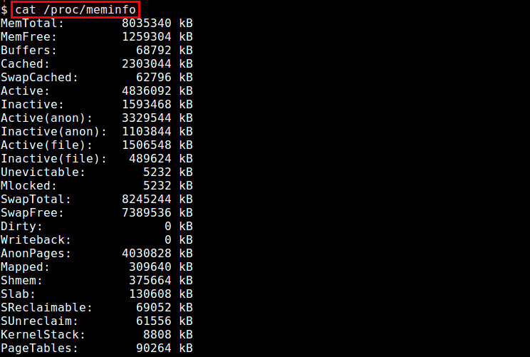
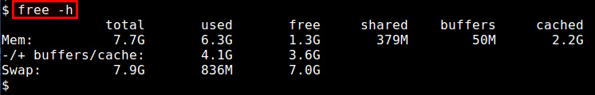
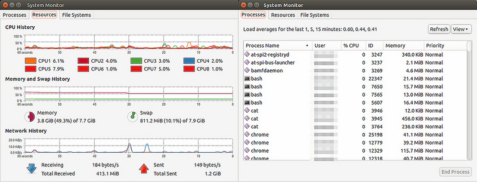
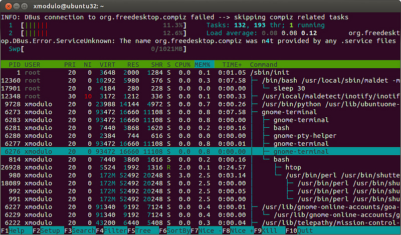
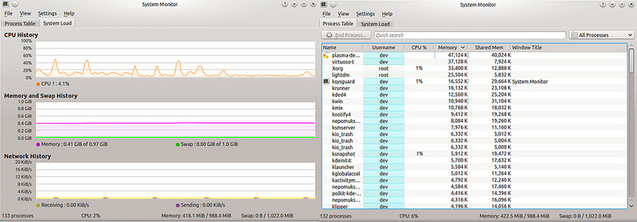

# 如何查看Linux的内存使用状况

**我想要监测Linux系统的内存使用状况。有哪些可用的图形界面或者[命令](https://www.linuxcool.com/)行工具来检查当前内存使用情况？**

当涉及到Linux系统性能优化的时候，物理内存是一个最重要的因素。自然的，Linux提供了丰富的选择来监测珍贵的内存资源的使用情况。不同的工具，在监测粒度（例如：全系统范围，每个进程，每个用户），接口方式（例如：图形用户界面，[命令](https://www.linuxcool.com/)行，ncurses）或者运行模式（交互模式，批量处理模式）上都不尽相同。

下面是一个可供选择的，但并不全面的图形或命令行工具列表，这些工具用来检查Linux平台中已用和可用的内存。

**1. /proc/meminfo**

一种最简单的方法是通过“/proc/meminfo”来检查内存使用状况。这个动态更新的虚拟文件事实上是诸如free，top和ps这些与内存相关的工具的信息来源。从可用/闲置物理内存数量到等待被写入缓存的数量或者已写回磁盘的数量，只要是你想要的关于内存使用的信息，“/proc/meminfo”应有尽有。特定进程的内存信息也可以通过“/proc/statm”和“/proc/status”来获取。

```
1.$ cat /proc/meminfo
```


**2. atop**

atop命令是用于终端环境的基于ncurses的交互式的系统和进程监测工具。它展示了动态更新的系统资源摘要（CPU, 内存, 网络, 输入/输出, 内核），并且用醒目的颜色把系统高负载的部分以警告信息标注出来。它同样提供了类似于top的线程（或用户）资源使用视图，因此系统管理员可以找到哪个进程或者用户导致的系统负载。内存统计报告包括了总计/闲置内存，缓存的/缓冲的内存和已提交的虚拟内存。

```
1.$ sudo atop
```



**3. free**

free命令是一个用来获得内存使用概况的快速简单的方法，这些信息从“/proc/meminfo”获取。它提供了一个快照，用于展示总计/闲置的物理内存和系统交换区，以及已使用/闲置的内核缓冲区。

```
1.$ free -h
```



**4. GNOME System Monitor**

GNOME System Monitor 是一个图形界面应用，它展示了包括CPU，内存，交换区和网络在内的系统资源使用率的较近历史信息。它同时也可以提供一个带有CPU和内存使用情况的进程视图。

```
1.$ gnome-system-monitor
```



**5. htop**

htop命令是一个基于ncurses的交互式的进程视图，它实时展示了每个进程的内存使用情况。它可以报告所有运行中进程的常驻内存大小（RSS）、内存中程序的总大小、库大小、共享页面大小和脏页面大小。你可以横向或者纵向滚动进程列表进行查看。

```
1.$ htop
```



**6. KDE System Monitor**

就像GNOME桌面拥有GNOME System Monitor一样，KDE桌面也有它自己的对口应用：KDE System Monitor。这个工具的功能与GNOME版本极其相似，也就是说，它同样展示了一个关于系统资源使用情况，以及带有每个进程的CPU/内存消耗情况的实时历史记录。

```
1.$ ksysguard
```

