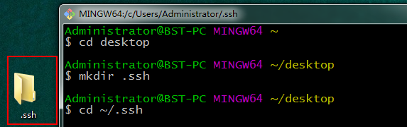
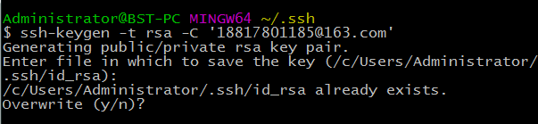
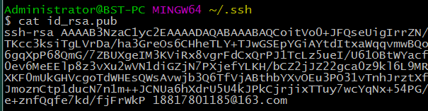
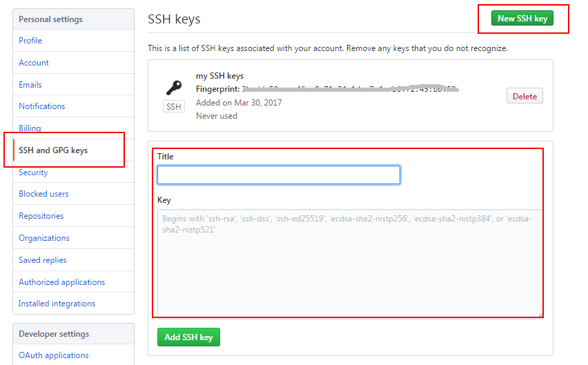
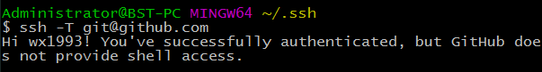
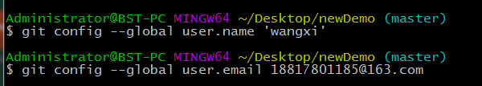

# GitHub 添加 SSH keys

首先在本地创建 SSH` Keys`

```shell
ssh-keygen -t rsa -C "wx166@163.com"
```

后面的邮箱即为 github 注册邮箱，之后会要求确认路径和输入密码，一路回车就行。

成功的话会在 `~/ `下生成 `.ssh`文件夹，进去，打开 `id_rsa.pub`，复制里面的`key`。

那么问题来了，如何进入到 ~/ 路径下找到 .ssh 文件夹呢？

使用命令

```
cd ~/.ssh
```

出现提示 "No such file or directory"，此时可以选择手动创建一个 .ssh 文件夹，如下：



然后执行之前的命令生成 SSH Keys



此时 SSH Keys 已经生成，查看内容



复制全部内容，打开 GitHub 主页，左侧选择 SSH and GPG Keys， 点击 Add SSH Keys，然后输入名称，并将复制的内容粘贴过来，添加即可。



验证 SSH Keys 是否添加成功

```shell
ssh -T git@github.com
```



如果是第一次的会提示是否continue，输入yes就会看到：You've successfully authenticated, but GitHub does not provide shell access 。这就表示已成功连上github。

接下来我们要做的就是把本地仓库传到github上去，在此之前还需要设置username和email，因为github每次commit都会记录他们。

```shell
1 $ git config --global user.name 'wangxi'
2 $ git config --global user.email 18817801185@163.com
```



进入要上传的仓库，右键 git bash，添加远程地址

```shell
 git remote add origin git@github.com:wangxi/Node-React-MongoDB-TodoList.git
```

加完之后进入 .git，打开 config，这里会多出一个remote "origin"内容，这就是刚才添加的远程地址，也可以直接修改config来配置远程地址。

创建新文件夹，打开，然后执行` git init` 以创建新的 git 仓库。

**检出仓库**

```shell
git clone /path/to/repository
```

**检出服务器上的仓库**

```shell
git clone username@host:/path/to/repository
```

