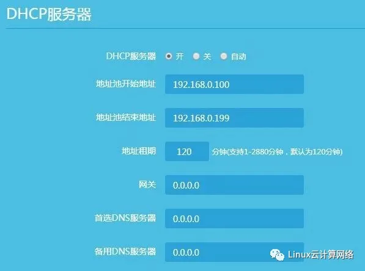
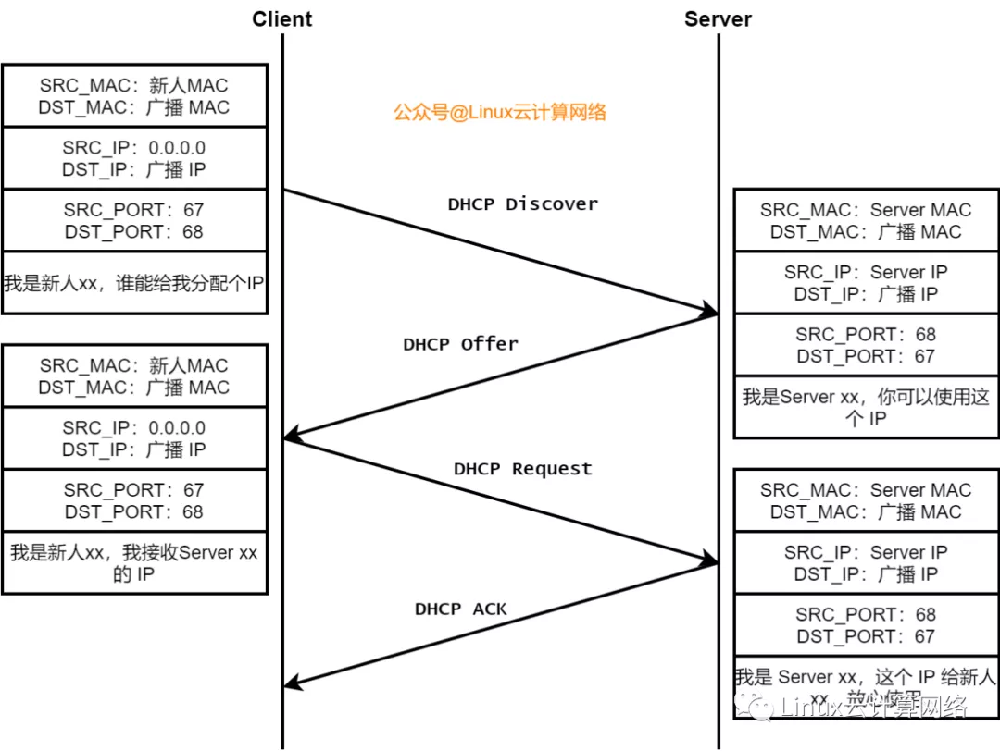
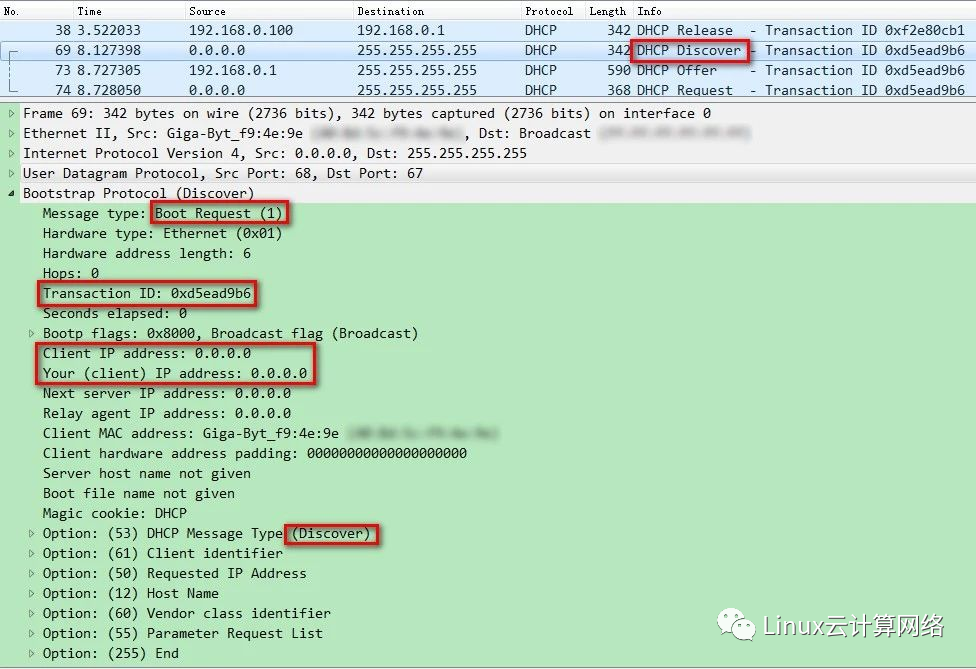
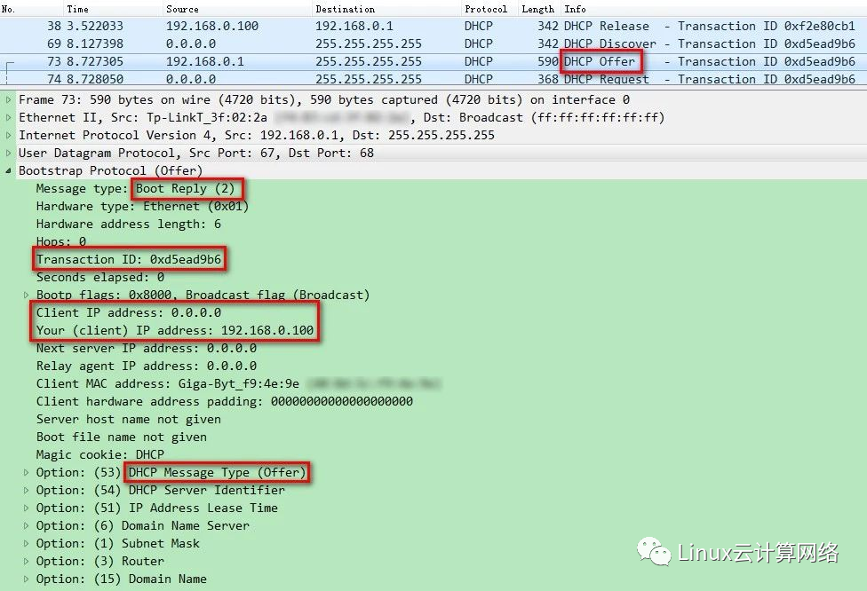
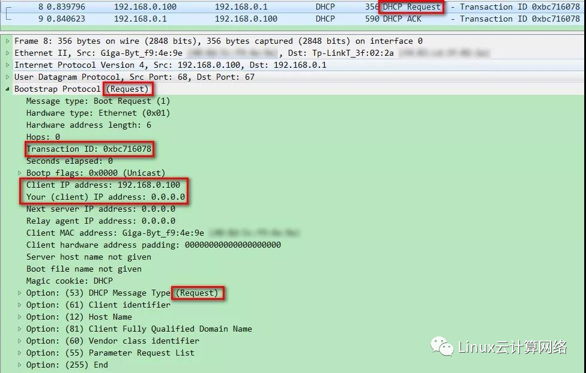
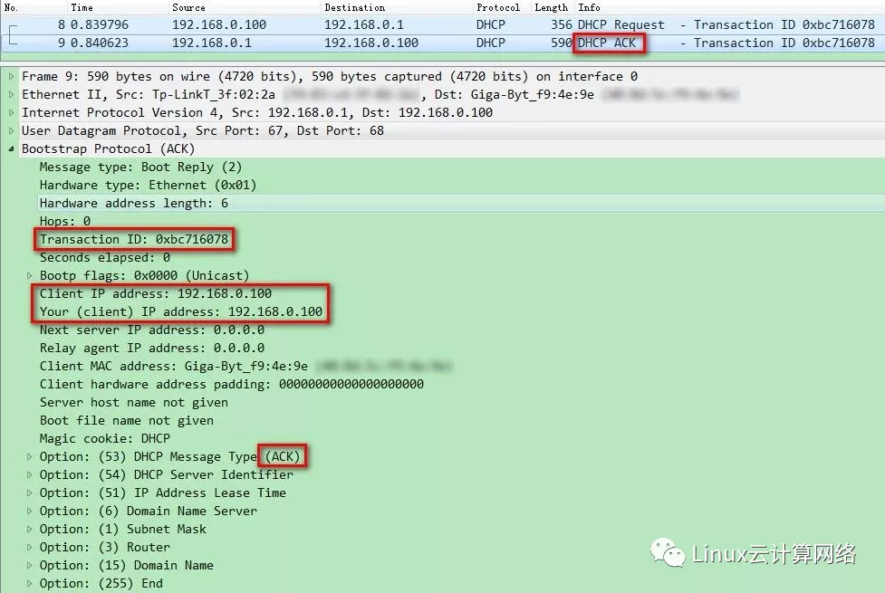
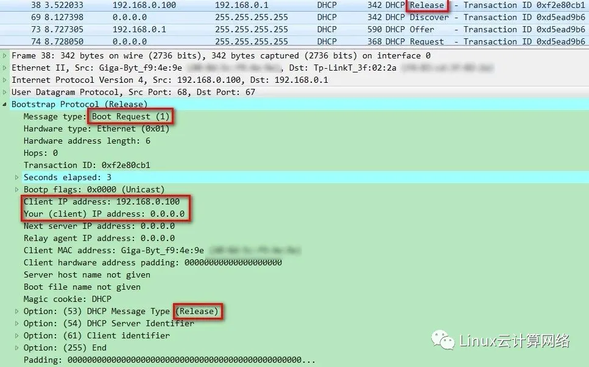
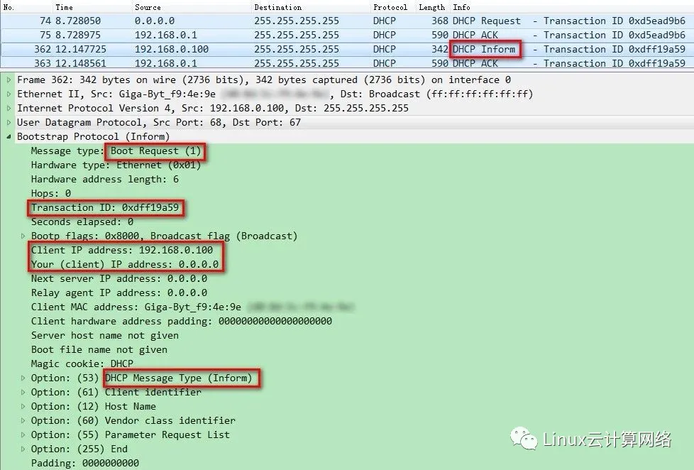
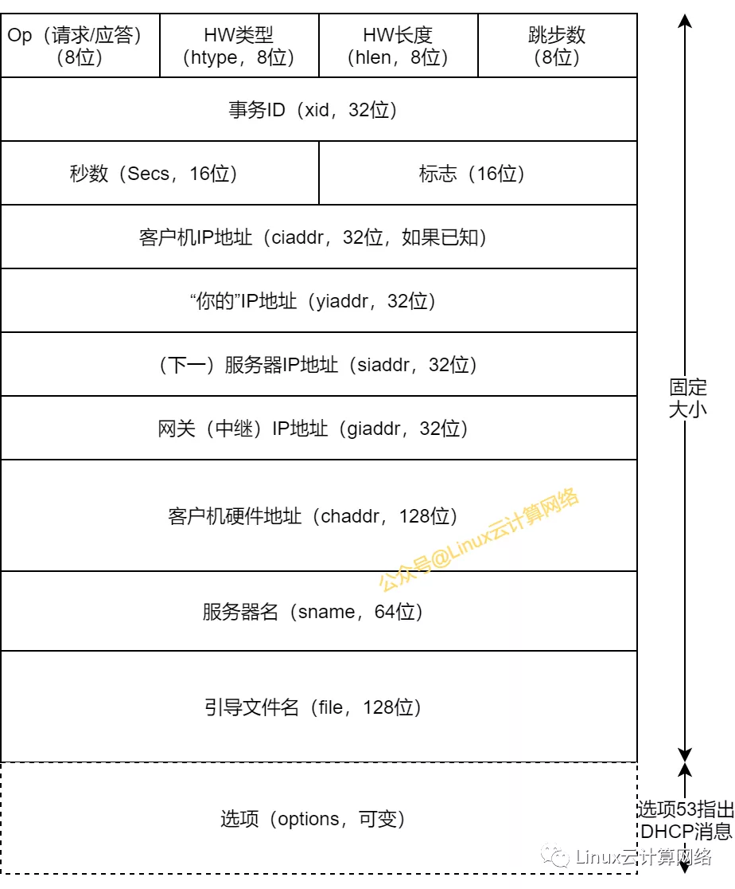

## 可能是目前最全的讲DHCP的文章了

对于 DHCP 协议，你可能想知道以下几个问题：

- DHCP 是啥
- 为啥需要 DHCP
- DHCP 的工作机制
- DHCP 如何分配地址
- DHCP 报文格式长啥样
- DHCP 中继是啥
- DHCP 有什么问题
- DHCP 使用到哪些工具

下面我们就带着这些问题，来一探究竟。

## 01 DHCP 是啥

DHCP 全称是 Dynamic Host Configuration Protocol，动态主机配置协议，主要用来给主机配置 IP 地址等网络信息的。IP 地址可以手动配（用 `ifconfig/ipconfig/ip addr` 等工具），也可以自动配，自动配就通过 DHCP 这个协议来完成，IPv6 有对应的 DHCPv6 协议。

## 02 为啥需要 DHCP

首先当然是方便了，手动配一台可以，如果让你去配一个数据中心所有的主机，怎么办？

还有有些主机可能经常要移动，这就意味着要提供灵活的重新分配地址的机制，不然人工操作相当麻烦。

再有有些系统，可能不仅仅需要配置某个网卡的地址，还需要配置出口网关地址，DNS 域名服务器地址等等，这同样面临操作成本的问题。

最后相比程序化的机器，人是最容易出错的，如果不小心操作不当，那可能会面临严重的 IT 事故。

因此，急需一个程序（协议）来自动化完成这件事，这就是 DHCP 必然存在的原因。

## 03 DHCP 的工作机制

DHCP 协议以 C/S 的方式进行工作。现在的操作系统的协议栈中都是包含 DHCP 功能的，当你的主机启动时，它就是一台 DHCP 客户端，会向当前局域网内的 DHCP 服务器获取 IP 地址等网络信息。

DHCP 服务器为了能够正确分发 IP 地址，需要完成两方面的内容：

- IP 地址管理：包括维护 IP 地址池、IP 地址租约管理等
- 配置数据交付：包括 DHCP 协议的消息格式和状态机处理等

**IP 地址管理**

DHCP 服务器通常会维护两张表：IP 地址池表和租约表（通常保存在持久性存储器中，比如非易失性内存或磁盘中）。

IP 地址池表是专门为 DHCP 用途而分配的一个连续的 IP 地址范围，我们可以在开启 DHCP 服务的主机上看到，大概像这样：

```
#cat /etc/dhcp/dhcpd.conf
subnet 10.10.0.0 netmask 255.255.0.0 {
range 10.10.0.2 10.10.0.254;
option routers 10.10.0.1;
}
```

所有新的客户端请求都会从 IP 地址池表中选择一个地址作为响应，等到确定该地址可以给某个客户端使用时，将其加入租约表中进行管理。

租约表主要维护已分配地址的租约时间。DHCP 协议规定每个地址都有一定的租约周期要求，要不然这个地址池分分钟就被耗尽了。有了租约时间，DHCP 服务器就可以动态地管理自己所管辖范围内的所有主机的进进出出，就像去餐厅吃饭，位置就那么几个，但是服务的客流量可能很大。

租约时间可以从几分钟到几天或更长时间。租约时间的长短各有利弊，时间较长，会较快耗尽可用的地址池，但却提供稳定的地址和减少网络开销（因为续租请求较少）；反之亦然。所以，确定租约时间的最佳值需要对预期客户数、地址池大小和地址稳定性等因素进行权衡。常见的默认值包括 **12~24 小时** 。而微软则建议较小的网络采用 **8 天** ，较大的网络采用 **16~24 天** 。

客户端在租约时间 **过半时** 需要向服务端尝试续订租约，服务端在确定本次续约成功后，也会更新相关的租约信息。

为了更好地给用户体验，很多系统都会提供配置 DHCP 地址池的界面：



**配置数据交付**

DHCP 客户端和服务端通过数据交互来完成地址的分配和租约更新。这些消息有不同的格式和作用，双方会根据收到的不同消息，进入不同的状态进行处理。

总的来说，包括以下 8 种消息：

- DHCP DISCOVER
- DHCP OFFER
- DHCP REQUEST
- DHCP ACK
- DHCP NAK
- DHCP RELEASE
- DHCP DECLINE
- DHCP INFORM

那这 8 种消息是如何进行交互来分配 IP 地址的呢？下面就来一探究竟。

## 04 DHCP 如何分配地址（消息交互流程）

如下图，是客户端接入网络时发生的消息交互流程：



**① 客户端初始请求 DHCP 服务器：发送 DHCP DISCOVER 包**

当 DHCP Client 第一次启动接入网络时，此时还没有 IP 地址，它就向网络当中所有的 DHCP Server 发送一个 DCHP DISCOVER 的广播包。其中包的源目的端口分别是 67、68（DHCP 基于 UDP 协议，使用 UDP 67、68 端口来指代客户端和服务端）；源目的 IP 地址分别是 `0.0.0.0`，`255.255.255.255`；然后包的内容会包含标识客户端的 MAC 地址和主机名等信息。（等于向网络传达：我是新人，谁能给我分配个 IP）。



DHCP DISCOVER 消息有超时时间限制，默认是 1s。如果包发出去，在 1s 之内没有得到回应，就会发第二次，还是没有回应，就继续发，一共会发 四次，以 2、4、8、16s 为时间间隔。

如果 四次之后还是没有得到 DHCP Server 的回应，Client 就会从 `169.254.0.0/16` 这个自动保留的私有 IP 地址域中选用一个 IP 地址。同时它还会继续向服务端请求，每隔 5min 请求一次，如果收到Server 响应了，就选用响应的地址。

**② 服务端响应 IP 地址租用：发送 DHCP OFFER 包**

网络中可能存在着多台 DHCP Server ，它们都会收到 DHCP DISCOVER 包，然后从自身维护的 IP 地址池中根据一定的规则选择一个可用的 IP 地址（比如看是否有 IP 之前分配给该 Client，如没有，则选择一个最小可用的 IP ），并发送 DHCP OFFER 广播包。其中，包的源目的端口号分别为 68、67，源 IP 为该 Server 的 IP，目的 IP 仍然为广播地址，包的内容包含 IP 地址、子网掩码、租约时间以及其他配置信息（如网关、DNS 服务器等）。（等于告诉 Client：我这有可用的地址，你可以使用）。

同时，DHCP Server 会为此 Client 保留为它提供的 IP 地址信息，不让其他 Client 分配此 IP。



**③ 客户端进行 IP 地址租约：发送 DHCP REQUEST 包**

Client 可能会收到多台 DHCP Server 的响应，它会按照一定的规则选择一个 DHCP OFFER（一般是先到达的那个）。这个时候 Client 还不能使用这个 DHCP OFFER 提供的 IP，因为网络中其他的 DHCP Server 还不知情，所以 Client 会再发一个 DHCP REQUEST 广播包，一方面是告诉它接受 IP 的 DHCP Server：我打算用你分配的 IP 了，另一方面也是告诉其他 DHCP Server，我已经接受了别人分配的 IP，你们给我分配的 IP 可以撤销了。



其中，包的源 IP 仍然是 `0.0.0.0`，因为还没有得到 DHCP Server 的确认，包的内容包含 Client 的 MAC 地址、接受租约的 IP 地址以及提供此租约的 DHCP Server 的地址等信息。

DHCP REQUEST 包除了以上初始化的过程用到，在整个地址租约生命周期内都会用到，比如租约更新、重新分配等等，不过在租约更新过程中使用的是单播包，因为这个时候 Server 的地址是明确的，也不需要告知其他 Server。

**④ 服务端对 IP 租约进行确认：发送 DHCP ACK 包**

当被 Client 接受的 DHCP Server 收到 DHCP REQUEST 包时，会根据 REQUEST 包中携带的 Client 的 MAC 来查找是否有相应的租约记录，如果有则广播一个 DHCP ACK 包，仍然还是广播，因为 Client 的地址还是未知的。其中，包的内容包含分配的 IP 地址、租约时间等确定的信息。

当 Client 收到包之后，并不会立马使用，详细解释见 DHCP DECLINE 包的部分。



**⑤ 服务端拒绝本次租约：发送 DHCP NAK 包**

DHCP Server 可能存在这种情况：待分配的 IP 无法使用了，或者与 DHCP Client 的 MAC 无法对应，这个时候，DHCP Server 就会发送 DHCP  NAK 包给 Client，表示：这个 IP 目前异常，不能分配给你了。

**⑥ 客户端不再使用该 IP 地址，发送 DHCP RELEASE 包**

但 Client 不再使用已分配的 IP 地址时，会主动向 DHCP Server 发送一个 DHCP RELEASE 的单播包，告诉 Server 我不再使用该地址了，你可以释放相关的租约信息了。



**⑦ 客户端发现地址冲突不可用，发送 DHCP DECLINE 包**

在 Client 收到 DHCP ACK 包之后，它并不会立即就使用。因为网络当中可能存在多台 Client 同时在请求地址，这势必会造成信息的不同步，也就是说可能当前 Client 分配的 IP 可能被其他 Client 分配了。

所以当前 Client 收到 ACK 包之后，会通过发送 ARP 请求来检查地址是否冲突（会发送三次 ARP），如果出现冲突了，表明该地址不能使用了，遂向 DHCP Server 发送 DHCP DECLINE 的单播包，并重新进入 DHCP DISCOVER 的流程。DHCP Server 端也会显示该 IP 地址为 `BAD_ADDRESS`，避免被再次分配。

**⑧ 客户端想获取除 IP 外更为详细的网络信息，发送 DHCP INFORM 包**

以上所有的包类型，一般只是针对主机的 IP 地址进行分配，当然，DHCP 是可以提供更多的网络信息的，比如网关地址、DNS 服务器地址等等，这些信息一般就是通过 DHCP INFORM 消息单独获得，当 DHCP Server 收到该报文时，会查询相关的租约信息，找到相应的配置信息后，发送 DHCP ACK 报文给到 Client。



OK，以上就是 8 种消息的交互流程，及可能出现的场景，有些消息通过抓包一探了究竟，下面看看报文格式具体长啥样，让大家有更直观的认识。

## 05 DHCP 报文格式长啥样

DHCP 有一个前身协议，叫 BOOTP，DHCP 扩展了 BOOTP 的报文格式。BOOTP 是最早用于分配 IP 地址的协议，常用于无盘工作站的局域网中。DHCP 为了和它保持兼容，就选择在它的基础上进行扩展。



其中：

- Op：分别表示请求（1）or 应答（2）
- HW 类型：二层类型值，比如以太网，值为 1
- HW 长度：表示硬件（MAC）地址的长度，以太网值为6
- 跳步数：记录消息传输过程中的中继次数，发送方将该值置为 0，每次中继时递增
- 事务ID：Client 产生的一个随机数，用于标识当前的事务，Server 响应时需要携带同样的 ID，将请求和响应进行匹配
- 秒数：Client 进行设置，表示第一次尝试申请或重新申请地址经过的秒数，用于地址租约
- 标志：广播标志，表示 Client 只能处理广播包
- ciaddr：Client IP 地址，如果未知，就是 `0.0.0.0`
- yiaddr：“你的”IP 地址，Server 向 Client 提供的 IP 地址
- siaddr：（下一）服务器 IP 地址，这个用于 Client 的自举过程
- giaddr：网关（中继）IP 地址，这个地址一般由 DHCP 中继填写（如果有），它们在转发 DHCP 消息时填写
- chaddr：Client 硬件地址，标识一个唯一的 Client，Server 利用它可以为同一个 Client 每次的请求分配同一个 IP 地址
- sname：服务器名，非必须填写，可附到 options 字段中
- bootfile：引导文件名，非必须填写，可附到 options 字段中
- options：选项字段，长度可变，有多种选项，其中选项 53 就用于标识上述的各种消息

常见的选项有：

填充（0）、子网掩码（1）、路由器地址（3）、域名服务器（6）、域名（15）、请求的 IP 地址（50）、地址租用期（51）、 **DHCP 消息类型（53）** 、服务器标识符（54）、DHCP 错误消息（56）、租约更新时间（58）、租约重新绑定时间（59）、客户机标识符（61）和结束（255）。

其中，DHCP 消息类型（53）就指代上面提到的各种消息，如：DHCP DISCOVER（1）、DHCP OFFER（2）、DHCP REQUEST（3）、DHCP DECLINE、（4）DHCP ACK（5）、DHCP NAK（6）、DHCP RELEASE（7）、DHCP INFORM（8）等。


## 06 DHCP 中继

DHCP 消息交互过程中，全程都是使用的 UDP 广播通信。这就问题来了：

如果 DHCP 服务器和客户端不是在同一个子网内，而路由器又不能转发广播包，这个时候该怎么办呢？难道每个子网都要配一个 DHCP 服务器吗？这显然不合常理。

为了解决这一问题，就出现了 DHCP 中继代理。

DHCP 中继解决了跨越多个网段申请 IP 地址的问题，对不同网段的 IP 地址分配可以只由一个 DHCP 服务器进行统一管理和运维。

每个网段可以设置一个 DHCP 中继（可以在路由器上设或者直接在主机上配置），它可以配置 DHCP 服务器的地址，这样通过中继代理即可完成和 DHCP 服务器之间的交互（通过选项字段来标识 DHCP 中继的信息）。

具体地，当 DHCP 中继收到 DHCP Client 发来的广播请求包（DHCP 只中继广播包），由于事先配置好了 DHCP Server 的地址，所以 DHCP 中继发送单播包给到 DHCP  Server，Server 收到包之后再向 DHCP 中继响应，由于之前 DHCP 中继接收请求包时已经记录下 Client 的 MAC 地址，所以这时直接将包转发给 DHCP Client。

由此，通过 DHCP 中继即可完成了跨不同网络的 IP 地址申请（实际上，DHCP 中继远比上面描述的要复杂，比如二层中继和三层中继等，大家有兴趣可以进一步查阅相关资料了解）。


## 07 DHCP 的问题

一定程度上说，DHCP  服务器就是个活雷锋，为网络上的设备提供公共服务，掌握了很大的公共权力，一些黑客就比较青睐这种角色，如果攻陷了 DHCP 服务器，自己也相应获取了 DHCP 服务器的权力。

比较典型的攻击还是泛洪攻击，攻击者可以不断发出 DHCP 请求，冒充新入网的客户端，这样，DHCP 服务器的地址池就会被耗干，无法为正常的用户提供服务。接着攻击者可能继续下连环套，从 DHCP 服务器骗取了大量 IP 地址，自己就可以装扮成新的 DHCP 服务器，将骗来的地址分配给 DHCP 客户端，从而控制客户端。

进一步，还有更危险的，因为 DHCP 还能提供其他的网络信息，比如 DNS 服务器地址和网关地址，攻击者就可以让自己成为 DNS 服务器或者网关，于是，客户端的域名解析和外网通信，都必须经过攻击者的电脑。这个时候，攻击者的权限就很大了，它可以偷听通信、伪装、假扮成某个域名的网站，比如说，攻击者可以篡改域名解析，让你在访问 `www.baidu.com` 的时候，实际上访问的是攻击者提供的一个网页。当你在这个网页上输入用户名和密码时，信息就会泄露给攻击者。

DHCP 攻击让人防不胜防。DHCP 协议在设计中并没有考虑到安全性的问题，所以很难从软件上杜绝 DHCP 攻击。某些品牌的交换机上，可以指定特定端口给合法的DHCP 服务器，以免其他人伪装。当然，最重要的保护方式，还是防止攻击者连入局域网。

## 08 DHCP 使用到了哪些工具

首先是 Windows 上的工具，主要是 `ipconfig`：

- `ipconfig /all` 查看 DHCP 分配到的所有网络信息
- `ipconfig /release` 释放 DHCP 租约
- `ipconfig /renew` 获取/更新 DHCP 租约

Linux 上，主要是 `dhclient` 工具：

- `dhclient` 获取/更新 DHCP 租约
- `dhclient -r` 释放 DHCP 租约


## 09 总结

本文从 DHCP 的工作机制、报文格式、交互的消息报文到 DHCP 中继、存在的问题，再到用户可以用到的配置工具，全面地介绍了 DHCP 协议。DHCP 是针对的 IPv4 地址，IPv6 则是 DHCPv6，和 DHCP 有些许的不同，这块就留作后面的文章再来讲解。
