## 漫画 | 看进程小 P 讲述它的网络性能故事！

## 01

大家好，我是一个进程，我的名字的小 P。
我和很多其它小伙伴一样，都由老大操作系统创建和管理。

要问我是怎么来的，嘘小点声，不能让那帮应用开发们听见。

其实就是内核的开发都认为应用开发是傻逼，怕应用开发的代码把服务器给搞坏。就设计了我们进程出来，专门运行各种用户态的代码。

我们天然和内核里的小伙伴们被隔离开来。我们大部分时间都运行在用户态,其它的兄弟们都一直运行在内核态。

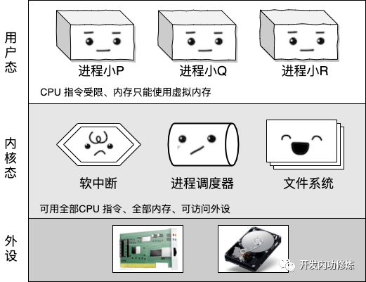

我们没有权限访问硬盘、网卡等设备。

如果我们需要这些功能的时候，需要通过系统调用先陷入到内核态中。不过在陷入之前，系统调用入口要对我们执行严格的安检。

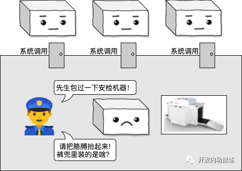

好了背景就是这样，今天我给大家讲讲我和我的好朋友们之间是怎么配合处理网络IO的。

## 02

我们进程通过一个叫 socket 的哥们来和我们的用户通信。但是实际上所有的 socket 以及整台机器上的网络包都是在内核态来把控着的，我们只能拿到 socket 的编号。

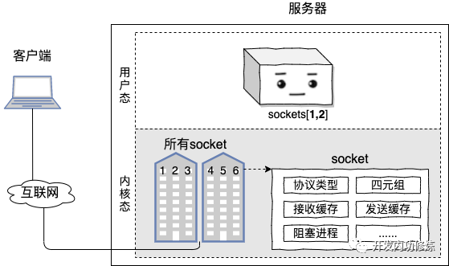

在很久很久以前，我们一般只处理一条 TCP 连接。

我们通过一个叫 recvfrom 的系统调用来读取我们的用户发送过来的数据。假如运气好的话，我们 recvfrom 的时候就可以把数据取走！

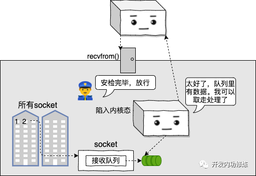

但是其实根本我们不知道用户那边啥时候给我们打数据包过来，所以大部分情况下都不会运气那么好。

如果 read 的时候数据包没有就绪，我们就得按照规矩主动把 CPU 让出来。

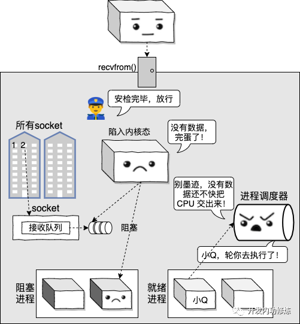

不过那时我们也确实只处理一条连接，连接上没请求被阻塞掉也正常。

后来老板不断的压榨我们，让我们一个进程处理成百上千条连接。这时候 read 某条连接的时候，没有数据就把我们挂起来，我们哪儿受得了哇， 我们还有其它好多连接要处理呢。

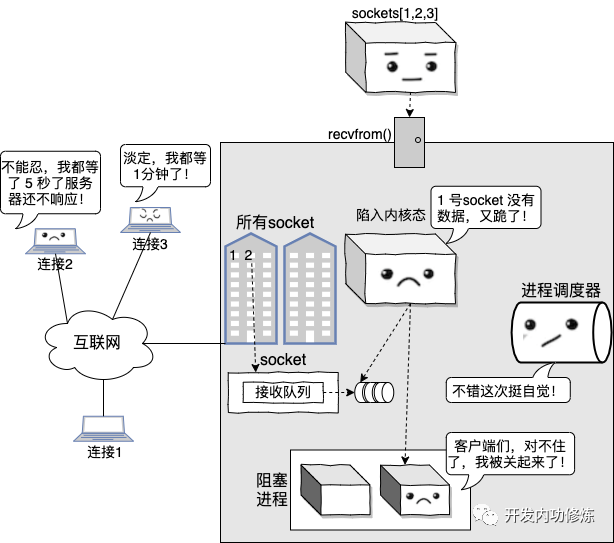

而且频繁的阻塞导致我的工作效率特别低下。 第一我们阻塞要花不少的时间保存我们当前的工作状态，第二我们在 L1/L2/L3 等 cache 里准备了好多工作时要用的缓存这下全没用了。

后来我们就给操作系统老大求了个情，要求把连接设置成非阻塞。

我：“哥，我只是来看看这条连接上有没有数据哈，有就给我，没有也别阻塞我可以不？”
操作系统：“准！”

这下就好了，我就可以用循环遍历的方式把我所有的 socket 挨个到内核中去看一遍。

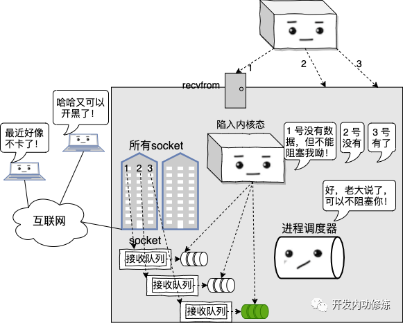

但是我的问题是我还是不知道用户啥时候把数据发过来。如果没有就绪的，那我只能就频繁循环地不断地来内核询问。

“去看看 1 号 socket 上有数据了没？” “没有”
“去看看 2 号 socket 上有数据了没？” “没有”
“去看看 3 号 socket 上有数据了没？” “没有”
...
“去看看 1 号 socket 上有数据了没？” “没有”
“去看看 2 号 socket 上有数据了没？” “没有”
“去看看 3 号 socket 上有数据了没？” “终于有啦”

干这事可特么把我累坏个屁的了，运气不好的时候我得访问成千上万次才能等到数据真正到来！

## 03

终于！！！

后来操作系统老大在内核态搞出了各种支持多路复用的新系统调用，它们是 select、poll、和 epoll。

不过嘿嘿，我最喜欢 epoll 这个新家伙。

我把需要观察的 socket 都交给他，他替我都维护了起来了，据说是内部用了一个叫啥红黑树的高深技术。

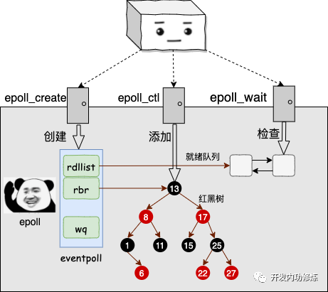

不过其实爱用啥用啥，我只关注能解放我的体力就行。
我是终于不用再不断的轮询了，每次我想要知道哪个 socket 上有请求的时候，直接进入内核态查看一下就绪队列就行了。

这种爽歪歪的感觉，你们真的无法体会。这就是我喜欢用这个家伙的原因。

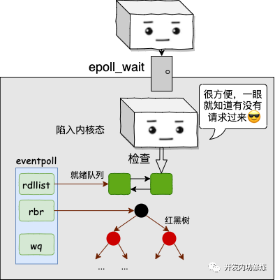

如果请求很多，那我就可以一直 epoll_wait 获取请求，一直处理，而不用阻塞。
直到时间片耗尽被再次丢到就绪队列等待调度。
我的工作效率发挥到了极致，能处理的并发也越来越多。
在 redis 上，我最高能达到每秒 10W 的qps，怎么样厉害吧！

不过在所有的连接上都没有数据的时候，我也需要阻塞起来。
这个我是接受的，毕竟没活儿干的时候还占着 CPU 资源，我也会觉得怪不好意思。

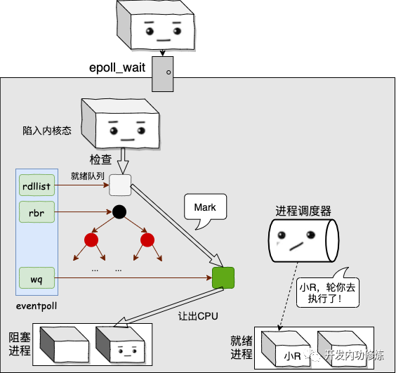

等网卡收到我的数据请求包的时候，我的另外一个兄弟软中断会从 epoll 的 wq 上找到我，把我叫醒。

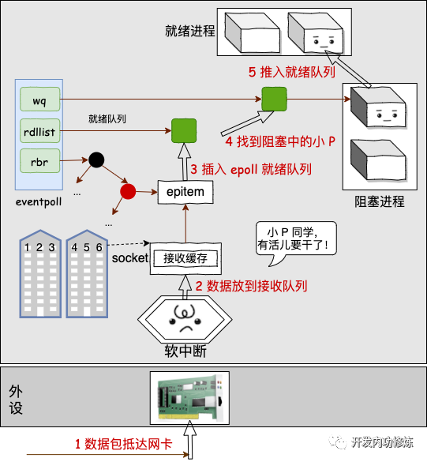

不过我所谓的叫醒，其实只是推入到就绪队列而已。真正的调度还得等进程调度器老哥把我拉起来。

看，我和 epoll、软中断、进程调度器等几兄弟配合的是不是天衣无缝！
