## 数据链路层  

### MAC 地址  

每个网卡或三层网口都有一个 MAC 地址， MAC 地址是烧录到硬件上，因此也称为硬件地址。MAC 地址作为数据链路设备的地址标识符，需要保证网络中的每个 MAC 地址都是唯一的，才能正确识别到数据链路上的设备。  

MAC 地址由 6 个字节组成。前 3 个字节表示厂商识别码，每个网卡厂商都有特定唯一的识别数字。后 3 个字节由厂商给每个网卡进行分配。厂商可以保证生产出来的网卡不会有相同 MAC 地址的网卡。  

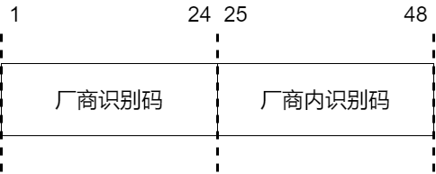

现在可以通过软件修改 MAC 地址，虚拟机使用物理机网卡的 MAC 地址，并不能保证 MAC 地址是唯一的。但是只要 MAC 地址相同的设备不在同一个数据链路上就没问题。  

为了查看方便， 6 个字节的 MAC 地址使用十六进制来表示。每个字节的 8位二进制数分别用 2 个十六进制数来表示，例如我的网卡 MAC 地址是 E0-06-E6-39-86-31 。  

> 什么是字节？什么是比特？  

比特，英文名 bit ，也叫位。二进制中最小单位，一个比特的值要么是 0 要么是 1 。  

字节，英文名 Byte 。一个字节由八个比特构成。  

> M A C 地址怎么使用？  

最常用的以太网和无线局域网，都是使用 MAC 地址作为地址标识符进行通信的。  

### 以太网  

有线局域网中普遍使用以太网，以太网标准简单，传输速率高。常见的网络拓扑结构如下图。  

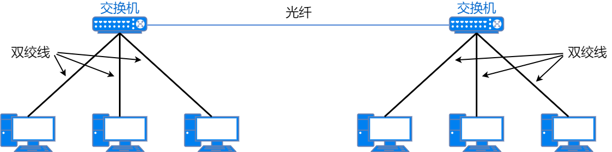

> 什么是网络拓扑？  

网络的连接和构成的形态称为网络拓扑。它不仅可以直观的看到网络物理连接方式，还可以表示网络的逻辑结构。  

#### 以太网数据格式  

当今最常用的以太网协议标准是 ETHERNET II 标准。 ETHERNET II标准定义的数据帧格式如下图。  

* 前导码（ Preamble ）  

前导码由 7 个字节组成，每个字节固定为 10101010 。之后的 1 个字节称为**帧起始定界符**，这个字节固定为 10101011 。这 8 个字节表示以太网帧的开始，也是对端网卡能够确保与其同步的标志。帧起始定界符的最后两位比特被定义为 11 ，之后就是以太网数据帧的本体。  

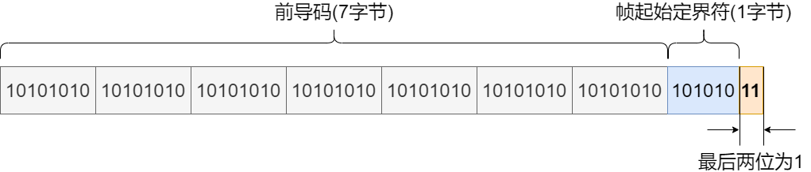

* 目的地址（ Destination Address ）  

目的地址由 6 个字节组成，用来标识数据帧的目的设备，类似于快递的收件人地址。  

* 源地址（ Source Address ）  

源地址由 6 个字节组成，用来标识数据帧的始发设备，类似于快递的发件人地址。  

* 类型（ Type ）  

类型字段由 2 个字节组成。类型字段是表明上一层（即网络层）的协议类型，可以让接收方使用相同的协议进行数据帧的解封装。  

* 数据（ Data ）  

帧头后就是数据。一个数据帧所能容纳的最大数据范围是 46 ～ 1500 个字节。如果数据部分不足 46 个字节，则填充这个数据帧，让它的长度可以满足最小长度的要求。  

* FCS（ Frame Check Sequence ）  

FCS 由 4 个字节组成，位于数据帧的尾部，用来检查帧是否有所损坏。通过检查 FCS 字段的值将受到噪声干扰的错误帧丢弃。  

> 最小的数据帧是多少字节？  

数据帧的各字段加起来一共是 64 字节，其中数据是 46 字节。再加上前导码就是 72 字节。因此最小的数据帧是 72 字节。在传输过程中，每个数据帧还有 12 字节的数据帧间隙，所以最小的可传输数据帧长度是 84 字节，即 672 比特。  

### 交换机二层转发原理  

交换机有多个网络端口，它通过识别数据帧的目标 MAC 地址，根据 MAC 地址表决定从哪个端口发送数据。MAC 地址表不需要在交换机上手工设置，而是可以自动生成的。  

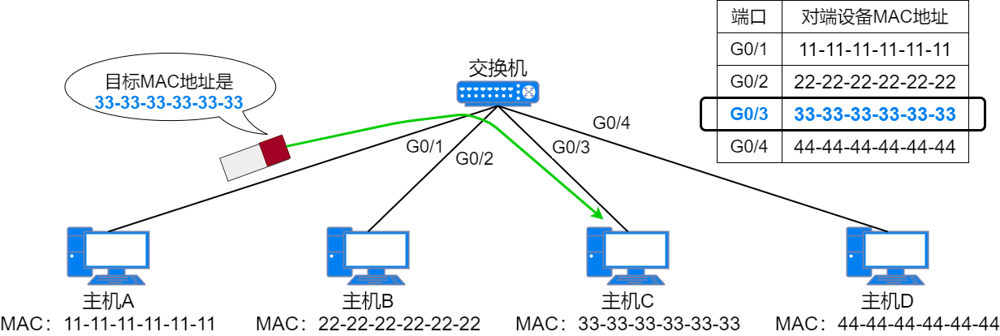

> 交换机是如何添加、更新、删除 M A C 地址表条目的？  

在初始状态下，交换机的 MAC 地址表是空的，不包含任何条目。当交换机的某个端口接收到一个数据帧时，它就会将这个数据帧的源 MAC 地址、接收数据帧的端口号作为一个条目保存在自己的 MAC 地址表中，同时在接收到这个数据帧时重置这个条目的老化计时器时间。这就是交换机自动添加 MAC 地址表条目的方式。  

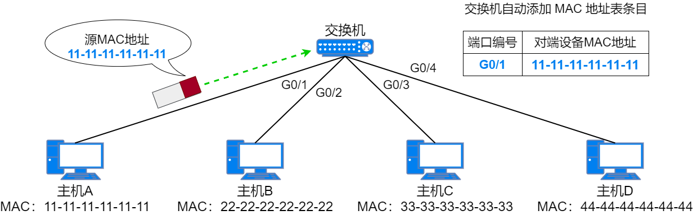

在新增这一条 MAC 地址条目后，如果交换机再次从同一个端口收到相同 MAC地址为源 MAC 地址的数据帧时，交换机就会更新这个条目的老化计时器，确保活跃的的条目不会老化。但是如果在老化时间内都没收到匹配这个条目的数据帧，交换机就会将这个老化的条目从自己的 MAC 地址表中删除。  

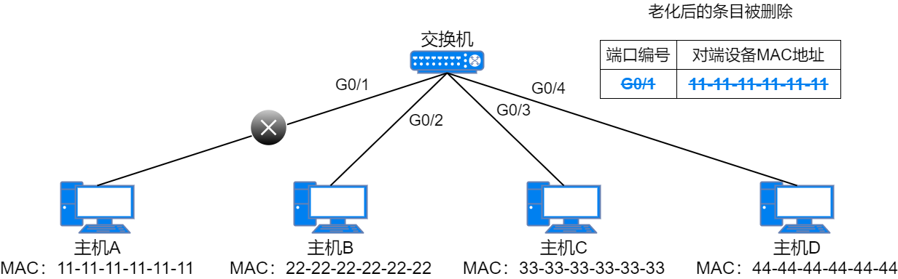

还可以手动在交换机的 MAC 地址表中添加静态条目。静态添加的 MAC 地址条目优先动态学习的条目进行转发，而且静态条目没有老化时间，会一直保存在交换机的 MAC 地址表中。  

> 如何使用 M A C 地址表条目进行转发？  

当交换机的某个端口收到一个单播数据帧时，它会查看这个数据帧的二层头部信息，并进行两个操作。一个操作是根据源 MAC 地址和端口信息添加或更新MAC 地址表。另一个操作是查看数据帧的目的 MAC 地址，并根据数据帧的目的 MAC 地址查找自己的 MAC 地址表。在查找 MAC 地址表后，交换机会根据查找结果对数据帧进行处理，这里有 3 中情况：  

1. 交换机没有在 MAC 地址表中找到这个数据帧的目的 MAC 地址，因此交换机不知道自己的端口是否有连接这个 MAC 地址的设备。于是，交换机将这个数据帧从除了接收端口之外的所有端口泛洪出去。  

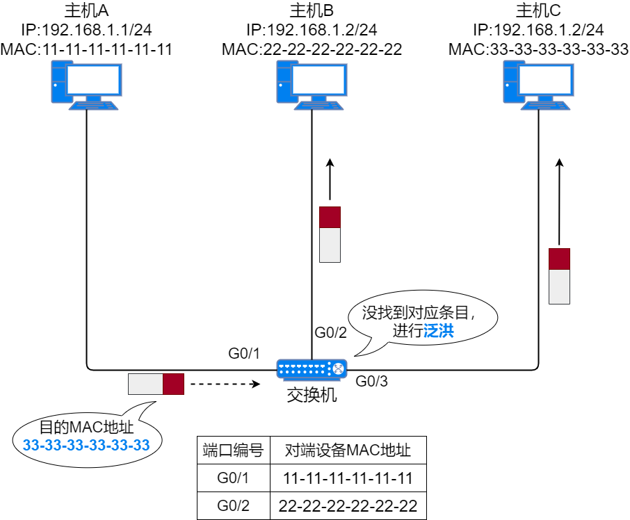

2. 交换机的 MAC 地址表中有这个数据帧的目的 MAC 地址，且对应端口不是接收到这个数据帧的端口，交换机知道目的设备连接在哪个端口上，因此交换机会根据 MAC 地址表中的条目将数据帧从对应端口单播转发出去，而其它与交换机相连的设备则不会收到这个数据帧。  

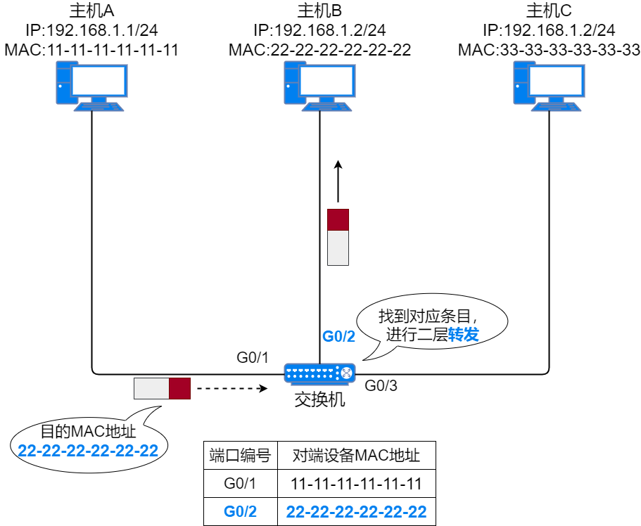

3. 交换机的 MAC 地址表中有这个数据帧的目的 MAC 地址，且对应端口就是接收到这个数据帧的端口。这种情况下，交换机会认为数据帧的目的地址就在这个端口所连接的范围内，因此目的设备应该已经收到数据帧。这个数据帧与其它端口的设备无关，不会将数据帧从其它端口转发出去。于是，交换机会丢弃数据帧。  

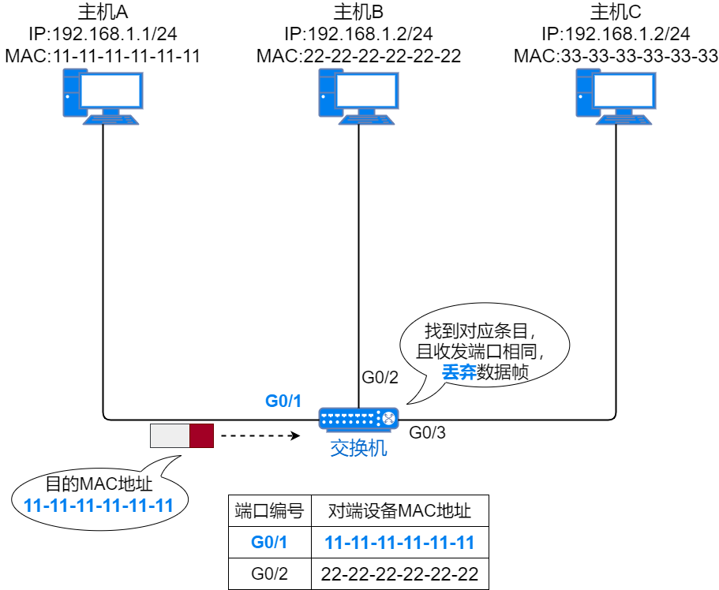

**单播**：主机一对一的发送数据。单播地址是主机的 MAC 地址。  

**广播**：向局域网内所有设备发送数据。只有全 1 的 MAC 地址为广播 MAC 地址，即 FF-FF-FF-FF-FF-FF 。  

**泛洪**：将某个端口收到的数据从除该端口之外的所有端口发送出去。泛洪操作广播的是普通数据帧而不是广播帧。  

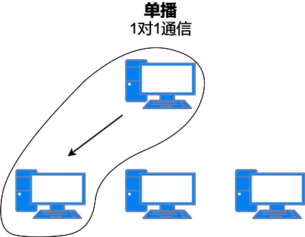

### VLAN  

**广播域**是广播帧可以到达的区域。换句话说，由多个交换机和主机组成的网络就是一个广播域。  

网络规模越大，广播域就越大，泛洪流量也越来越大，降低通信效率。在一个广播域内的任意两台主机之间可以任意通信，通信数据有被窃取的风险。  

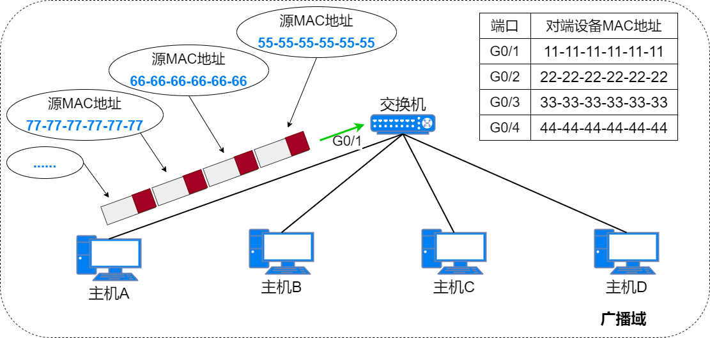

为了解决广播域扩大带来的性能问题和安全性降低问题， VLAN 技术应运而生。 VLAN 技术能够在逻辑上把一个物理局域网分隔为多个广播域，每个广播域称为一个虚拟局域网（即 VLAN ）。每台主机只能属于一个 VLAN ，同属一个 VLAN 的主机通过二层直接通信，属于不同 VLAN 的主机只能通过 IP路由功能才能实现通信。通过划分多个 VLAN ，从而减小广播域传播的范围，过滤多余的包，提高网络的传输效率，同时提高了网络的安全性。  

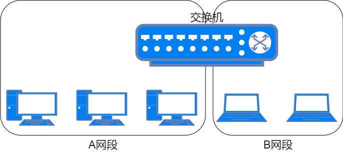

#### VLAN 原理  

VLAN 技术通过给数据帧插入 VLAN 标签（又叫 VLAN TAG ）的方式，让交换机能够分辨出各个数据帧所属的 VLAN 。  

VLAN 标签是用来区分数据帧所属 VLAN 的，是 4 个字节长度的字段，插入到以太网帧头部上。 VLAN 标签会插入到源 MAC 地址后面， IEEE 802.1Q标准有这个格式定义和字段构成说明。  

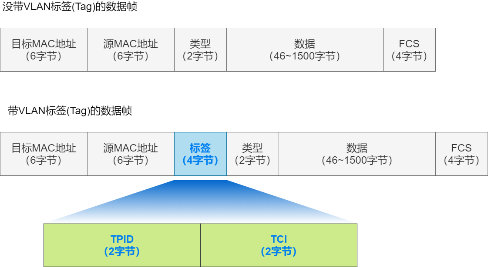

* TPID （标签协议标识符）：  

长度 2 个字节，值为 0x8100 ，用来表示这个数据帧携带了 802.1Q 标签。不支持 802.1Q 标准的设备收到这类数据帧，会把它丢弃。  

* TCI （标签控制信息）：  

  长度 2 个字节，又分为三个子字段，用来表示数据帧的控制信息：   

  * 优先级（ Priority ）：长度为 3 比特，取值范围 0 ~ 7 ，用来表示数据帧的优先级。取值越大，优先级越高。当交换机发送拥塞是，优先转发优先级高的数据帧。  
  * CFI （规范格式指示器）：长度为 1 比特，取值非 0 即 1 。  
  * VLAN ID （ VLAN 标识符）：长度为 12 比特，用来表示 VLAN 标签的数值。取值范围是 1 ~ 4094 。  

> 划分 V L A N 后，交换机如何处理广播报文？  

交换机上划分了多个 VLAN 时，在交换机接收到广播数据帧时，只会将这个数
据帧在相同 VLAN 的端口进行广播。  

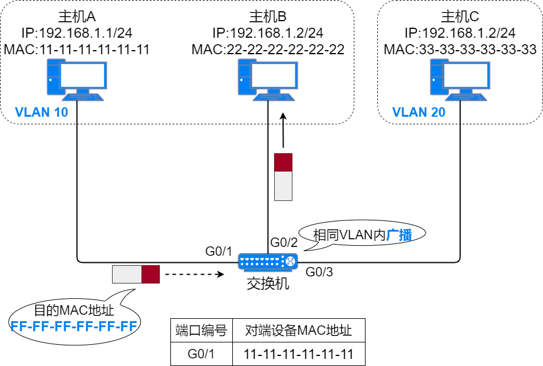

> 划分 V L A N 后，交换机如何处理目的 M A C 地址不在 M A C 地址表中的单播数据帧？  

交换机上划分了多个 VLAN 时，当交换机接收到一个目的 MAC 地址不存在于自己 MAC 地址表中的单播数据帧时，只会将这个数据帧在相同 VLAN 的端口进行泛洪。  

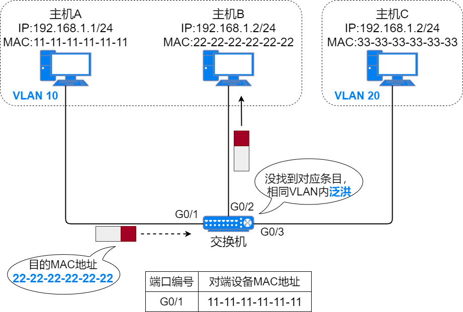

> 划分 V L A N 后，不同 V L A N 的主机能否通信？  

划分多 VLAN 的环境中，即使交换机 MAC 地址表里保存了某个数据帧的目的MAC 地址条目，若这个目的 MAC 地址所对应的端口与数据帧的入端口在不同的 VLAN 中，交换机也不会通过 MAC 地址表中的端口发送数据帧。  

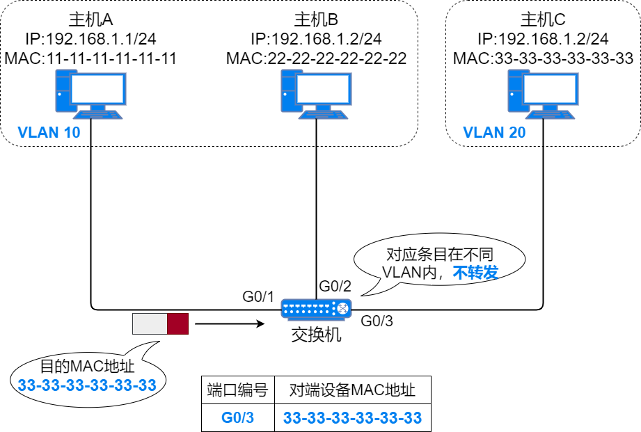

小结：在不使用路由转发的前提下，交换机不会从一个 VLAN 的端口中接收到的数据帧，转发给其它 VLAN 的端口。  

> 怎么区分不同的 V L A N ？  

通过 VLAN ID 进行区分，例如 VLAN 10 和 VLAN 20 就是不同的 VLAN。  

> V L A N 技术有哪些好处？  

* 增加了广播域的数量，减小了每个广播域的规模，也减少了每个广播域中终端设备的数量；  
* 增强了网络安全性，保障网络安全的方法增加了；  
* 提高了网络设计的逻辑性，可以规避地理、物理等因素对于网络设计的限制。  

#### 划分 VLAN  

我们可以使用不同的方法，把交换机上的每个端口划分到某个 VLAN 中，以此在逻辑上分隔广播域。  

交换机通常会使用基于端口划分 VLAN 的方法。在交换机上手动配置，绑定交换机端口和 VLAN ID 的关系。  

优点：配置简单。想要把某个端口划分到某个 VLAN 中，只需要把端口的PVID （端口 VLAN ID ）配置到相应的 VLAN ID 即可。  

缺点：当终端设备移动位置是，可能需要为终端设备连接的新端口重新划分VLAN 。  

除了这种方法外，还可以使用基于 MAC 地址划分 VLAN 、基于 IP 地址划分VLAN 、基于协议划分 VLAN 、基于策略划分 VLAN 等方法来划分VLAN。  

PVID ：接口默认 VLAN ID ，是交换机端口配置的参数，默认值是 1 。  

#### 跨交换机 VLAN 原理  

终端设备不会生成带 VLAN 标签的数据帧，它们发出的数据帧叫做无标记帧（Untagged ）。它们连接的交换机会给无标记帧打上 VLAN 标签。交换机通过每个端口的 PVID ，判断从这个接口收到的无标记帧属于哪个 VLAN ，并在转发时，插入相应的 VLAN 标签，从而将无标记帧变为标记帧（ Tagged ）。  

当两台交换机通过端口连接时，收到的数据帧是标记帧还是无标记帧？交换机端口会如何处理呢？  

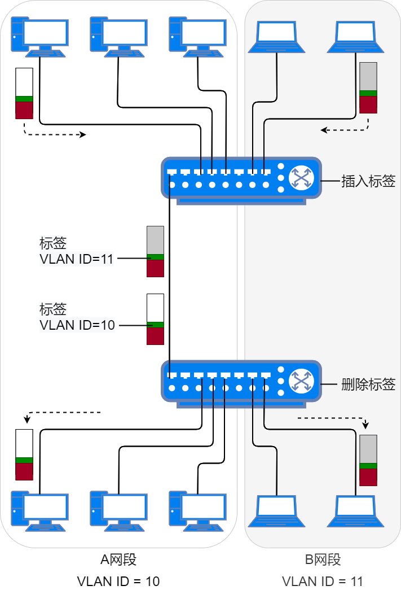

交换机根据连接的设备类型，判断各个接口收到的数据帧是否打标，来配置交换机接口的类型。  

* 如果交换机接口收到无标记帧，由交换机根据这个接口所在 VLAN 为数据帧打上 VLAN 标签；同时接口发送数据帧时，也不携带 VLAN 标签。应该把这类接口配置为 Access （接入）接口， Access 接口连接的链路称为
  Access 链路。  
* 如果交换机接口收到多个 VLAN 的流量，也就是收到了标记帧；同时为了让对端设备能够区分不同 VLAN 的流量，通过接口发出的流量会打上 VLAN 标签。应该把这类接口配置为 Trunk （干道）接口，相应的链路称为 Trunk链路。  

> 跨交换机发送数据  

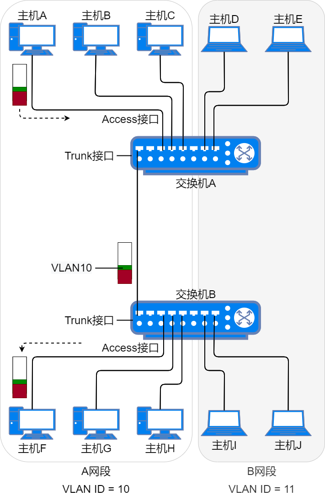

**主机 A **以主机 F 的 MAC 地址作为目的 MAC 地址封装了一个数据帧，从网卡发送出去。  

**交换机 A** 在 Access 接口收到数据帧。查询 MAC 地址表，发现数据帧的目的地址是与交换机 B 相连的 Trunk 接口。于是交换机给数据帧打上 Access接口的 PVID 配置，即给数据帧打上 VLAN 10 的标签，并从 Trunk 接口转发给交换机 B 。  

**交换机 B** 在 trunk 接口收到数据帧。查看 MAC 地址表，发现是 VLAN 10的数据帧，目的地址设备是连接在 VLAN 10 的一个 Access 接口上。于是去掉数据帧的 VLAN 标签，并从这个 Access 接口转发给主机 F 。  

