## 网络层

> 有小伙伴问：为什么没有配置 I P 地址就无法上网？ I P 协议又是啥？  

这要从 TCP/IP 协议说起，互联网使用的是 TCP/IP 协议，其中 IP 协议又是最重要的协议之一。 IP 协议是基于 IP 地址将数据包发送给目的主机，能够让互联网上任何两台主机进行通信。  

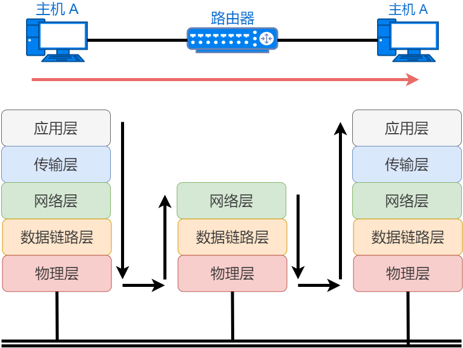

IP 协议位于 OSI 参考模型的第三层，即网络层。  

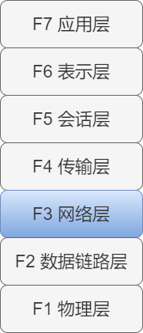

网络层的主要作用是实现终端节点之间的通信。这种终端节点之间的通信，也叫点对点通信。  

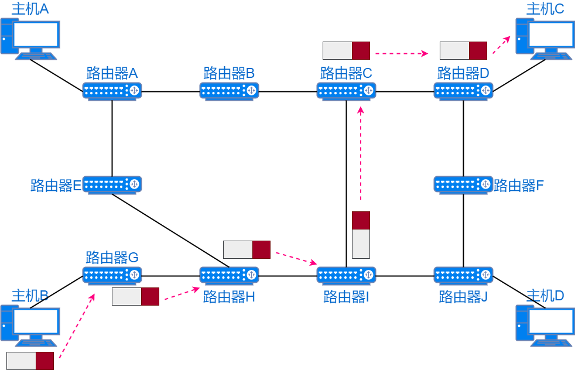

主机：配置有 IP 地址，不进行路由控制的设备  。

路由器：既有 IP 地址又具有路由控制功能的设备。  

节点：主机和路由器的统称。  

#### 数据如何传输到目的地？  

数据链路层实现两个直连设备之间的数据传输，网络层的 IP 协议实现没有直连的两个网络之间的数据传输。  

以旅行为例，小美要去一个很远的地方旅行，先计划要乘坐的高铁、地铁、公交车，并且购买相应车票，再制定一个详细行程表，记录乘车时间。  

高铁票、地铁票只能在一个区间内移动，就像网络上的数据链路。出发点就像源MAC 地址，目的地就像目的 MAC 地址，整个行程表的作用就相当于网络层，出发点就像源 IP 地址，目的地就像目的 IP 地址。  

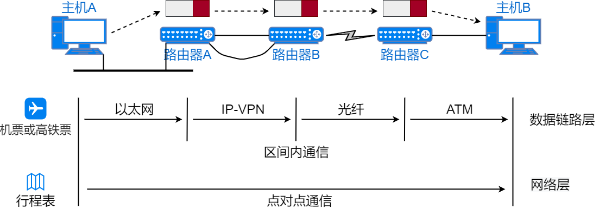

小美如果只有行程表，没有车票，就无法乘坐交通工具到达目的地。相反，小美只有车票，不知道坐什么车，在哪里换乘，恐怕也到不了目的地。只有两者兼备，既有某个区间的车票又有整个旅行的行程表，才能保证到达目的地。网络中也需要数据链路层和网络层协同工作，才能实现最终目的地址的通信。  

### IP 地址的基础知识  

在 TCP/IP 通信中使用 IP 地址识别主机和路由器。 IP 地址是逻辑地址，需要手工配置或自动获取，为了保证正常通信，每个设备必须配置 IP 地址。  

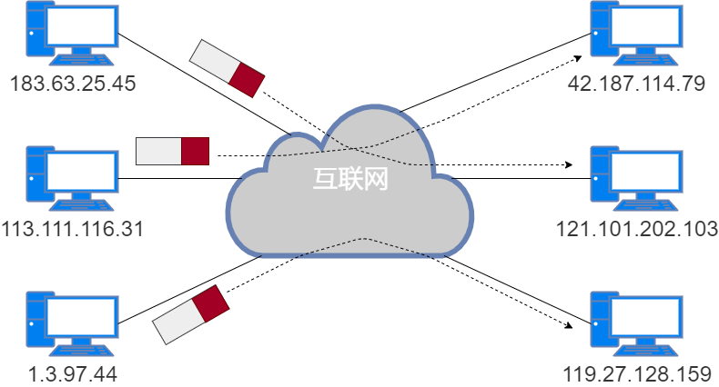

#### IP 地址的定义  

IP 地址由 32 位二进制数组成。为了方便记录，将 32 位的 IP 地址分为 4组，每 8 位为一组，每组以“ . ”隔开，再将每组数转换为十进制数。  

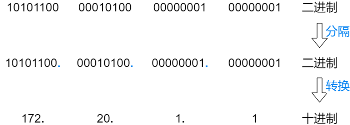

> 二进制与十进制怎么快速转换？  

通过 Windows 系统自带的计算器，选择程序员，可实现二进制和十进制的快速转换。默认十进制（“ DEC ”）输入，单击“ BIN ”切换成二进制输入。同步显示十六进制、十进制、八进制和二进制的数值。  

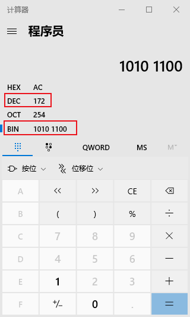

> I P 地址一共有多少个？  

将 IP 地址的32位二进制进行计算，得出约 43 亿个 IP 地址。  

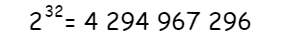

使用 Windows 系统自带计算机，选择科学模式，可快速进行次方计算。  

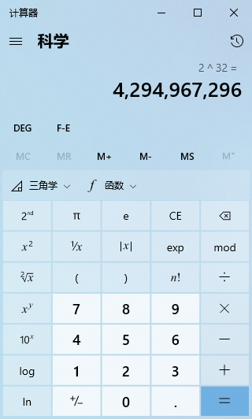

实际上，网络的发展超乎想象，互联网上的设备远超 43 亿， 2019 年 11 月25 日全球的 IPv4 地址已经彻底耗尽，但是直到现在大家仍然还在用 IPv4 ，并没有因为地址没了而无法上网。是因为除了 IPv6 之外，我们使用 NAT 技术缓解了地址不足的问题。这篇文章里的 IP 全是指的 IPv4 ，非 IPv6 。  

#### IP 地址的组成  

IP 地址由网络号（网段地址）和主机号（主机地址）两部分组成。  

网络号是设备所在区域的一种标识，网络号相同的设备位于同一个网段内，网络号不同的设备通过路由器实现通信。主机号是在同一个网段中不同设备的标识，不允许同一个网段内出现重复的主机号。  

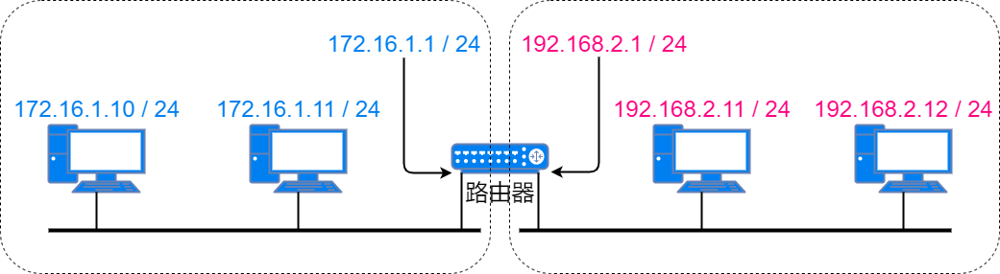

路由器是根据目的 IP 地址的网络号进行路由。  

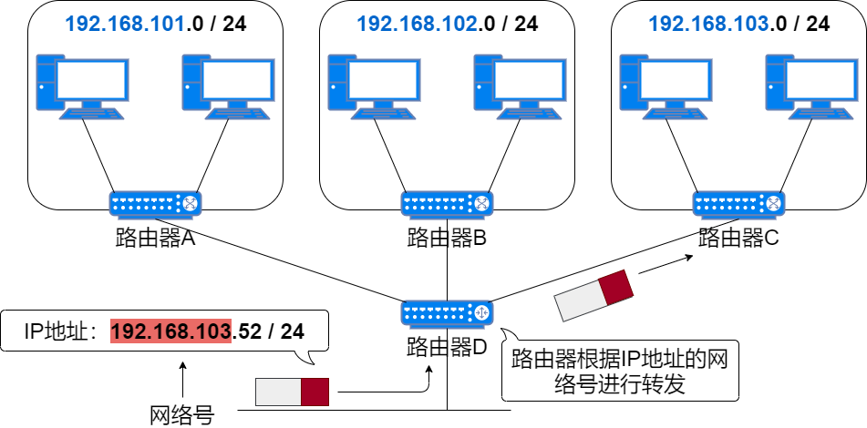	那么 IP 地址哪几位是网络号？哪几位是主机号？早期是以分类地址区分，现在是以子网掩码区分。  

#### IP 地址的分类  

IP 地址分为四类，分别是 A 类、 B 类、 C 类、 D 类（还有一个保留的 E类）。  

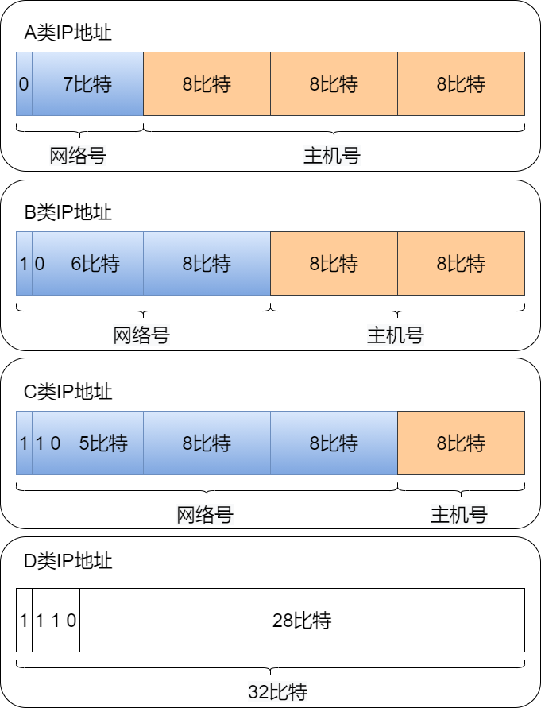

> A 类地址  

A 类 IP 地址是首位以“ 0 ”开头的地址。从第 1 位到第 8 位是它的网络号，网络号的范围是 0 ~ 127 。其中 0 和 127 属于保留地址，减去两个保留地址，因此有 126 个可用的 A 类地址。  

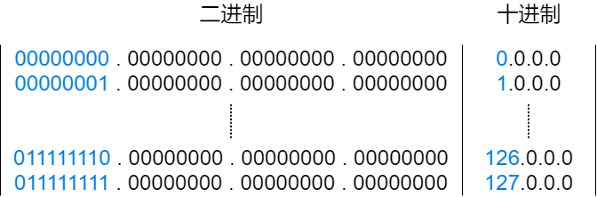

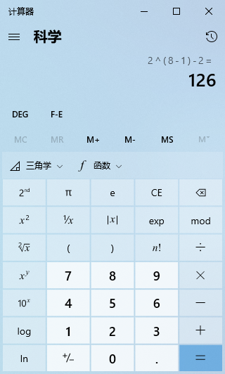

后 24 位是主机号，一个 A 类地址的主机地址数量就是 2 的 24 次方，即16777216 个主机地址。  

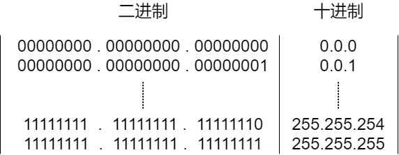

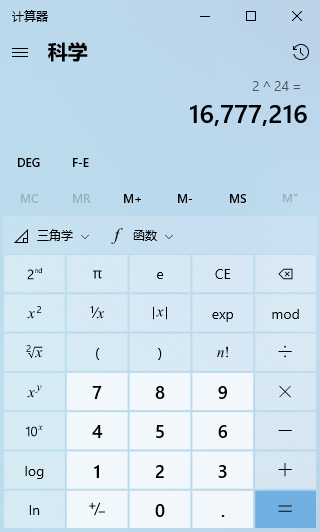

> B 类地址  

B 类 IP 地址是前两位以“ 10 ”开头的地址。从第 1 位到第 16 位是它的网络号，网络号的范围是 128.0 ~ 191.255 。其中 128.0 和 191.255 属于保留地址，减去两个保留地址，因此有 16382 个可用的 B 类地址。  

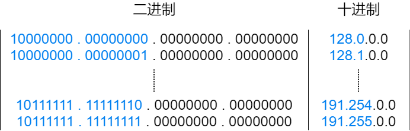

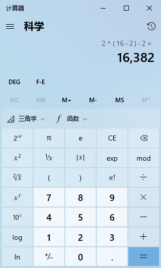

后 16 位是主机号，一个 B 类地址的主机地址的数量就是 2 的 16 次方，即65536 个主机地址。  

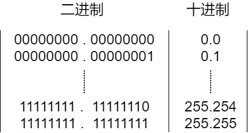

> C 类地址  

C 类 IP 地址是前三位以“ 110 ”开头的地址。从第 1 位到第 24 位是它的网络号，网络号的范围是 192.0.0 ~ 223.255.255 。其中 192.0.0 和223.255.255 属于保留地址，减去两个保留地址，因此有 2097150 个可用的C 类地址。  

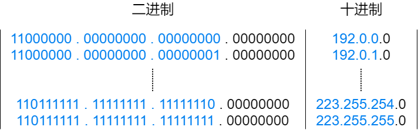

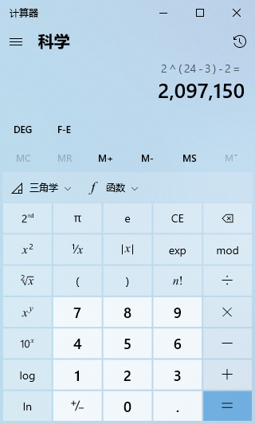

后 8 位是主机号，一个 C 类地址的主机地址的数量就是 2 的 8 次方，即256 个主机地址。  

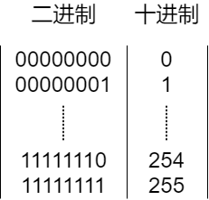

> D 类地址  

D 类 IP 地址是前四位以“ 1110 ”开头的地址。从第 1 位到第 32 位是它的网络号，网络号的范围是 224.0.0.0 ~ 239.255.255.255 。D 类地址没有主机号，用于组播。  

> 网段地址和广播地址  

当主机号全为 0 时，表示的是网段地址，非主机地址。当主机号全为 1 时是广播地址，也不是主机地址。因此在分配 IP 地址过程中，需要排除这两个地址。例如一个 C 类地址 192.168.1.0/24 最多只有 254 个可用主机地址，而不是 256 个。  

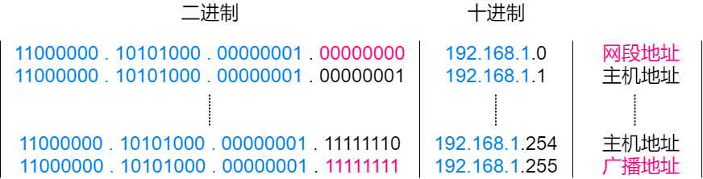

#### 广播地址  

IP 地址中的主机号全部为 1 的就是广播地址，它是向同一个网段中的所有主机发送数据包。例如一个 B 类主机地址 172.20.1.100 的广播地址是172.20.255.255 。  

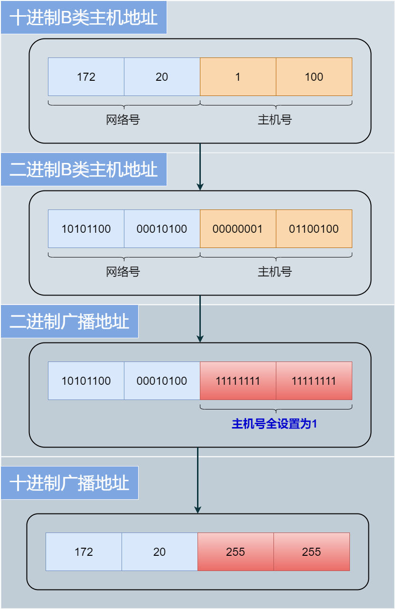

#### IP 组播  

组播用于将包发送给特定组内的所有主机。  

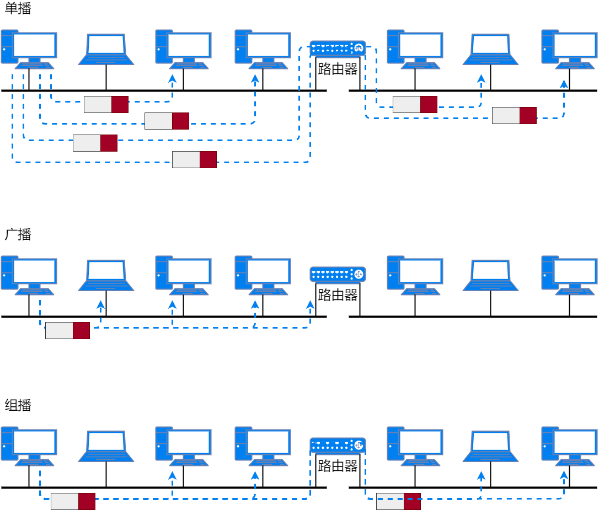

组播使用 D 类地址。因此 IP 地址前四位是“ 1110 ”开头的，就是组播地址。剩下的 28 位就是组播的组编号。组播的地址范围是 224.0.0.0 ~239.255.255.255 ，其中 224.0.0.0 ~ 224.0.0.255 既可以在同一个网段内实现组播，又可以跨网段给全网所有组员发送组播包。  

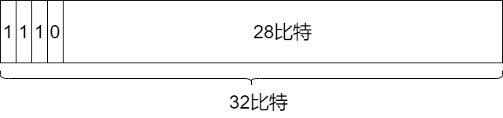

#### 子网掩码  

早期网络地址采用固定网络位长度的方式，使 IPv4 地址遭到大量浪费。如今网段地址的长度可变，同时也需要一种标识来获取网段地址，以便路由器对数据包进行转发，这种识别码就是子网掩码。  

子网掩码用 32 位的二进制表示， IP 地址的网段地址部分设置为 1 ， IP 地址的主机地址部分设置为 0 。换句话说， IP 地址有多少位网段地址，子网掩码就有多少位取 1 ，其余都取 0 。为了方便记录，每 8 位为一组，以“ . ”隔开，再转换为十进制数。  

例如： 201.20.100.25 的子网掩码是 255.255.255.0 ，算出它的网段地址。  

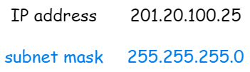

将子网掩码和 IP 地址进行与（ AND ）运算，可得到这个 IP 地址的网段地址。  

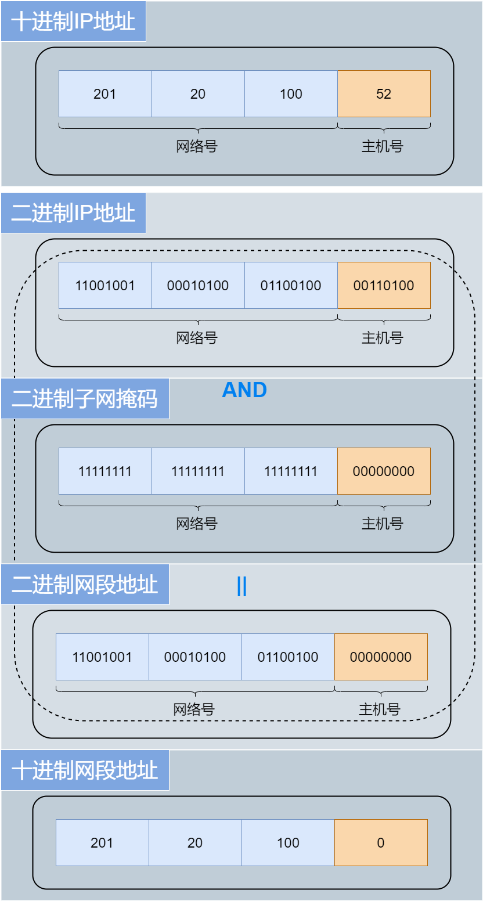

> 与（ A N D ）运算  

IP 地址和子网掩码的二进制数，逐位进行计算。只有当 IP 地址和掩码都是 1时，运算结果为 1 。其余情况计算结果都为 0 。  

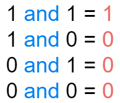

Windows 系统自带计算机也可以进行二进制与运算  。

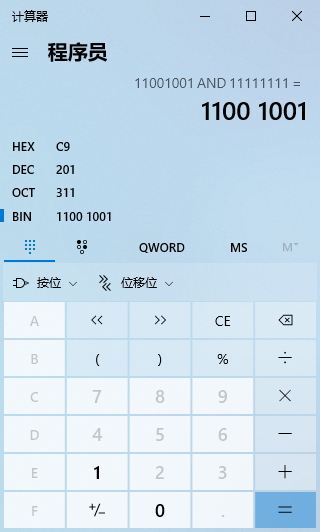

IP 地址的另一种表示方式是在每个 IP 地址后面追加网络号的位数用“ / ”隔开。例如：201.20.100.25/255.255.255.0 可表示为201.20.100.25/24 。  

#### CIDR 与 VLSM  

解决 IP 地址浪费问题，除了使用子网掩码，还使用了 CIDR 和 VLSM 技术。  

CIDR ，即无类域间路由，采用任意长度分割 IP 地址的网络号和主机号。它有两个作用：  

* 把多个网段聚合到一起，生成一个更大的网段；
* 汇总路由表 IP 地址，分担路由表压力。  

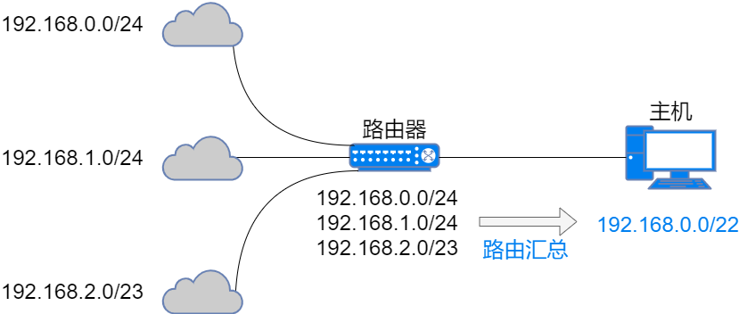

VLSM ，即可变长子网掩码，它可以对 A 、 B 、 C 类地址再进行子网划分，以达到充分利用 IP 地址的目的。  

假如一家企业有 100 台电脑，按以前的办法，只能分配一个 C 类地址222.222.222.0 。但是 VLSM 可以在一个 C 类地址上划分出多个子网地址，再分配其中一个容纳主机数量与稍大于企业需求数量的子网地址给企业，这样就可以实现 IP 地址的合理使用。  

* 计算容纳 100 台电脑的子网：使用主机号的位数计算出子网的主机地址数量。当主机号有 7 位时，有 126 个可用主机地址，可容纳 100 台电脑。  

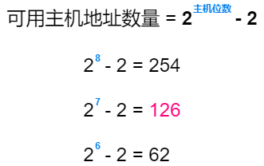

* 计算子网地址：当主机号有 7 位时，网络号有 32 - 7 = 25 位，也就是222.222.222.0/24 向主机位借了一位作为子网位，那么子网掩码也就是255.255.255.128 。可分配 222.222.222.0/25 使用。  

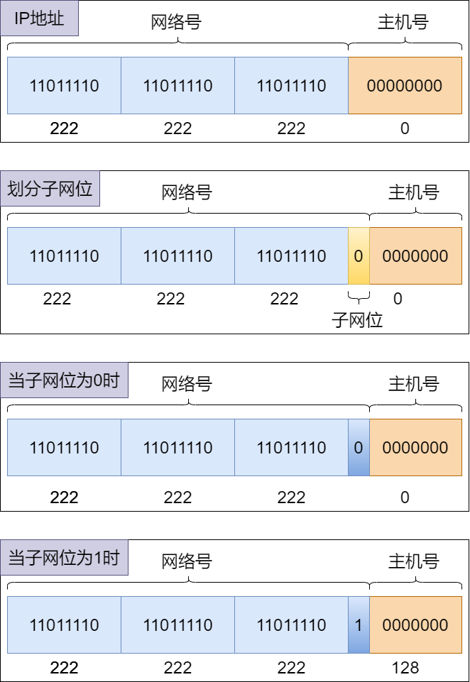

* 222.222.222.0/25 子网详情：  

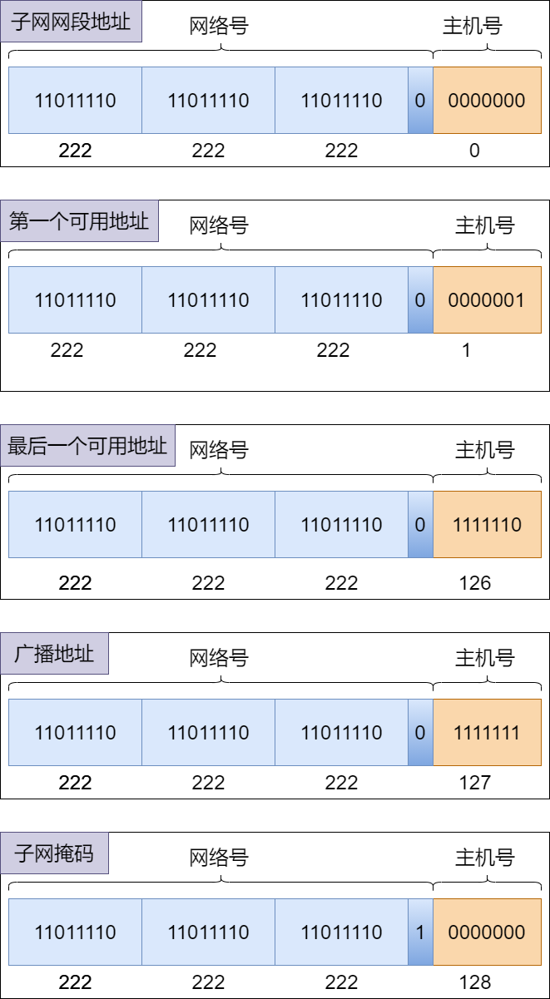

> C I D R 和 V L S M 的区别  

CIDR 是主机号向网络号借位，目的是把几个网络汇总成一个大的网络，增加子网主机数量；  

VLSM 是网络号向主机号借位，目的是把一个标准的网络划分成几个子网，减少子网主机数量。  

#### 公网地址与私有地址  

IP 地址分为公网地址和私有地址。公网地址是在互联网上使用的，私有地址是在局域网中使用的。  

公网地址由 Internet NIC 负责分配，通过它直接访问互联网  。

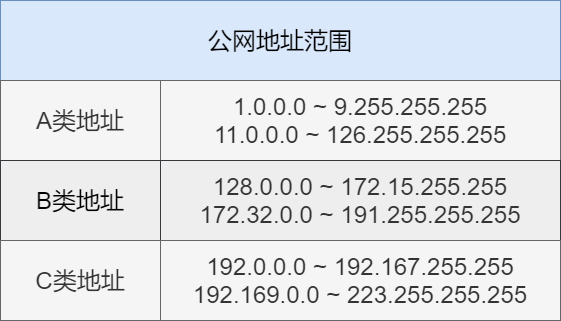

私有地址是一段保留的 IP 地址。只在局域网中使用，无法在互联网上使用。但是私有地址可以通过 NAT 技术，将私有地址转换为公网地址接入互联网。  

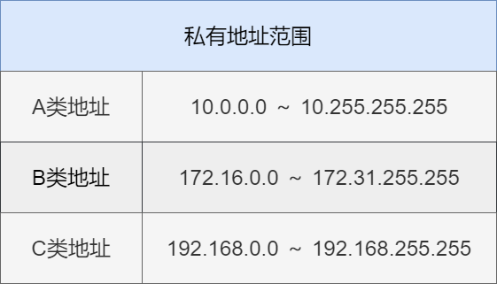

公网 IP 地址在互联网范围内是唯一的，私有 IP 地址只要在同一个局域网内唯一即可。在不同局域网内出现相同的私有 IP 不会影响使用  

### IP 路由  

IP 路由是设备根据 IP 地址对数据进行转发的操作。当一个数据包到达路由器时，路由器根据数据包的目的地址查询路由表，根据查询结果将数据包转发出去，这个过程就是 IP 路由。  

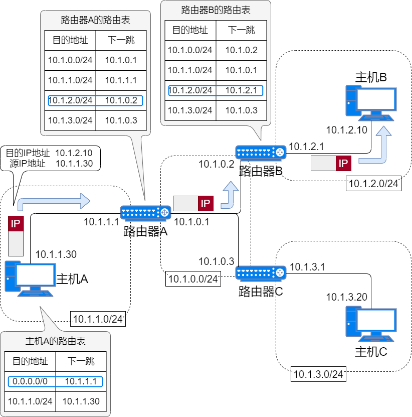

> 路由表  

为了将数据包发给目的节点，所有节点都维护着一张路由表。路由表记录 IP 数据在下一跳应该发给哪个路由器。 IP 包将根据这个路由表在各个数据链路上传输。  

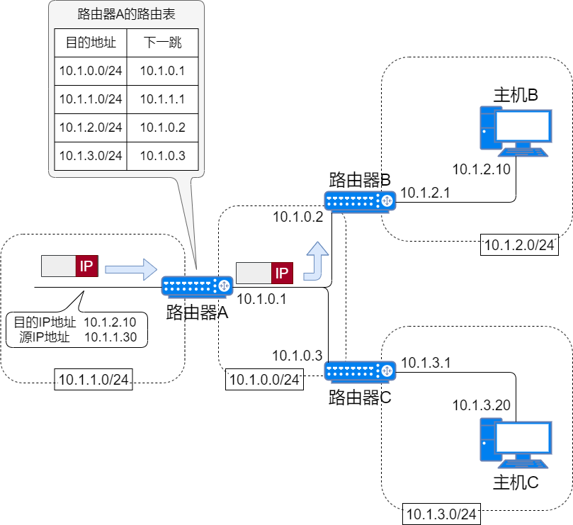

路由表的生成方式有两种：一种是手动设置，也叫静态路由。另一种是路由器之间通过交换信息自动刷新，也叫动态路由。  

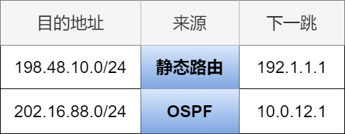

> 下一跳  

Hop ，中文叫“跳”。它是指网络中的一个区间。 IP 包就是在网络中一跳一跳的转发，在每一个区间内决定 IP 包下一跳的路径。  

一跳是指数据链路中广播域的区间，也就是说不经过路由器而能直接到达的相连主机或路由器网卡的一个区间。  

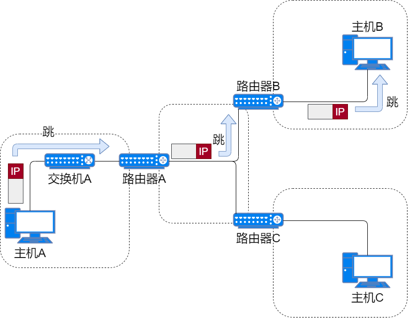

IP 数据包就像包裹，而送货车就像数据链路。包裹不可能自己移动，必须有送货车承载转运。而一辆送货车只能将包裹送到某个区间范围内。每个不同区间的包裹将由对应的送货车承载、运输。 IP 的工作原理也是如此。  

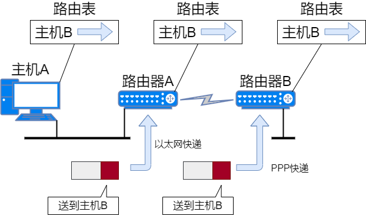

#### 路由条目类型  

> 默认路由  

默认路由是指路由表中任何一个地址都能与之匹配的条目。所有数据包都可以使用默认路由进行数据转发。默认路由为 0.0.0.0/0 或 default 。  

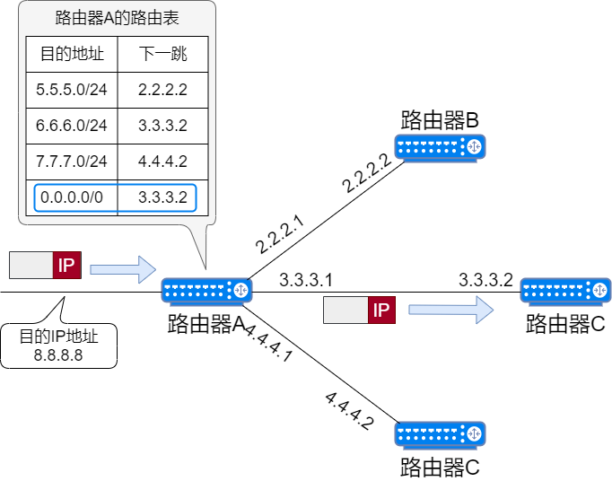

> 主机路由  

“ IP地址/32 ”被称为主机路由，它是路由表中指向单个 IP 地址或主机名的路由条目。例如： 192.168.153.15/32 就是一条主机路由，表示整个 IP 地址的所有位都将参与路由。  

> 回环地址  

以 127 开头的 IP 地址都是环回地址，其所在的回环接口可以理解为虚拟网卡。使用回环地址时，数据包会直接被主机的 IP 层获取，而不经过链路层，也不会流向网络。一般用来检查主机上运行的网络服务是否正常。  

#### 路由汇总  

路由汇总主要是为了减少路由条目，把可以聚合的路由汇聚为一个大网络。  

路由表越大，查找路由表所需的内存和 CPU 也就越多，时间也会越长，导致转发 IP 数据包的性能下降。如果想要搭建大规模、高性能的网络，就需要尽可能的路由表的大小。  

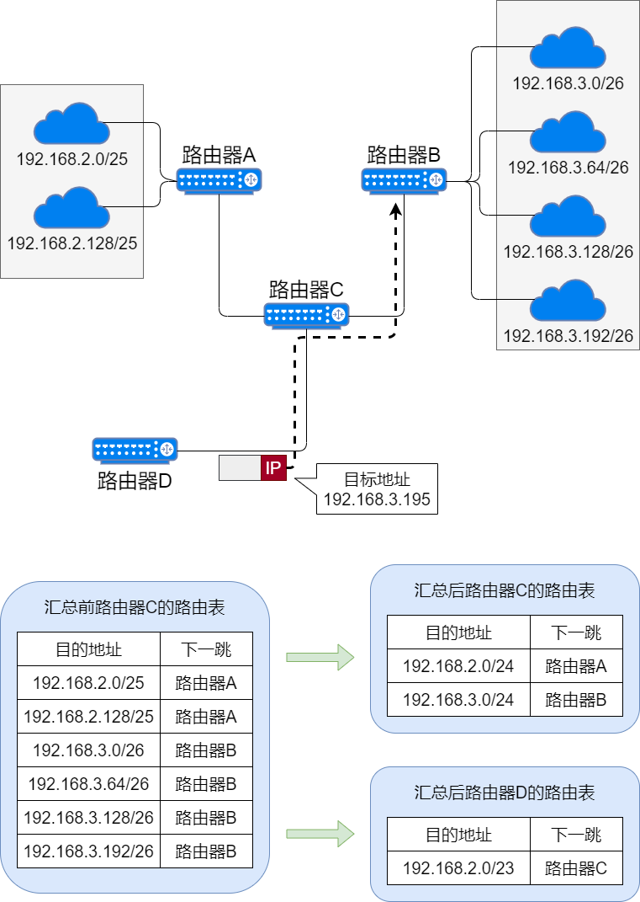

### IP 分片与重组  

#### 数据链路不同， MTU 则不同  

每种数据链路的最大传输单元（ MTU ）不同，网络层的 IP 是数据链路的上一层， IP 通过分片屏蔽数据链路的差异，实现不同数据链路互通。从 IP 的上一层看，它完全可以忽略各个数据链路上的 MTU ，只需要按照源 IP 地址发送的长度接收数据包。  

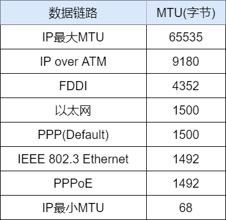

#### IP 报文的分片与重组  

当遇到 IP 数据包大于数据链路 MTU 时，往往无法直接发送出去，主机或路由器就会对 IP 数据包进行分片处理。  

经过分片后的 IP 数据，只会在目标主机上进行重组，中途经过路由器时不会进行重组。  

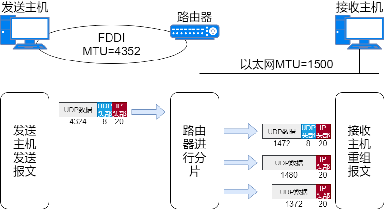

#### 路径MTU发现  

分片机制有两点不足：  

* 加重路由器的处理性能；
* 在分片传输中，一旦某个分片丢失，会造成整个 IP 数  

为了解决这个问题，要使用路径 MTU 发现（ Path MTU Discovery ）技术。路径 MTU 是指从发送端主机到接收端主机之间不需要分片时最大 MTU值。即路径中存在的所有数据链路中最小的 MTU 。路径 MTU 发现是从发送主机按照路径 MTU 的值将数据报分片后进行发送，避免在中途的路由器上进行分片处理。  

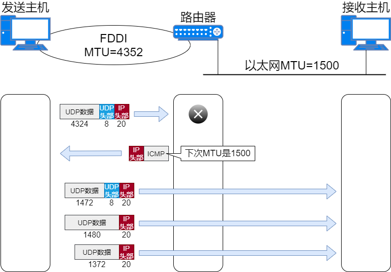

路径 MTU 发现的工作原理如下：  

1. 发送端主机发送 IP 数据包时将其头部的分片禁止标志位设置为 1 。根据这个标志位，途中的路由器即使收到需要分片的大包，也不会分片，而是直接将包丢弃。之后通过一个 ICMP 不可达消息将数据链路上 MTU 值给发送端主机  

2. 发送端主机根据收到的 MTU 值对数据包进行分片处理，再把 IP 数据包发送给相同的目的主机。如此重复，直到数据包被发送到目标主机为止没有再收到任何 ICMP ，就认为最后一次 ICMP 所通知的 MTU 即是一个合适的 MTU值。 MTU 值至少可以缓存约 10 分钟，在这 10 分钟内使用刚得到的 MTU，过了 10 分钟后就重新做一次路径 MTU 发现。  

上面的例子是 UDP ，如果是在 TCP 的情况下，根据路径 MTU 的大小计算出最大段长度（ MSS ），然后再根据这些信息进行数据包的发送。因此，在TCP 中如果使用路径 MTU 发现， IP 层则不会再分片。  

### 路由器三层转发原理  

路由器有多个端口，分别连接不同的数据链路。它通过识别目的 IP 地址的网络号，再根据路由表进行转发，路由表中有匹配的路由条目才会转发，无匹配的路由条目则直接丢弃。路由条目既可以手动设置静态路由，也可以通过路由协议自动生成动态路由。  

> 路由器如何进行三层转发？  

当一台路由器收到一个数据包时，会执行如下步骤：  

1. 对数据包进行解封装。  

   通过解封装，查看网络层头部信息的目的 IP 地址。  

2. 在路由表中查找匹配的路由条目。  

查找匹配的路由条目，就需要将数据包的目的 IP 地址与各个路由条目的网段地址先进行二进制与（ AND ）运算，再将运算结果与路由条目的网段地址进行比较，若一致则该条目与目的 IP 地址相匹配。最后，与所有路由条目完成运算和比较，可得到一条或多条相匹配的路由条目。也可能没有匹配的路由条目，那么丢弃数据包。  

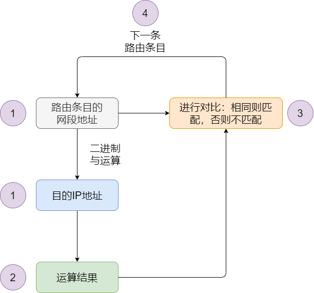

3. 从多个匹配项中选择掩码最长的路由条目。  

如果路由表中有多条路由条目都匹配数据包的目的 IP 地址，则路由器会选择掩码长度最长的路由条目，这种匹配方式称为最长匹配原则。
例如：10.1.3.10 的网络地址与 10.1.3.0/16 和 10.1.3.0/24 两项都匹配，这时应该选择匹配度最长的 10.1.3.0/24。  

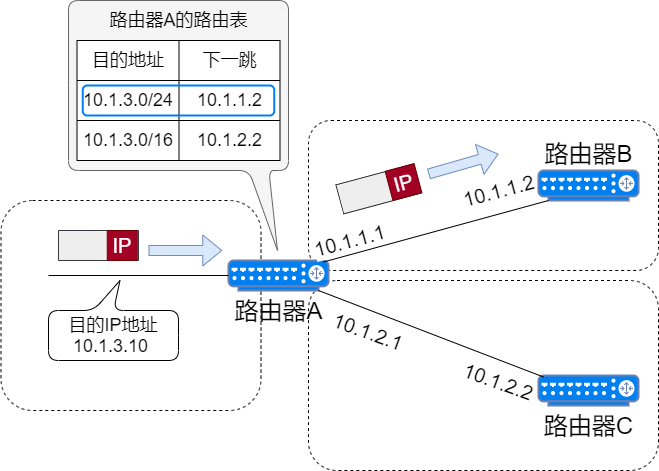

4. 将数据包按照相应路由条目进行转发。  

路由条目中包含下一跳和出接口。当路由器找到相应的路由条目后，它就会根据对应的下一跳和出接口，将数据包从出接口发送数据给下一跳设备。  

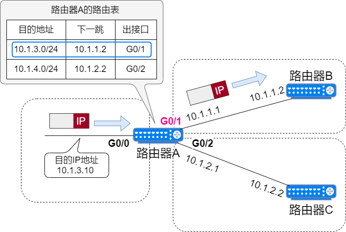

### ARP  

只要确定了 IP 地址，就可以向这个目标地址发送 IP 数据报文。但是在进行实际通信时，还要知道每个 IP 地址所对应的 MAC 地址。  

地址解析协议，简称 ARP 协议。是根据目的设备的 IP 地址来查询对应 MAC地址的协议。  

#### ARP 的工作原理  

当主机 A 向同一个网段内的主机 C 发送数据，但是不知道主机 C 的 MAC地址。  

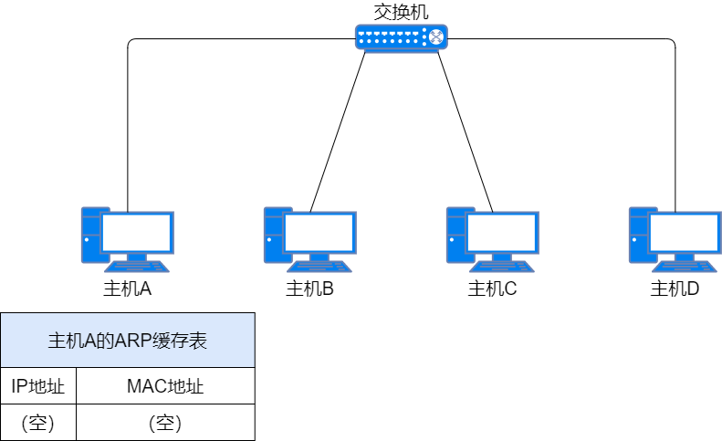

1. ARP 请求：主机 A 以主机 C 的 IP 地址为目的 IP 地址，以广播 MAC 地址为目的 MAC 地址，在同网段内发送这个广播报文，这个报文就叫 ARP 请求报文。  

   二层交换机不查看 IP 地址，根据目的 MAC 地址将报文除接收端口外的所有端口发送。  

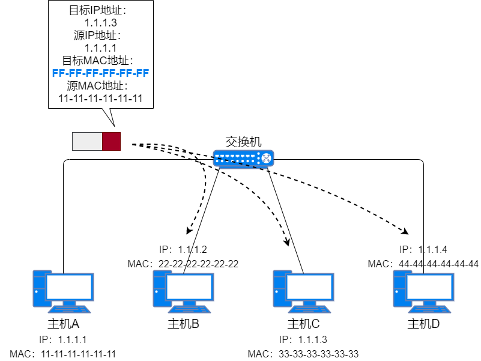

2. ARP 响应：主机 C 发现目的 IP 地址是自己的 IP 地址，于是主机 C 以自己 MAC 地址和 IP 地址作为源 MAC 地址和源 IP 地址，以主机 A 的MAC 地址和 IP 地址作为目的 MAC 地址和目的 IP 地址，发送响应报文给主机 A ，这个报文就叫 ARP 响应报文。其它主机收到主机 A 的 ARP 请求报文，因为目的 IP 地址不是自己的 IP 地址，因此不会进行响应。当主机 A 在发送 ARP 广播请求报文时，二层交换机已经有主机 A 的 MAC地址表条目。当收到主机 C 发送的单播 ARP 响应报文时，二层交换机将报文从相应端口发送出去。并将主机 C 的 MAC 地址和对应端口记录到 MAC地址表中。  

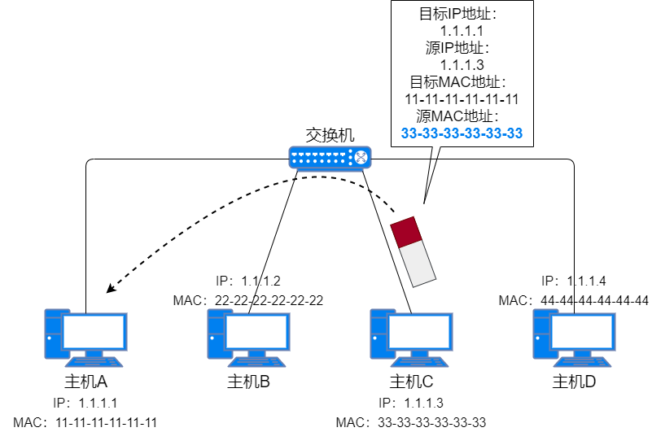

3. 更新 ARP 缓存表：主机 A 收到 ARP 响应报文后，将主机 C 的 IP 地址和 MAC 地址记录到 ARP 缓存表中。下次再向主机 C 发送数据时，直接将缓存的目的 MAC 地址进行封装。  

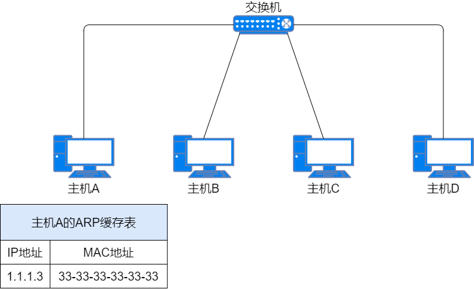

当主机 A 向不同网段的主机 C 发送数据，但是不知道主机 C 的 MAC 地址。  

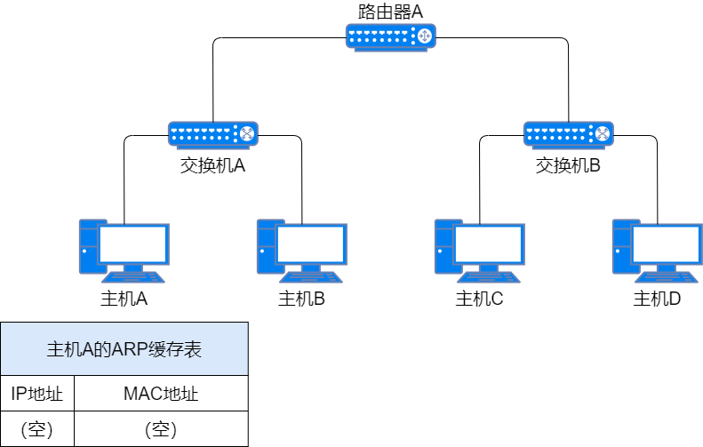

1. 主机 A 使用主机 C 的 IP 地址查询 ARP ，ARP 发现主机 C 不在同一个网段，需要通过默认网关（即默认路由的下一跳地址），但是没有网关 MAC地址；  

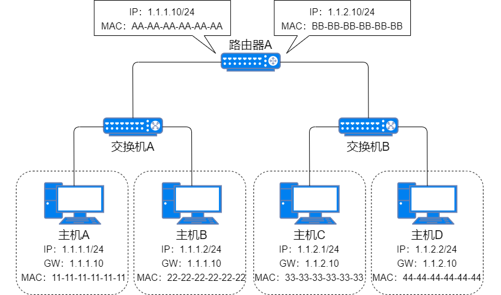

2. 主机 A 先将发送给主机 C 的数据放入缓存中，然后发送 ARP 请求报文，主机 A 以网关 IP 地址为目的 IP 地址发送 ARP 广播请求报文；  

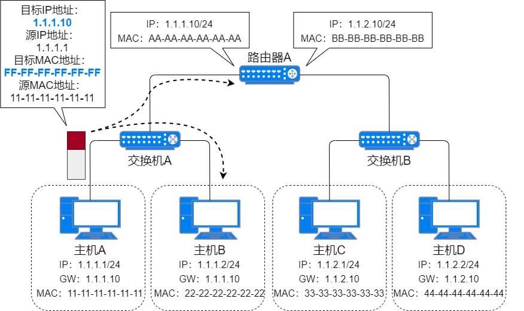

3. 路由器收到 ARP 广播请求报文后，将主机 A 的 MAC 地址和对应端口添加到自己的 MAC 表中，然后查看目的 IP 地址发现是请求自己的 MAC 地址，于是单播发送 ARP 响应报文；  

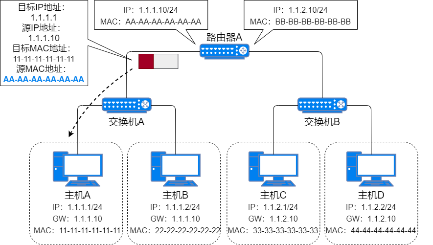

4. 主机 A 收到 ARP 响应报文后，将发送给主机 C 的数据封装网关 MAC 地址为目的 MAC 地址进行发送；  

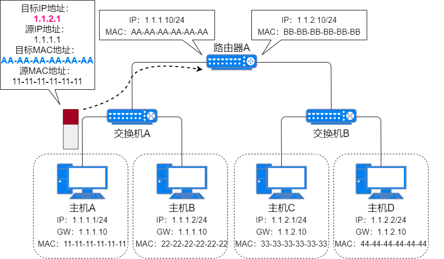

5. 路由器收到报文后，查看目的 IP 地址，是发送给主机 C 的，于是查询路由表从相应端口发送数据。由于没有主机 C 的 MAC 地址，路由器发送 ARP请求报文，源 MAC 地址和源 IP 地址替换为发送端口的MAC 地址和 IP 地址；  

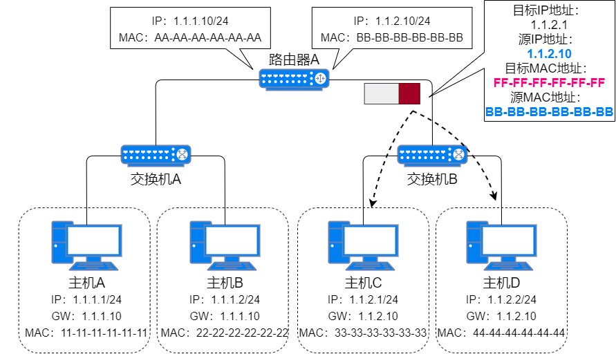

6. 主机 C 收到 ARP 请求报文后，添加路由器的端口和 MAC 地址到 MAC 地址表，单播发送 ARP 响应报文；  

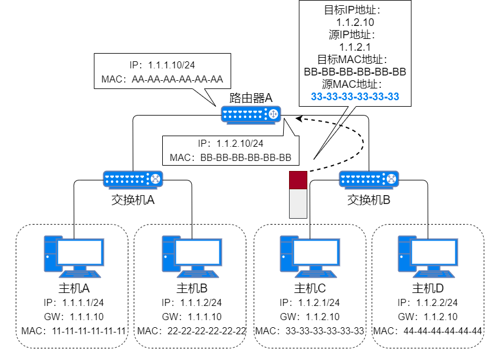

7. 路由器收到主机 C 的 MAC 地址后，将其添加到 MAC 地址表中。将主机 A发送给主机 C 的报文重新封装，以自己的 MAC 地址为源 MAC 地址，以主机 C 的 MAC 地址为目的 MAC 地址，发送给主机 C ；  

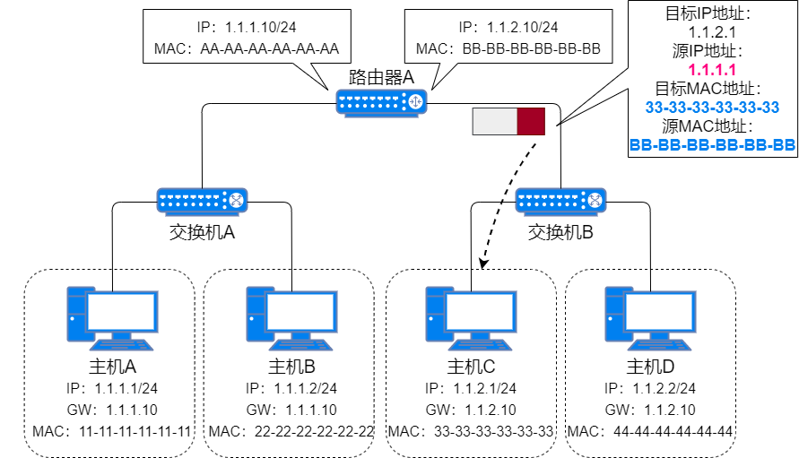

8. 主机 C 收到主机 A 发送的数据，发送过程结束。  

当主机 C 向主机 A 发送回复报文时，同主机 A 向主机 C 发送数据的步骤一致。  

#### ARP 代理  

如果 ARP 请求是从一个网络的主机发往同一网段却不在同一物理网络上的另一台主机，那么连接它们的具有代理 ARP 功能的设备就可以回答该请求，这个过程称作代理 ARP 。  

代理 ARP 功能屏蔽了分离的物理网络，让用户使用起来，跟在同一个物理网络上一样。  

#### 免费 ARP  

免费 ARP 是一种特殊的 ARP 请求，它并非通过 IP 找到对应的 MAC 地址，而是当主机启动的时候，发送一个免费 ARP 请求，即请求自己的 IP 地址的 MAC 地址。  

与普通 ARP 请求报文的区别在于报文中的目标 IP 地址。普通 ARP 报文中的目标 IP 地址是其它主机的 IP 地址；而免费 ARP 的请求报文中，目标 IP地址是自己的 IP 地址。  

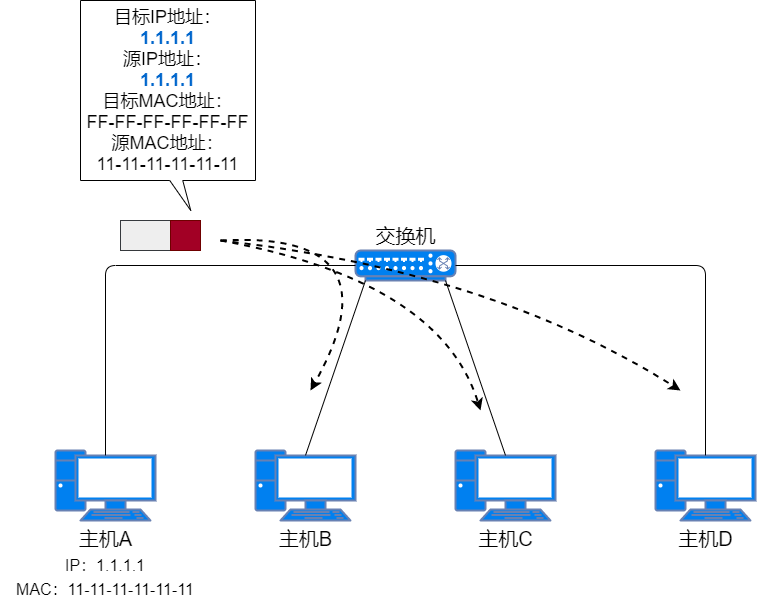

免费 ARP 的作用：  

* 起到一个宣告作用。它以广播的形式将数据包发送出去，不需要得到回应，只为了告诉其它主机自己的 IP 地址和 MAC 地址。
* 可用于检测 IP 地址冲突。当一台主机发送了免费 ARP 请求报文后，如果收到了 ARP 响应报文，则说明网络内已经存在使用该 IP 地址的主机。
* 可用于更新其它主机的 ARP 缓存表。如果该主机更换了网卡，而其它主机的ARP 缓存表仍然保留着原来的 MAC 地址。这时，通过免费的 ARP 数据包，更新其它主机的 ARP 缓存表。  

### ICMP  

IP 提供尽力而为的服务，指为了把数据包发送到目的地址尽最大努力。它并不做对端目的主机是否收到数据包的验证，无法保证服务质量  。

ICMP（互联网控制消息协议）是提供这类功能的一种协议。ICMP 的主要功能包括，确认 IP 包是否成功送达目的地址，通知发送过程中 IP 包被丢弃的原因。  

ICMP 报文像 TCP/UDP 一样通过 IP 进行传输，但是 ICMP 的功能不是传输层的补充，应该把它当做网络层协议。  

ICMP 头部封装字段如下图。  

通过类型字段和编码字段的取值判断这个 ICMP 消息的类型。常见的 ICMP消息所对应的类型和编码值如下图。  

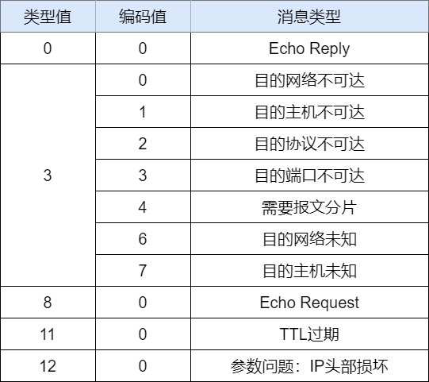

从功能上，ICMP 的消息分为两类：一类是通知出错原因的错误消息，另一类是用于诊断的查询消息。  

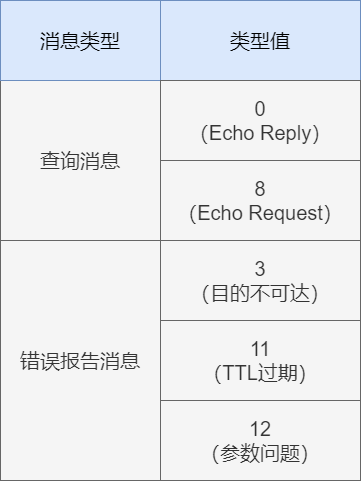

#### ping  

我们常用的 ping 工具就是通过 ICMP 消息测试网络层连通性的。源主机发出Echo request 消息，目的主机回应 Echo reply 消息，则两台主机间的网络层通信正常。也可以通过 ping 命令来判断目标主机是否启用。  

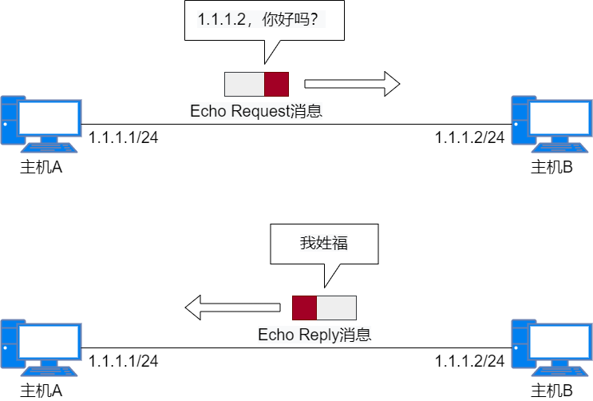

#### IPv4 头部  

IP 提供最简单的服务：实现从源到目的的数据转发。不会在传输数据前先与接收方建立连接，也不保证传输的可靠性，它只提供尽力而为的服务。  

IP 通信时传输的是 IP 报文， IP 报文由 IP 头部和数据两部分组成。 IP 头部包含控制报文转发的必要信息。通过 IP 头部的结构，可以对 IP 的功能有一个详细的了解。  

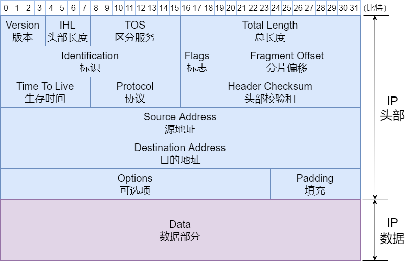

> 什么是字节？什么是比特？  

比特，英文名 bit ，也叫位。二进制中最小单位，一个比特的值要么是 0 要么是 1 。  

字节，英文名 Byte 。一个字节由八个比特构成。  

* 版本（ Version ）
  字段长度为 4 比特，表示 IP 的版本号。IPv4 的版本号是 4 ，所以这个字段的值也是 4 。常见的版本号有 IPv4 和 IPv6 。  

* 头部长度（ IHL：Internet Header Length ）  

  字段长度为 4 比特，表示 IP 头部大小，单位是 4 字节（ 32 比特）。没有可选项的 IP 包，头部长度为 5 ，即 20 字节（ 4 × 5 = 20 ）。  

* 区分服务（ TOS：Type Of Service ）  

  字段长度为 8 比特，用来说明数据是要加速传输还是精确传输，以及数据在传输过程中是否遇到了拥塞。  

* 总长度（ Total Length ）  

  字段长度为 16 比特，表示 IP 头部和数据加起来的总字节数。 IP 包的最大
  长度为 65535 字节。  

* 标识（ ID：Identification ）  

  字段长度为 16 比特，用于分片重组。同一个分片的标识值相同，不同分片的标识值不同。通常，每发送一个 IP 包，它的值也逐渐递增。另外，即使 ID相同，如果目标地址、源地址或协议不同的话，也会被认为是不同的分片。  

* 标志（ Flags ）  

  字段长度为 3 比特，表示分片信息。每比特的具体含义如下表。  

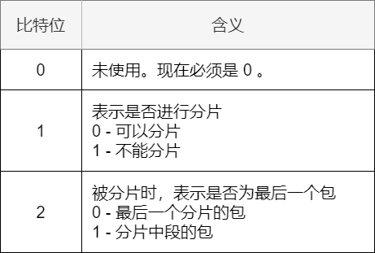

* 分片偏移（ FO：Fragment Offset ）  

  字段长度为 13 比特，表示分片在整个数据包中的位置。作用是告诉重组分片的设备，应该按照什么样的顺序重组数据包  

* 生存时间（ TTL：Time To Live ）  

  字段长度为 8 比特，表示数据包可以经过的中转路由器数量。每经过一个路由器， TTL 会减少 1 ，直到变成 0 则丢弃改包，避免数据包在网络中无限传递。  

* 协议（ Protocol ）  

  字段长度为 8 比特，表示 IP 上一层所使用的协议。常见的 IP 上层协议有TCP 和 UDP 。  

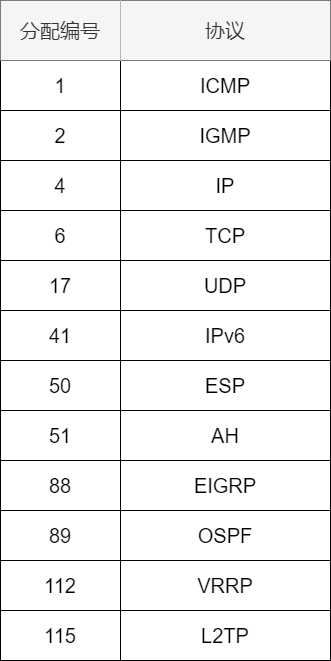

* 头部校验和（ Header Checksum ）
  字段长度为 16 比特，用来校验数据包的头部是否被破坏。设备会丢弃校验失败的数据包。 IPv6 以取消头部校验和字段，通过上层的 TCP 或 UDP 校验协议是否正确。
* 源地址（ Source Address ）
  字段长度为 32 比特（ 4 字节），表示发送端 IP 地址。目的地址（ Destination Address ）字段长度为 32 比特（ 4 字节），表示接收端 IP 地址。
* 可选项（ Options ）
  这个字段很少使用，在 IPv6 协议中已经取消。
* 填充（ Padding ）
  在有可选项的情况下， 头部长度不是 32 比特的整数倍时，通过向字段填充0 ，调整为 32 比特的整数倍。
* 数据（ Data ）
  IP 数据字段，用于存放数据。把 IP 上一层协议的头部也作为数据进行处理。  